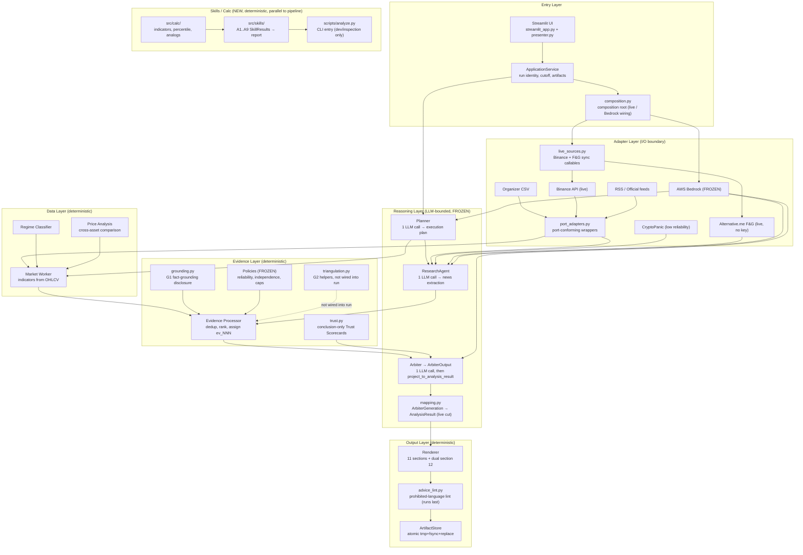
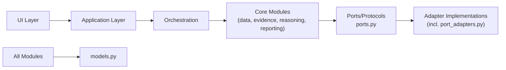
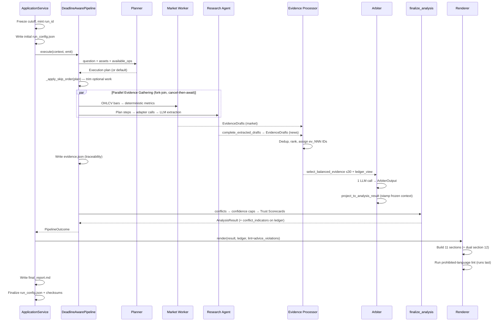
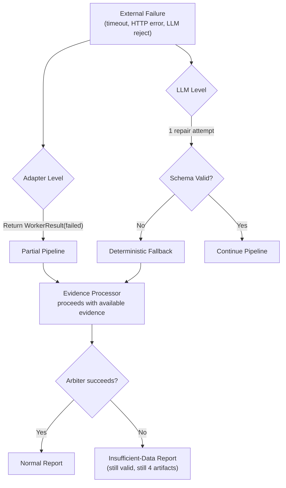
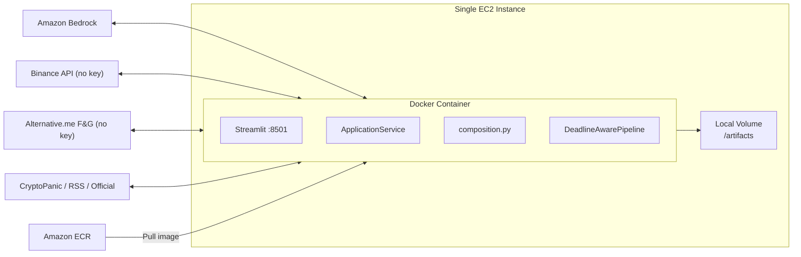

# Architecture

## System Overview

HOYA Market Agent implements an **H2-Lite bounded workflow** — a single-pass, evidence-first analysis pipeline that produces a structured Traditional Chinese market report within 15 minutes. The system prioritizes traceability and honest degradation over prediction accuracy.

## Architectural Style

The system uses a **layered pipeline architecture** with strict dependency direction:

**Dependency rules:**
- `models.py` imports no project module
- `ports.py` imports `models` only — defines Protocol boundaries consumed by adapters and orchestration
- `clock.py` imports `models` and `ports` — implements `Clock` protocol and `build_run_context()`
- `config.py` may import `models`, never adapters or UI — single environment parsing boundary
- `composition.py` is the ONE module allowed to import concrete adapters (Bedrock, live_sources) and hand them to orchestration — orchestration/, evidence/ and ui/ stay provider-free by construction
- Adapters own all network I/O; no `httpx`/`boto3` imports elsewhere
- `port_adapters.py` wraps the sync fetchers to satisfy the async Protocol boundaries from `ports.py`
- `live_sources.py` builds the plain sync `load_bars`/`extra_drafts` callables the deterministic pipeline injects (Binance + Fear & Greed); all HTTP stays in the adapter layer
- Data, evidence, and reporting modules are deterministic (no LLM, no network)
- Only `reasoning/` modules consume the `LLMClient` protocol
- UI imports only `ApplicationService`, `presenter`, `composition`, and `live_sources` — never adapters or pipeline stages directly
- `src/calc/` and `src/skills/` are a deterministic, parallel analysis surface (no LLM, no network) consumed by `scripts/analyze.py`; they do not import `hoya_agent` and are not wired into the `DeadlineAwarePipeline`

**Provisional seams status:** `_provisional_seams.py` is RETIRED (deleted from `main`). `application.py`, `reporting/artifacts.py`, and orchestration all consume the canonical seams in `models.py`, `ports.py`, and `clock.py`. There is no parallel provisional contract.

## H2-Lite Pipeline Flow

The core execution is a fixed 6-stage pipeline. `DeadlineAwarePipeline` owns the
stage order; `OrganizerCsvPipeline` is the deterministic offline `market_pipeline`
injected into it. Reasoning consumes an `ArbiterOutput` (no frozen request context)
which `project_to_analysis_result` stamps back onto `AnalysisResult`; the live cut
wraps the Arbiter in `MappingArbiter` (`composition.py`) which maps a lax
`ArbiterGeneration` onto the strict result and returns `None` on any failure.

## Deadline Architecture

```mermaid
gantt
    title Run Timeline (900s maximum)
    dateFormat s
    axisFormat %S

    section Stages
    Plan           :plan, 0, 30
    Parallel Gather:gather, 30, 270
    Evidence Process:proc, 270, 360
    Arbiter+Render :arbiter, 360, 510
    Verify+Artifacts:verify, 510, 630
    Buffer         :buffer, 630, 720

    section Hard Stops
    Analysis Cutoff (720s) :milestone, 720, 0
    Artifact Deadline (780s):milestone, 780, 0
    Competition Limit (900s):milestone, 900, 0
```

**Timeout discipline:**
- Each external call: max 45s, at most 1 retry within stage deadline
- Schema repair: 1 attempt, sharing the original stage deadline
- Skip order on time pressure: H3 → optional context adapters → counter-signal search
- After 720s (analysis hard stop): cancel all non-essential external/LLM calls
- After 780s (artifact deadline): all 4 artifacts must be on disk
- Finalize reserve: `max(20%, min(60 s, half the run))` of the request deadline

## Error Handling Philosophy

The system uses **degradation-first** error handling:

**Key invariant:** The pipeline ALWAYS produces 4 valid artifacts, even when all external sources fail.

## Module Ownership Boundaries

| Module | Owns | Must NOT Do |
|---|---|---|
| `models.py` | Shared Pydantic contracts | Import any project module |
| `ports.py` | Protocol boundaries (Clock, LLMClient, MarketDataAdapter, ResearchSourceAdapter, ProgressSink, ArtifactStore, PersistencePort, ToolRegistry) | Import adapters, UI, or orchestration; contain concrete I/O |
| `config.py` | Environment parsing, typed `Settings`, sanitized `RunConfigSnapshot` emission | Import adapters or UI |
| `clock.py` | UTC/monotonic injection via `SystemClock`, `build_run_context()` | Network I/O, import adapters |
| `composition.py` | Composition root — wires Bedrock + live_sources into `DeadlineAwarePipeline` / `MappingArbiter` | Be imported by adapters, evidence, or UI business logic |
| `adapters/` | All network I/O (one file per provider) | Business logic, reliability assignment |
| `adapters/port_adapters.py` | Port-conforming async wrappers over sync fetchers | Own business logic; wrapped sources are CSV, Binance, RSS, CryptoPanic, F&G, official |
| `adapters/live_sources.py` | Sync `load_bars` (Binance) + `extra_drafts` (F&G) callables for the deterministic pipeline | Be imported by orchestration/evidence directly (only `composition`/`ui` glue may) |
| `adapters/bedrock.py` (FROZEN) | Bedrock Converse structured output + repair/fallback path | Be modified without owner agreement |
| `data/` | Deterministic calculations | LLM calls, network I/O |
| `evidence/` | Dedup, ranking, policy enforcement, grounding (G1), trust scorecards | LLM calls, network I/O |
| `evidence/triangulation.py` | Cross-source triangulation helpers (G2) | Be wired into the run (currently not — review_notes) |
| `reasoning/` (FROZEN) | LLM interaction, plan validation, ArbiterOutput boundary, mapping | Write artifacts, assign reliability |
| `reporting/` | Deterministic rendering (11 + dual section 12), advice lint, atomic writes | LLM calls, invent new facts |
| `orchestration/` | Stage coordination, deadline management, fork-join, `finalize_analysis` | Compute indicators, render reports |
| `application.py` | Composition wiring (`build_research_*`), run identity, artifact ordering | Provider parsing, UI rendering |
| `ui/` | Streamlit glue + framework-free presenter view models | Business logic (lives in `application.py`/`presenter.py`), adapter imports |
| `src/calc/`, `src/skills/` | Deterministic OHLCV analysis skills (A1..A9) and report assembly | LLM, network, or importing `hoya_agent` |
| `scripts/analyze.py` | Dev/inspection CLI over `src/skills/` | Implement the run-artifact contract (deliberately weak) |

## Deployment Architecture

**Constraints:**
- Single container, single process (Streamlit + pipeline colocated)
- One active run at a time
- Artifacts written to mounted local volume
- EC2 instance role for Bedrock permissions (no stored credentials)
- Non-root Docker image with pinned dependencies
- Deployment flow: Docker build → ECR (immutable tag) → EC2 `docker compose pull` / `up`
  (see `docs/deploy-ec2.md`, `docs/Tech-Stack-Plan.md`)

## Run Modes and Data-Mode Honesty

| Run mode | Requested data mode | May degrade to | Honesty rule |
|---|---|---|---|
| `official` | `live` | — | `official` + any non-live effective data mode is rejected by the `RunConfigSnapshot` validator (models.py) |
| `rehearsal` | `fixture` | — | May replay a fixed cutoff; reports its real `effective_data_mode` at completion |
| `demo` | `live` | `recorded_fallback` | Finalization re-validates the merged snapshot; `ALLOW_RECORDED_DEMO_FALLBACK` gates the fallback |

`build_request()` freezes `analysis_as_of` to the injected clock for `official`
and refuses a caller-supplied value. The pipeline reports its actual
`effective_data_mode` at completion and the application re-validates the full
`RunConfigSnapshot` before the final `run_config.json` rewrite.

## Frozen Paths (Do Not Modify)

These paths are completed and covered by tests. Changes require owner agreement:

- `src/hoya_agent/adapters/bedrock.py`
- `src/hoya_agent/reasoning/` (entire package)
- `src/hoya_agent/evidence/policies.py`
- `tests/unit/evidence/test_policies.py`
- `prompts/`
- `tests/contract/`
- `tests/unit/reasoning/`

## 2026-08-01 architecture update (S8 third pass)

The implementation remains a typed same-process H2-Lite system. `_provisional_seams.py`
is retired; `application.py`, `reporting/artifacts.py`, and orchestration consume the
canonical seams in `models.py` / `ports.py` / `clock.py`. The composition root
(`composition.py`) is the single module allowed to import concrete adapters
(`bedrock`, `live_sources`) and hand them to the pipeline. Orchestration balances
the Arbiter projection while retaining the complete ledger artifact; frozen
reasoning paths remain untouched. See `s8-s9-s9b.md`.

New deterministic surfaces sit parallel to the pipeline: `src/calc/` (indicators,
percentile, analogs, cross-asset, data quality) and `src/skills/` (A1..A9 analysis
skills → `AnalysisReport`), driven by `scripts/analyze.py` as a dev/inspection CLI.
These do not participate in the `DeadlineAwarePipeline` and do not import
`hoya_agent`; they are a separate, fully deterministic report path over the
organizer dataset.

The Bronze UI (`src/hoya_agent/ui/streamlit_app.py` + `presenter.py`) offers three
modes — live `official` (real Binance + Fear & Greed, Arbiter when Bedrock is
configured via env/EC2 IAM role), offline `rehearsal` and offline `demo` over the
organizer CSV. Pipeline `ExecutionEvent`s stream live into an `st.status` panel;
the presenter derives a trust funnel (G3) from the run's own `evidence.json`.

## 2026-08-02 P4 HTML report

The deterministic reporting layer now has parallel Markdown and HTML projections over the same validated domain inputs. The HTML projection adds presentation only; it cannot call providers, Bedrock, or runtime network resources.
