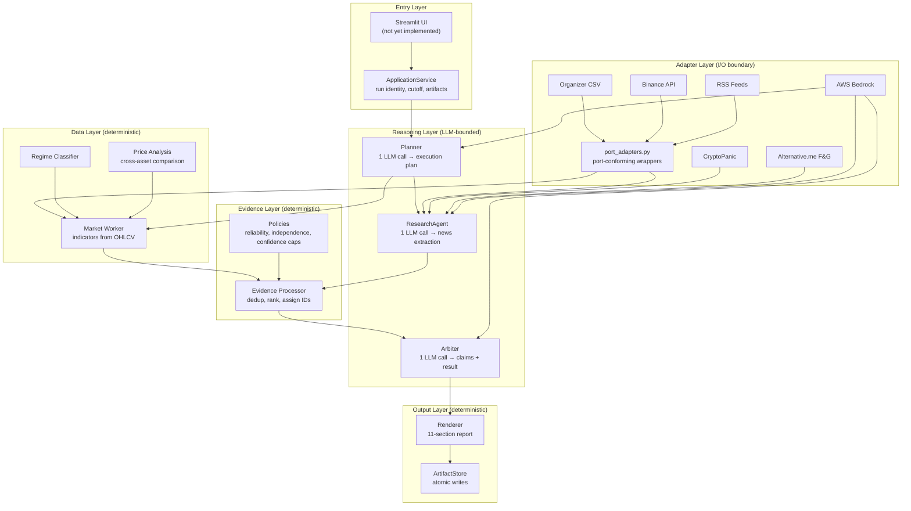
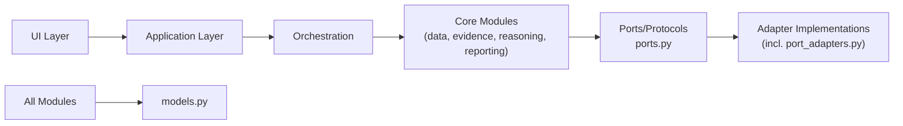
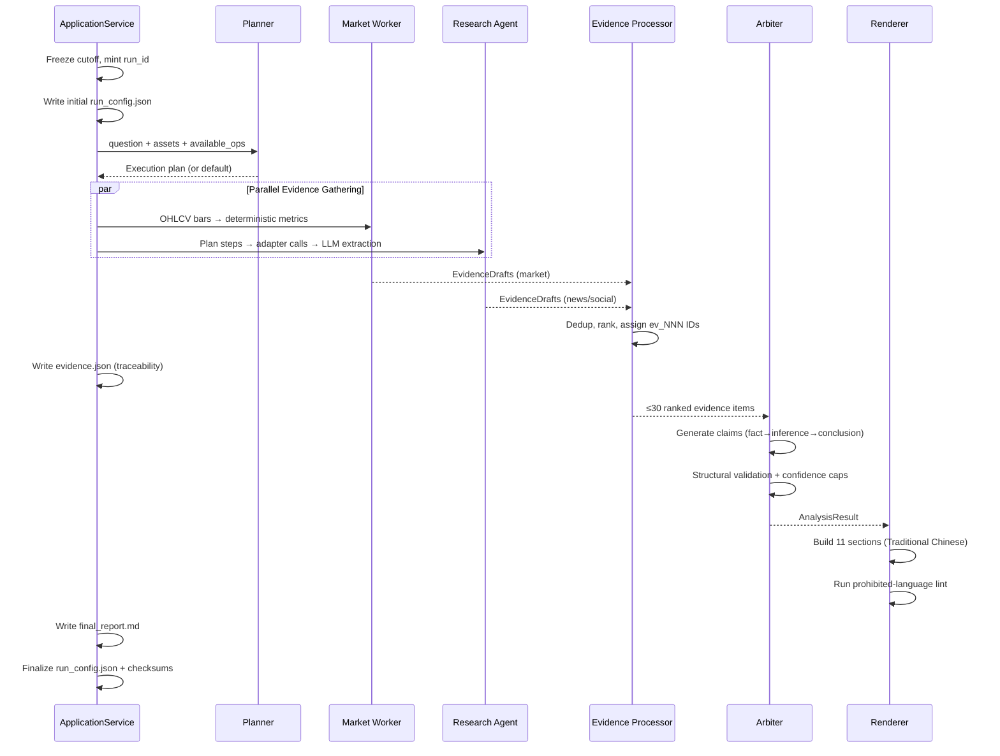
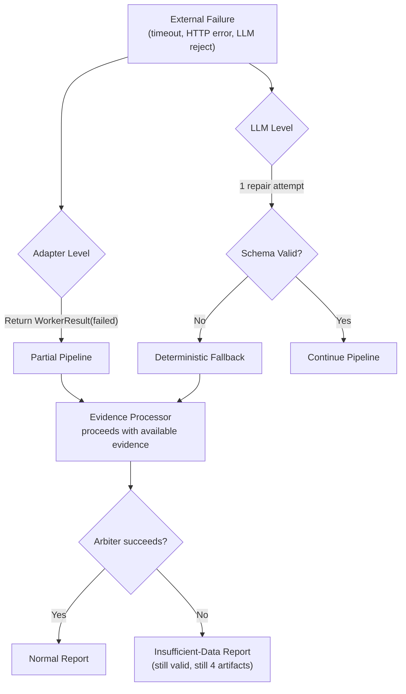
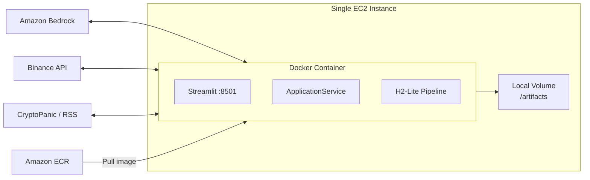

# Architecture

## System Overview

HOYA Market Agent implements an **H2-Lite bounded workflow** — a single-pass, evidence-first analysis pipeline that produces a structured Traditional Chinese market report within 15 minutes. The system prioritizes traceability and honest degradation over prediction accuracy.

## Architectural Style

The system uses a **layered pipeline architecture** with strict dependency direction:

**Dependency rules:**
- `models.py` imports no project module
- `ports.py` imports `models` only — defines Protocol boundaries consumed by adapters and orchestration
- `clock.py` imports `models` and `ports` — implements `Clock` protocol and `build_run_context()`
- `config.py` may import `models`, never adapters or UI — single environment parsing boundary
- Adapters own all network I/O; no `httpx`/`boto3` imports elsewhere
- `port_adapters.py` wraps P2's sync fetchers to satisfy the async Protocol boundaries from `ports.py`
- Data, evidence, and reporting modules are deterministic (no LLM, no network)
- Only `reasoning/` modules consume the `LLMClient` protocol
- UI imports only `ApplicationService` and `presenter` — never adapters or pipeline stages

**Provisional seams note:** `_provisional_seams.py` is still present on `main` (not yet deleted). It was created before Task 1b landed and contains stand-in types (`ExecutionEvent`, `RunConfigSnapshot`, `RunSummary`, `RunContext`, `Clock`, `ProgressSink`, `TerminalState`, `AnalysisPipeline`, `PipelineOutcome`). The real implementations now coexist in `models.py`, `ports.py`, and `clock.py`. The swap procedure (deleting `_provisional_seams.py` and updating its importers) is tracked but not yet executed.

## H2-Lite Pipeline Flow

The core execution is a fixed 6-stage pipeline:

## Deadline Architecture

```mermaid
gantt
    title Run Timeline (900s maximum)
    dateFormat s
    axisFormat %S

    section Stages
    Plan           :plan, 0, 30
    Parallel Gather:gather, 30, 270
    Evidence Process:proc, 270, 360
    Arbiter+Render :arbiter, 360, 510
    Verify+Artifacts:verify, 510, 630
    Buffer         :buffer, 630, 720

    section Hard Stops
    Analysis Cutoff (720s) :milestone, 720, 0
    Artifact Deadline (780s):milestone, 780, 0
    Competition Limit (900s):milestone, 900, 0
```

**Timeout discipline:**
- Each external call: max 45s, at most 1 retry within stage deadline
- Skip order on time pressure: H3 → optional context adapters → counter-signal search
- After 720s: cancel all non-essential external calls
- After 780s: all 4 artifacts must be on disk

## Error Handling Philosophy

The system uses **degradation-first** error handling:

**Key invariant:** The pipeline ALWAYS produces 4 valid artifacts, even when all external sources fail.

## Module Ownership Boundaries

| Module | Owns | Must NOT Do |
|---|---|---|
| `models.py` | Shared Pydantic contracts | Import any project module |
| `ports.py` | Protocol boundaries (Clock, LLMClient, MarketDataAdapter, ResearchSourceAdapter, ProgressSink) | Import adapters, UI, or orchestration; contain concrete I/O |
| `config.py` | Environment parsing, typed `Settings`, sanitized `RunConfigSnapshot` emission | Import adapters or UI |
| `clock.py` | UTC/monotonic injection via `SystemClock`, `build_run_context()` | Network I/O, import adapters |
| `adapters/` | All network I/O (one file per provider) | Business logic, reliability assignment |
| `adapters/port_adapters.py` | Port-conforming async wrappers over sync P2 fetchers | Own business logic; wrapped sources are CSV, Binance, RSS in MVP |
| `data/` | Deterministic calculations | LLM calls, network I/O |
| `evidence/` | Dedup, ranking, policy enforcement | LLM calls, network I/O |
| `reasoning/` | LLM interaction, plan validation | Write artifacts, assign reliability |
| `reporting/` | Deterministic rendering, atomic writes | LLM calls, invent new facts |
| `orchestration/` | Stage coordination, deadline management | Compute indicators, render reports |
| `application.py` | Composition, run identity, artifact ordering | Provider parsing, UI rendering |
| `_provisional_seams.py` | Legacy stand-in types (pre-Task 1b) — pending deletion | Be imported by new code; real types live in models/ports/clock |

## Deployment Architecture

**Constraints:**
- Single container, single process (Streamlit + pipeline colocated)
- One active run at a time
- Artifacts written to mounted local volume
- EC2 instance role for Bedrock permissions (no stored credentials)
- Non-root Docker image with pinned dependencies

## Frozen Paths (Do Not Modify)

These paths are completed and covered by tests. Changes require owner agreement:

- `src/hoya_agent/adapters/bedrock.py`
- `src/hoya_agent/reasoning/` (entire package)
- `src/hoya_agent/evidence/types.py`
- `src/hoya_agent/evidence/policies.py`
- `tests/unit/evidence/test_policies.py`
- `prompts/`
- `tests/contract/`
- `tests/unit/reasoning/`

## 2026-08-01 architecture update

The implementation remains a typed same-process H2-Lite system. Orchestration balances only the Arbiter projection while retaining the complete ledger artifact; frozen reasoning paths remain untouched. See `s8-s9-s9b.md`.
