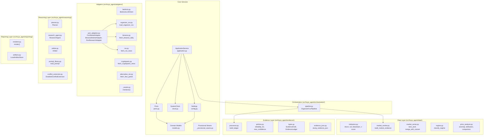

# Components

## Component Map

## Component Details

### ApplicationService (`application.py`)

**Responsibility:** Single entry point for a complete analysis run. Owns run identity, immutable cutoff, artifact write ordering, and terminal state determination.

**Key behaviors:**
- Mints `run_id` from injected clock
- Official mode: freezes `analysis_as_of` to current UTC, rejects caller-supplied values
- Writes `run_config.json` before pipeline starts (crash recoverability)
- Writes `evidence.json` immediately when ledger is ready (traceability before reasoning)
- Determines terminal state: `completed` → `degraded` if artifacts missing → `failed` if all 4 missing
- Detects question/asset mismatch and logs warning
- **Cancellation:** catches `asyncio.CancelledError` from the pipeline, finalizes all
  four artifacts from what already exists (labelled `cancelled`, with the deterministic
  insufficient-data report), then **re-raises**. The whole finalize path is
  synchronous on purpose — a further `await` inside a cancelled task raises again
  before the writes complete — so `progress_tasks` are cancelled rather than awaited.
  Finalizing is not suppressing.

**Injected dependencies:** `clock`, `pipeline`, `prompt_version`, `configured_sources`, `optional_keys_present`

---

### Settings (`config.py`)

**Responsibility:** Frozen typed configuration parsed once from environment variables. Enforces hard caps and validates request parameters. Never leaks secrets into artifacts or logs.

**Key behaviors:**
- Parses environment variables once at startup into an immutable typed object
- Enforces hard caps: 45-second LLM timeout, 30 evidence items max for Arbiter
- Validates requests: maximum question length enforcement
- Generates sanitized `RunConfigSnapshot` for artifact persistence (records key presence as booleans, never values)
- Configuration names are fixed: `BEDROCK_PRIMARY_MODEL_ID`, `BEDROCK_FALLBACK_MODEL_ID`, `CRYPTOPANIC_API_TOKEN`

**Cannot:** Import adapters or UI modules; expose secret values; be mutated after construction.

---

### SystemClock (`clock.py`)

**Responsibility:** Concrete implementation of the `Clock` protocol. Provides UTC wall-clock time and monotonic time for deadline arithmetic.

**Key behaviors:**
- `now_utc()`: returns timezone-aware UTC `datetime`
- `monotonic()`: returns `time.monotonic()` value for deadline calculations
- `build_run_context()` factory: freezes official `analysis_as_of` at the moment of run start
- Tests inject `FixedClock` (deterministic, no real time dependency)

**Cannot:** Be used directly for sleeping or delays; produce naive datetimes.

---

### Ports (`ports.py`)

**Responsibility:** All shared `Protocol` interfaces that define boundaries between layers. Also contains the concrete `StaticToolRegistry`.

**Protocols defined:**
- `Clock` — UTC time and monotonic time
- `LLMClient` — Bedrock structured output calls
- `SourceAdapter` — generic external source interface
- `MarketDataAdapter` — OHLCV bar retrieval (CSV or live)
- `ResearchSourceAdapter` — news/announcement record retrieval
- `ProgressSink` — stage progress reporting (UI consumption)
- `ArtifactStore` — atomic file writes for competition artifacts
- `PersistencePort` — execution log streaming
- `ToolRegistry` — allowlisted operation lookup for Planner/Research Agent

**Concrete class:** `StaticToolRegistry` — immutable, allowlist-backed registry. Operations are fixed at construction and cannot be extended at runtime.

**Cannot:** Contain concrete I/O implementations (those live in `adapters/`); import `httpx` or `boto3`.

---

### Port Adapters (`adapters/port_adapters.py`)

**Responsibility:** Async wrappers that implement the `MarketDataAdapter` and `ResearchSourceAdapter` protocols from `ports.py`. Thin bridge layer, no business logic.

**Adapters:**
- `CsvMarketAdapter` — wraps `organizer_csv.load_organizer_csv()` for offline CSV retrieval via `asyncio.to_thread()`
- `BinanceMarketAdapter` — wraps `binance.fetch_binance_daily()` for live kline retrieval via `asyncio.to_thread()`
- `RssResearchAdapter` — wraps `rss.fetch_rss_news()` for first-party feed retrieval via `asyncio.to_thread()`

**Key behaviors:**
- All use `asyncio.to_thread()` for sync→async bridging (underlying adapters are synchronous `httpx` calls)
- No business logic — delegates entirely to the underlying adapter module
- Returns typed results matching the port protocol contracts

**Cannot:** Compute indicators; assign reliability; make decisions about evidence; bypass configured timeouts.

---

### Planner (`reasoning/planner.py`)

**Responsibility:** Converts user question into a bounded, allowlisted execution plan. Deliberately weak — it only selects which pre-registered operations to run.

**Key behaviors:**
- Single LLM call with max_tokens=2000
- Validates plan: ≤8 steps, all operations in allowlist, assets unchanged, lookback_days positive
- Any violation → deterministic default plan (all allowed operations, default windows)
- LLM failure → deterministic default plan with degradation note

**Cannot:** Name providers, hosts, or URLs outside configuration; change asset list; add unbounded loops.

---

### Research Agent (`reasoning/research_agent.py`)

**Responsibility:** Executes plan steps by invoking registered tool operations (adapters), then makes one bounded LLM extraction call over collected records.

**Key behaviors:**
- Runs only allowlisted operations from the plan
- Collects up to 40 records from adapters
- Single LLM extraction call with max_tokens=6000
- Discards any draft citing a `record_id` not in the fetched set (anti-fabrication)
- Detects injection-like text in records (flags but processes normally)
- Status: `completed` (all operations + extraction OK), `partial` (some failed), `failed` (no records)

**Cannot:** Browse URLs decided by the model; make follow-up calls; modify source reliability.

---

### Arbiter (`reasoning/arbiter.py`)

**Responsibility:** Forms the market judgement. Receives ≤30 ranked evidence items and produces a layered `AnalysisResult` with fact→inference→conclusion claims.

**Key behaviors:**
- Selects evidence: prioritizes high-reliability, conflict-involved items, round-robin across groups
- Single LLM call with max_tokens=8000
- Structural validation: DAG acyclicity, link resolution, fact layering, coverage rules
- Deterministic confidence caps applied post-LLM (never loosens confidence)
- Fallback on failure: low-confidence insufficient-data result from up to 5 high-reliability facts

**Cannot:** Assign reliability; create evidence; loosen confidence caps; make multiple calls.

---

### Market Worker (`data/market_worker.py`)

**Responsibility:** Transforms OHLCV bars into traceable high-reliability `EvidenceDraft` objects. Pure computation, no LLM, no network.

**Metrics produced:**
- 14-day simple return
- 30-day realized volatility
- 90-day maximum drawdown
- 30-day volume z-score

**Key behaviors:**
- Each metric computed independently — one failure doesn't block others
- Status: `completed` (all 4 metrics), `partial` (some), `failed` (no bars at all)
- Each draft carries full traceability (source, parameters, query range)

---

### Market Regime Classifier (`data/regime.py`)

**Responsibility:** Deterministic synthesis of indicators into a descriptive market state label. Uses each asset's OWN rolling history (coin-agnostic).

**Classification (first match wins):**
1. Realized vol percentile ≥ 0.80 → `high_volatility`
2. |14d return| ≥ 10% → `trending_up` / `trending_down`
3. |14d return| ≤ 5% → `range_bound`
4. Otherwise → `mixed`

---

### Price Analysis (`data/price_analysis.py`)

**Responsibility:** Extended deterministic analysis for cross-asset comparison, anomaly detection, and attribution. Implements design doc outputs A5/A6/A7.

**Capabilities:**
- Anomaly days (±Nσ log-return z-scores)
- Attribution: rolling correlation, beta, relative-strength percentile vs reference asset
- Analog base rates: conditional self-history frequency analysis
- Cross-asset comparison: uses only returns/ratios/percentiles (NEVER base-asset volume)

---

### Evidence Processor (`evidence/processor.py`)

**Responsibility:** Merges all `EvidenceDraft` items into one clean, ranked, deduplicated `EvidenceLedger`.

**Pipeline:**
1. Rank by reliability (high→medium→low), then by freshness
2. Exact-hash dedup (SHA-256 of canonicalized normalized_fact)
3. Assign stable IDs (`ev_001`, `ev_002`, ...)
4. Return `EvidenceLedger` with items + dropped_duplicates count

---

### Evidence Policies (`evidence/policies.py`)

**Responsibility:** Deterministic policy enforcement — reliability assignment, independence group resolution, and confidence cap calculation.

**Static reliability table:**
| Level | Sources |
|---|---|
| `high` | Exchange API data, organizer CSV, official announcements, deterministic calculations |
| `medium` | Original news pages with URL and timestamp |
| `low` | Aggregators, social, Fear & Greed, secondary commentary |

---

### Renderer (`reporting/renderer.py`)

**Responsibility:** Produces the final 11-section Traditional Chinese report from `AnalysisResult` + `EvidenceLedger`. Completely deterministic.

**Fixed sections (in order):**
1. 報告標題與摘要 (Header)
2. 直接回答 (Direct Answer)
3. 市場範圍 (Market Context)
4. 事實 (Facts)
5. 支持證據 (Supporting Evidence)
6. 反方訊號 (Counter Evidence)
7. 推論 (Inferences)
8. 結論 (Conclusions)
9. 信心與理據 (Confidence)
10. 限制與降級 (Limitations)
11. 失效條件與觀察項目 (Invalidation + Watch Items)

**Key behaviors:**
- `build_insufficient_data_result()` for fallback reports
- Runs pluggable `lint` hook for prohibited language detection
- Raises on lint violation (report must not ship with investment advice)

---

### Artifact Store (`reporting/artifacts.py`)

**Responsibility:** Atomic file writing for the 4 fixed competition artifacts.

**Fixed artifact names:** `run_config.json`, `execution_log.jsonl`, `evidence.json`, `final_report.md`

**Key behaviors:**
- Atomic writes: tmp file in same directory → `os.replace`
- `os.fsync` after every write
- Streaming execution log (append + flush per event)
- Failure tracking: records which artifacts failed but never crashes
- `disclose_missing()`: prints exactly which artifacts are absent

---

### BedrockLLMClient (`adapters/bedrock.py`)

**Responsibility:** Single gateway to Amazon Bedrock Converse API. Forces structured output via synthetic tool call.

**Key behaviors:**
- `converse_structured()`: generic over any Pydantic result model
- One schema repair attempt within same deadline
- One fallback model switch for retryable availability/throttling errors
- Timeout clamped to min(configured_cap, remaining_stage_budget)
- Sanitized `CallEvent` logging (no prompts, no credentials)

---

### Pipeline (`orchestration/pipeline.py`)

**Responsibility:** Stage order for the H2-Lite run. Hosts `DeadlineAwarePipeline`
(plan → market/research fork-join → ledger → Arbiter) and `OrganizerCsvPipeline`
(the offline organizer-CSV-only market branch). Bridges provisional
`evidence/types.py` dataclasses to canonical `models.py` contracts.

**Key behaviors:**
- `DeadlineAwarePipeline.execute()`: builds `DeadlineManager.for_run()` and a
  `RunStateMachine`, runs both branches under one acquisition window, then settles
  each stage into the state machine and takes the terminal state from it
- `_fork_join()`: `asyncio.wait(timeout=gather window)` → `task.cancel()` on the
  unfinished branches → `gather(..., return_exceptions=True)`. Cancel first, then
  await, so no pending task leaks into the Evidence stage. A cancelled branch is
  *returned* as a `CancelledError` value rather than raised, because the sibling's
  evidence must still reach the ledger. Outer cancellation tears children down and
  re-raises — `CancelledError` is never suppressed.
- The acquisition window has exactly one owner. Branches clamp only their own
  per-call timeout (45 s); nesting a second clamp on the same milestone made
  "which one cancelled this branch" a race.
- `MIN_ARBITER_SECONDS` (5 s): below this the Arbiter is skipped so the
  deterministic finalize keeps its window; the run falls back deterministically
- `_apply_skip_order()`: consults `plan_optional_work()` before the fork-join and
  enforces the decision by trimming skipped steps out of the `ResearchPlan`. Which
  operations are optional is constructor configuration (`optional_operations`,
  `counter_signal_operations`), not a pipeline guess. Baseline steps are never
  trimmed; if nothing survives, the research branch is not started at all.
- `_classify()`: counter-signal is checked before optional context, so an operation
  declared as both is treated as the more valuable category
- `OrganizerCsvPipeline.execute()`: iterates assets, loads bars, builds market evidence
- `to_contract_ledger()`: maps frozen dataclasses to Pydantic models, preserves `metric_name`/`metric_value` in side index

---

### Deadline Manager (`orchestration/deadline.py`)

**Responsibility:** Every stage budget for one run. Adapters and stages receive a
budget; they never extend one. `time.monotonic()` drives all arithmetic — UTC is
only persisted.

**Key behaviors:**
- `Stage` enum (`planner|gather|evidence_processor|reason|artifact`) holds the
  Features §5.6 milestones (30/270/360/510/630 s) as fractions of a reference
  720-second analysis window, so a shorter request deadline scales every stage
  instead of keeping competition-sized budgets
- Finalize reserve `max(20% of total, min(60 s, half the run))`. For 900 s that is
  180 s, which is exactly why the analysis hard stop lands on 720
- `deadline_for(stage)`, `remaining(stage)`, `budget_for(stage, timeout_seconds=)`,
  `can_start(reserve_seconds=)`, `budget_seconds()` for reporting
- `for_run(context, clock)` reads the frozen `RunContext` so run start is not re-sampled
- `run(awaitable, stage=, timeout_seconds=)` clamps to the smaller of the two and
  closes the coroutine without starting it when the budget is already gone
- Owns the fixed optional-work skip order: `OptionalWork`, `SKIP_ORDER`
  (`conditional_debate` → `optional_context` → `counter_signal_second_search`),
  `plan_optional_work(pending, remaining_seconds=, default_cost_seconds=, cost_seconds=)`
  and `skip_note(work)`. Costs are supplied by the caller; the policy invents none.
  Unknown optional work raises `ValueError` rather than being ordered by guess.

**Note:** `Stage` values are *budget milestones*, not execution-log stage names.
Log stages are finer grained and owned by `run_state.py`.

---

### Run State (`orchestration/run_state.py`)

**Responsibility:** In-memory stage lifecycle and terminal run state, so no other
layer infers them — the UI reads a state orchestration already recorded.

**Key behaviors:**
- `RunStateMachine`: `pending → running → {completed|degraded|failed|cancelled}`.
  Illegal transitions raise `ValueError`. A stage may settle without ever running
  (optional work skipped under time pressure is recorded, not dropped).
- Streams `stage_start`/`stage_end` `ExecutionEvent`s with `duration_ms`; exposes
  `stage_durations_ms()` for the run-config snapshot
- `stage_state_for(WorkerStatus)`: `completed → completed`, `partial → degraded`,
  `failed → failed`. One-way and deterministic; a partial branch never passes as complete.
- `derive_terminal_state(states, run_cancelled=)`: one cancelled or failed branch
  beside a completed sibling is **degraded**; all-cancelled or `cancel_run()` is
  **cancelled**; all-failed is **failed**

---

### Prompt Library (`reasoning/prompt_library.py`)

**Responsibility:** Loads versioned markdown prompt files. Only version identifiers reach logs — prompt bodies never do.

**Registered prompts:**
- `planner` → `planner-v1.md`
- `research_extraction` → `research-extraction-v1.md`
- `arbiter` → `arbiter-v1.md`

---

### Conflict Extension (`reasoning/conflict_extension.py`)

**Responsibility:** H3 conditional-debate seam. MVP implementation is a **deterministic pass-through** — always routes to Arbiter, always reports disabled.

**Status:** Stub only. No debate participants, no LLM calls. Exists to satisfy the interface contract for future H3 work.

## 2026-08-01 component update

`DeadlineAwarePipeline` owns Plan → Market/Research fork-join → Process → Arbiter ordering. `build_trust_scorecards` is a pure Evidence component; the renderer adds Trust/Regime and a dual-only comparison projection. See `s8-s9-s9b.md`.

## S8 Silver gate additions

- `PipelineOutcome` now carries optional `effective_data_mode`.
- `ApplicationService` revalidates the final run configuration before the last
  atomic rewrite, so mode honesty validators execute on pipeline-derived values.
- `tests/integration/test_run_modes.py` and `test_provenance.py` cover artifact
  labels and claim-to-ledger resolution.
- `tests/live/test_live_sources.py` and `test_bedrock_access.py` are opt-in
  network/AWS gates and skip unless `RUN_LIVE_TESTS=1`.
