# Components

## Component Map

```mermaid
graph TB
    subgraph Core["Core Services"]
        App["ApplicationService<br/>application.py"]
        Composition["Composition Root<br/>composition.py"]
        Models["Domain Models<br/>models.py"]
        Config["Settings<br/>config.py"]
        ClockMod["SystemClock<br/>clock.py"]
        Ports["Ports<br/>ports.py"]
    end

    subgraph Adapters["Adapters (src/hoya_agent/adapters/)"]
        Bedrock["bedrock.py (FROZEN)<br/>BedrockLLMClient"]
        BinanceA["binance.py<br/>fetch_binance_daily"]
        CryptoA["cryptopanic.py<br/>fetch_cryptopanic_news"]
        OrgCSV["organizer_csv.py<br/>load_organizer_csv"]
        AltMe["alternative_me.py<br/>fetch_fear_greed"]
        RSSA["rss.py<br/>fetch_rss_news"]
        Official["official.py<br/>fetch_official_announcements"]
        LiveSources["live_sources.py<br/>binance_bar_loader, fear_greed_drafts"]
        Assets["_assets.py<br/>asset metadata"]
        Errors["_errors.py<br/>classify_error"]
        PortAdapters["port_adapters.py<br/>CsvMarketAdapter, BinanceMarketAdapter,<br/>RssResearchAdapter, CryptoPanicResearchAdapter,<br/>FearGreedResearchAdapter, OfficialAnnouncementsResearchAdapter"]
    end

    subgraph DataLayer["Data Layer (src/hoya_agent/data/)"]
        DTypes["types.py<br/>MarketBar"]
        Indicators["indicators.py<br/>return, vol, drawdown, z-score"]
        MWorker["market_worker.py<br/>build_market_evidence"]
        MSeries["market_series.py<br/>bars_asof, merge_with_cutover"]
        Regime["regime.py<br/>classify_regime"]
        PriceAn["price_analysis.py<br/>anomaly, attribution, comparison"]
        TextClean["text_clean.py<br/>clean_text"]
    end

    subgraph EvidenceLayer["Evidence Layer (src/hoya_agent/evidence/)"]
        Drafts["drafts.py<br/>PendingEvidence"]
        Processor["processor.py<br/>build_ledger"]
        Policies["policies.py (FROZEN)<br/>reliability_for, max_confidence"]
        Ledger["ledger.py<br/>conflicts, confidence signals"]
        Grounding["grounding.py<br/>fact grounding"]
        Trust["trust.py<br/>Trust Scorecards"]
        Triangulation["triangulation.py<br/>G2 (not wired into run)"]
    end

    subgraph ReasoningLayer["Reasoning Layer (src/hoya_agent/reasoning/ — FROZEN)"]
        Planner["planner.py<br/>Planner"]
        ResAgent["research_agent.py<br/>ResearchAgent"]
        ResExtr["research_extractor.py<br/>complete_extracted_drafts"]
        Arbiter["arbiter.py<br/>Arbiter"]
        ArbOut["arbiter_output.py<br/>ArbiterOutput, projection"]
        Schemas["schemas.py<br/>ArbiterGeneration, PlanGeneration"]
        Mapping["mapping.py<br/>build_analysis_result"]
        PromptLib["prompt_library.py<br/>load_prompt"]
        Conflict["conflict_extension.py<br/>DisabledConflictExtension"]
    end

    subgraph ReportingLayer["Reporting Layer (src/hoya_agent/reporting/)"]
        Renderer["renderer.py<br/>render()"]
        AdviceLint["advice_lint.py<br/>prohibited-language lint"]
        ArtStore["artifacts.py<br/>LocalArtifactStore"]
    end

    subgraph Orchestration["Orchestration (src/hoya_agent/orchestration/)"]
        Pipeline["pipeline.py<br/>DeadlineAwarePipeline, OrganizerCsvPipeline"]
        Deadline["deadline.py<br/>DeadlineManager, SKIP_ORDER"]
        RunState["run_state.py<br/>RunStateMachine"]
    end

    subgraph UI["UI (src/hoya_agent/ui/)"]
        Streamlit["streamlit_app.py<br/>Bronze UI"]
        Presenter["presenter.py<br/>summary_view, trust_funnel"]
    end

    subgraph ParallelTools["Parallel tool packages (NOT in agent pipeline)"]
        Calc["src/calc/<br/>indicators, percentile, cross_asset, analogs"]
        Skills["src/skills/<br/>A1..A9 skills, report, lint, html_report"]
    end

    %% Dependency arrows
    App --> Config
    App --> ClockMod
    App --> Ports
    App --> Pipeline
    App --> ArtStore
    Composition --> Bedrock
    Composition --> LiveSources
    Composition --> Pipeline
    Composition --> Mapping
    Streamlit --> App
    Streamlit --> Composition
    Streamlit --> LiveSources
    Streamlit --> Presenter
    Pipeline --> MWorker
    Pipeline --> Processor
    Pipeline --> ArbOut
    PortAdapters --> OrgCSV
    PortAdapters --> BinanceA
    PortAdapters --> RSSA
    Ports --> Models
    Config --> Models
    Skills --> Calc
```

## Component Details

### ApplicationService (`application.py`)

**Responsibility:** Single entry point for a complete analysis run. Owns run identity, immutable cutoff, artifact write ordering, and terminal state determination.

**Key behaviors:**
- Mints `run_id` from injected clock
- Official mode: freezes `analysis_as_of` to current UTC, rejects caller-supplied values
- Writes `run_config.json` before pipeline starts (crash recoverability)
- Writes `evidence.json` immediately when ledger is ready (traceability before reasoning)
- Determines terminal state: `completed` → `degraded` if artifacts missing → `failed` if all 4 missing
- Detects question/asset mismatch and logs warning
- **Cancellation:** catches `asyncio.CancelledError` from the pipeline, finalizes all
  four artifacts from what already exists (labelled `cancelled`, with the deterministic
  insufficient-data report), then **re-raises**. The whole finalize path is
  synchronous on purpose — a further `await` inside a cancelled task raises again
  before the writes complete — so `progress_tasks` are cancelled rather than awaited.
  Finalizing is not suppressing.

**Injected dependencies:** `clock`, `pipeline`, `prompt_version`, `configured_sources`, `optional_keys_present`

**Composition helpers (S6):**
- `build_research_tool_registry(...)` → `StaticToolRegistry` mapping
  `fetch_rss_news` / `fetch_fear_greed` / `fetch_official_announcements` /
  `fetch_cryptopanic_news` to port-conforming adapters. Handlers unwrap `SourceResult`
  into `list[RawSourceRecord]` (the only shape the frozen Research Agent consumes) and
  raise `SourceUnavailable` on a failed source so the agent records a gap.
- `build_research_pipeline(...)` → `DeadlineAwarePipeline` with both branches live. This is
  the declaration point for the fixed skip order: `BASELINE_RESEARCH_OPERATIONS`
  (`fetch_rss_news`, never trimmed), `OPTIONAL_CONTEXT_OPERATIONS`
  (`fetch_fear_greed`, `fetch_official_announcements`), `COUNTER_SIGNAL_OPERATIONS`
  (`fetch_cryptopanic_news`, surrendered last).
- `ALLOWED_RESEARCH_HOSTS` + `_require_allowlisted_host()`: a non-allowlisted host is
  rejected at registry construction, before any request can be made.
- `DeterministicPlanner`: with no LLM configured, returns the same allowlisted default plan
  the frozen Planner falls back to and discloses the substitution, so research still fetches.

---

### Settings (`config.py`)

**Responsibility:** Frozen typed configuration parsed once from environment variables. Enforces hard caps and validates request parameters. Never leaks secrets into artifacts or logs.

**Key behaviors:**
- Parses environment variables once at startup into an immutable typed object
- Enforces hard caps: 45-second LLM timeout, 30 evidence items max for Arbiter
- Validates requests: maximum question length enforcement
- Generates sanitized `RunConfigSnapshot` for artifact persistence (records key presence as booleans, never values)
- Configuration names are fixed: `BEDROCK_PRIMARY_MODEL_ID`, `BEDROCK_FALLBACK_MODEL_ID`, `CRYPTOPANIC_API_TOKEN`

**Cannot:** Import adapters or UI modules; expose secret values; be mutated after construction.

---

### SystemClock (`clock.py`)

**Responsibility:** Concrete implementation of the `Clock` protocol. Provides UTC wall-clock time and monotonic time for deadline arithmetic.

**Key behaviors:**
- `now_utc()`: returns timezone-aware UTC `datetime`
- `monotonic()`: returns `time.monotonic()` value for deadline calculations
- `build_run_context()` factory: freezes official `analysis_as_of` at the moment of run start
- Tests inject `FixedClock` (deterministic, no real time dependency)

**Cannot:** Be used directly for sleeping or delays; produce naive datetimes.

---

### Ports (`ports.py`)

**Responsibility:** All shared `Protocol` interfaces that define boundaries between layers. Also contains the concrete `StaticToolRegistry`.

**Protocols defined:**
- `Clock` — UTC time and monotonic time
- `LLMClient` — Bedrock structured output calls
- `SourceAdapter` — generic external source interface
- `MarketDataAdapter` — OHLCV bar retrieval (CSV or live)
- `ResearchSourceAdapter` — news/announcement record retrieval
- `ProgressSink` — stage progress reporting (UI consumption)
- `ArtifactStore` — atomic file writes for competition artifacts
- `PersistencePort` — execution log streaming
- `ToolRegistry` — allowlisted operation lookup for Planner/Research Agent

**Concrete class:** `StaticToolRegistry` — immutable, allowlist-backed registry. Operations are fixed at construction and cannot be extended at runtime.

**Cannot:** Contain concrete I/O implementations (those live in `adapters/`); import `httpx` or `boto3`.

---

### Port Adapters (`adapters/port_adapters.py`)

**Responsibility:** Async wrappers that implement the `MarketDataAdapter` and `ResearchSourceAdapter` protocols from `ports.py`. Thin bridge layer, no business logic.

**Adapters:**
- `CsvMarketAdapter` — wraps `organizer_csv.load_organizer_csv()` for offline CSV retrieval via `asyncio.to_thread()`
- `BinanceMarketAdapter` — wraps `binance.fetch_binance_daily()` for live kline retrieval via `asyncio.to_thread()`
- `RssResearchAdapter` — wraps `rss.fetch_rss_news()` for first-party feed retrieval via `asyncio.to_thread()`
- `CryptoPanicResearchAdapter` — wraps `cryptopanic.fetch_cryptopanic_news()`; no token → `SourceStatus.rejected`; the token never enters `query_or_parameters`
- `FearGreedResearchAdapter` — wraps `alternative_me.fetch_fear_greed()`; records carry `asset=None` (market-wide)
- `OfficialAnnouncementsResearchAdapter` — wraps `official.fetch_official_announcements()`; an asset with no configured feed is a disclosed gap

**Key behaviors:**
- All use `asyncio.to_thread()` for sync→async bridging (underlying adapters are synchronous `httpx` calls)
- No business logic — delegates entirely to the underlying adapter module
- Returns typed results matching the port protocol contracts
- `fetch(*, operation, context=None, **params)` accepts either a `RunContext` or the loose
  `assets`/`analysis_as_of`/`lookback_days` parameters the `StaticToolRegistry` passes;
  `_resolve_target()` normalizes both and never recomputes the cutoff from the wall clock
- `SourceStatus` is normalized from the adapter's category token (`adapters/_errors.py`):
  `timeout | http_error | malformed | rejected`; a source with nothing to say is `empty`,
  which is a disclosed gap rather than an error
- `_to_raw_record()` carries provenance the deterministic completion step needs:
  `original_publisher`, `original_page_fetched`, `source_reference`
- `SourceUnavailable` is raised only by registry handlers, so the frozen Research Agent
  records a failed source as a gap; an empty result never raises

**Cannot:** Compute indicators; assign reliability; make decisions about evidence; bypass configured timeouts.

---

### Adapter Error Categories (`adapters/_errors.py`)

**Responsibility:** One normalized failure vocabulary shared by the flat adapters, so a
degradation note can be mapped back to `SourceResult.status`.

**Key behaviors:**
- `classify_error(exc)` → `timeout | http_error | malformed | rejected`
- `category_note(message, category)` appends a `[category=…]` token after the human-readable text
- `category_of(notes)` reads the token back at the port boundary

**Cannot:** Raise across a port; carry provider payloads, credentials, or URLs.

---

### Research Extractor (`reasoning/research_extractor.py`)

**Responsibility:** The two halves the frozen `ResearchAgent` takes by injection — the
structured-output schema for bounded extraction, and the deterministic completion that turns
extracted wording into Evidence drafts. Migrated from `p2-etl-mvp/reasoning/research_extractor.py`.

**Key behaviors:**
- `ResearchExtraction` / `ExtractedFact` (`extra="forbid"`): one record may yield several facts,
  so one article becomes several Evidence items rather than one summary; carries a `relevant`
  verdict so off-topic feed noise is dropped without a second LLM call
- `complete_extracted_drafts(drafts, *, records, fetched_at)` → `(drafts, notes)`:
  reliability from the static policy table (feed item with no original page fetched stays `low`),
  `independence_group` from `policies.independence_group()`, timestamps from the record
- A fact citing a `record_id` that was never fetched is dropped and disclosed, never repaired
- `MAX_FACTS_PER_RECORD = 3`; `content_reference` is a bounded quotation (≤400 chars of body)
  so `evidence/grounding.py` can check extracted numbers against the source's own wording
- Already-complete drafts (market worker, source adapters) pass through untouched

**Cannot:** Let the model assign reliability, independence group, or stance; write files; call an LLM itself.

---

### Planner (`reasoning/planner.py`)

**Responsibility:** Converts user question into a bounded, allowlisted execution plan. Deliberately weak — it only selects which pre-registered operations to run.

**Key behaviors:**
- Single LLM call with max_tokens=2000
- Validates plan: ≤8 steps, all operations in allowlist, assets unchanged, lookback_days positive
- Any violation → deterministic default plan (all allowed operations, default windows)
- LLM failure → deterministic default plan with degradation note

**Cannot:** Name providers, hosts, or URLs outside configuration; change asset list; add unbounded loops.

---

### Research Agent (`reasoning/research_agent.py`)

**Responsibility:** Executes plan steps by invoking registered tool operations (adapters), then makes one bounded LLM extraction call over collected records.

**Key behaviors:**
- Runs only allowlisted operations from the plan
- Collects up to 40 records from adapters
- Single LLM extraction call with max_tokens=6000
- Discards any draft citing a `record_id` not in the fetched set (anti-fabrication)
- Detects injection-like text in records (flags but processes normally)
- Status: `completed` (all operations + extraction OK), `partial` (some failed), `failed` (no records)

**Cannot:** Browse URLs decided by the model; make follow-up calls; modify source reliability.

---

### Arbiter (`reasoning/arbiter.py`)
**Responsibility:** Forms the market judgement. Receives ≤30 ranked evidence items and produces a layered `AnalysisResult` with fact→inference→conclusion claims.
**Key behaviors:**
- Selects evidence: prioritizes high-reliability, conflict-involved items, round-robin across groups
- Single LLM call with max_tokens=8000
- Structural validation: DAG acyclicity, link resolution, fact layering, coverage rules
- Deterministic confidence caps applied post-LLM (never loosens confidence)
- Fallback on failure: low-confidence insufficient-data result from up to 5 high-reliability facts

**Cannot:** Assign reliability; create evidence; loosen confidence caps; make multiple calls.

**Boundary note:** its `result_schema` is `ArbiterOutput`, not `AnalysisResult`, and it must
receive `ledger_view()` items rather than canonical `EvidenceItem`s — see below.

---

### Arbiter Output Schema (`reasoning/arbiter_output.py`)

**Responsibility:** The schema the Arbiter's single call fills, and the deterministic
projection onto `AnalysisResult`. Added 2026-08-01 without modifying any frozen file.

**Key behaviors:**
- `ArbiterOutput` = `AnalysisResult` minus the frozen request context
  (`run_id`, `question`, `assets`, `analysis_as_of`), with nullable claim and market-context
  time ranges — exactly the shape the frozen `_fallback()` produces. `extra="forbid"` also
  keeps the deterministic-only `trust_scorecards` / `market_regime` out of the model's reach.
- **All boundary values are plain `Literal` strings, never enums.** The frozen
  `apply_confidence_caps()` compares confidence and stance via `str(...)`; a `str`-mixin enum
  renders as `"Reliability.low"` / `"Stance.supports"` and matches nothing, so every cap
  adjustment would corrupt the payload and silently drop the run into its fallback.
- `ledger_view()` / `EvidenceView` / `LedgerView`: string-valued ledger view, the same pattern
  as `ReasoningRequest`. Without it `_reliability_rank()` returns unknown for every item, so
  `select_evidence()` loses its high-first priority, `_fallback()` finds no facts and emits a
  report with no claims or links, and the only-low-evidence cap never fires.
- `project_to_analysis_result(output, *, request, evidence_items)` → `(result, notes)`:
  stamps the frozen context, maps strings to canonical enums, tolerates the fallback's
  `"Asset.BTC"` formatting, fills a missing time range from the evidence window
  (earliest evidence date → cutoff) and clamps anything past the cutoff. Notes record every
  correction so the report discloses it. A `ValidationError` is the caller's signal to use the
  deterministic fallback.

**Cannot:** Call an LLM; write files; widen the frozen cutoff; invent a time range not derived
from evidence.

---

### Market Worker (`data/market_worker.py`)

**Responsibility:** Transforms OHLCV bars into traceable high-reliability `EvidenceDraft` objects. Pure computation, no LLM, no network.

**Metrics produced:**
- 14-day simple return
- 30-day realized volatility
- 90-day maximum drawdown
- 30-day volume z-score

**Key behaviors:**
- Each metric computed independently — one failure doesn't block others
- Status: `completed` (all 4 metrics), `partial` (some), `failed` (no bars at all)
- Each draft carries full traceability (source, parameters, query range)

---

### Market Regime Classifier (`data/regime.py`)

**Responsibility:** Deterministic synthesis of indicators into a descriptive market state label. Uses each asset's OWN rolling history (coin-agnostic).

**Classification (first match wins):**
1. Realized vol percentile ≥ 0.80 → `high_volatility`
2. |14d return| ≥ 10% → `trending_up` / `trending_down`
3. |14d return| ≤ 5% → `range_bound`
4. Otherwise → `mixed`

---

### Price Analysis (`data/price_analysis.py`)

**Responsibility:** Extended deterministic analysis for cross-asset comparison, anomaly detection, and attribution. Implements design doc outputs A5/A6/A7.

**Capabilities:**
- Anomaly days (±Nσ log-return z-scores)
- Attribution: rolling correlation, beta, relative-strength percentile vs reference asset
- Analog base rates: conditional self-history frequency analysis
- Cross-asset comparison: uses only returns/ratios/percentiles (NEVER base-asset volume)

---

### Evidence Drafts (`evidence/drafts.py`)

**Responsibility:** The single draft type, and the provenance the processor needs.
Replaced the provisional dataclasses in `evidence/types.py`, which is deleted.

**Key behaviors:**
- `PendingEvidence` = canonical `models.EvidenceDraft` + `source_class` +
  `original_publisher`/`provider_id` + optional `MetricValue`
- **A draft has no `reliability` and no `independence_group`.** That is the contract:
  they are processor-assigned. The old dataclass carried them, which let a producer
  state its own trustworthiness.
- `pending(...)` builds and validates in one call; plain strings for asset and source
  type are coerced to enums, so an unsupported value is rejected where it is produced
  rather than dropped later at ledger time
- `MetricValue` carries a deterministic number that `EvidenceItem` (16 fields,
  `extra="forbid"`) cannot hold, which §16.4 needs for a verifiable threshold

**Cannot:** Assign reliability or grouping; call an LLM, the network or the filesystem.

---

### Evidence Processor (`evidence/processor.py`)

**Responsibility:** Merges all `PendingEvidence` into one canonical
`models.EvidenceLedger`, and is the **only** place the processor-assigned fields are
assigned.

**Pipeline:**
1. reliability from `source_class` (static table — never a producer, never an LLM)
2. independence group: original publisher → registered domain → configured provider id
3. `content_hash` over the canonicalized fact (exact matching only)
4. rank by reliability, then freshness, then input order
5. exact-hash dedup, keeping the highest-ranked copy
6. assign `ev_001`, `ev_002`, … then sort the ledger by id

**Merge support:** `existing=` admits an already-processed ledger (the market branch
when research lands later) and reuses its assignments while renumbering ids across the
merged set. `existing_metrics=` is re-keyed **by content hash** — a metric left on a
stale id would silently point at the wrong evidence.

---

### Evidence Ledger Service (`evidence/ledger.py`)

**Responsibility:** Deterministic queries and rules over a built ledger. No LLM, no network,
no file I/O.

**Key behaviors:**
- `build_conflict_indicators(*, claim_evidence_links, ledger)` → `list[ConflictIndicator]`:
  the evidence-contracts §9 rule. Only claims carrying both a `supports` and an `opposes`
  link are examined; both sides must hold `high`/`medium` reliability and at least one pair
  must come from different `independence_group` values. `neutral` links can never create a
  conflict, and an unresolvable `evidence_id` is ignored rather than assumed.
  Output is ordered by `claim_id` with sorted id lists, so link order cannot change it.
  `CONFLICT_RULE_VERSION` is persisted with each indicator.
- `detect_material_conflict(...)` — the single-claim primitive the above builds on
- `confidence_signals_for_claim(...)` — supporting groups / max reliability / conflict /
  stale inputs for the deterministic confidence caps, with grounding gating for
  LLM-extracted facts
- `filter_by_asset` / `filter_by_source_type` / `distinct_source_types` /
  `distinct_independence_groups` / `has_first_hand_source` / `source_coverage_gaps`
- `select_for_arbiter` / `select_for_arbiter_dual` — ledger-side selection helpers
  (the live run currently uses the orchestration-side balanced projection)

**Cannot:** Assign reliability; call an LLM; mutate the ledger it is given.

---

### Evidence Policies (`evidence/policies.py`)

**Responsibility:** Deterministic policy enforcement — reliability assignment, independence group resolution, and confidence cap calculation.

**Static reliability table:**
| Level | Sources |
|---|---|
| `high` | Exchange API data, organizer CSV, official announcements, deterministic calculations |
| `medium` | Original news pages with URL and timestamp |
| `low` | Aggregators, social, Fear & Greed, secondary commentary |

---

### Renderer (`reporting/renderer.py`)

**Responsibility:** Produces the final 11-section Traditional Chinese report from `AnalysisResult` + `EvidenceLedger`. Completely deterministic.

**Fixed sections (in order):**
1. 報告標題與摘要 (Header)
2. 直接回答 (Direct Answer)
3. 市場範圍 (Market Context)
4. 事實 (Facts)
5. 支持證據 (Supporting Evidence)
6. 反方訊號 (Counter Evidence)
7. 推論 (Inferences)
8. 結論 (Conclusions)
9. 信心與理據 (Confidence)
10. 限制與降級 (Limitations)
11. 失效條件與觀察項目 (Invalidation + Watch Items)

**Key behaviors:**
- `build_insufficient_data_result()` for fallback reports
- Runs pluggable `lint` hook for prohibited language detection
- Raises on lint violation (report must not ship with investment advice)

---

### Artifact Store (`reporting/artifacts.py`)

**Responsibility:** Atomic file writing for the 4 fixed competition artifacts.

**Fixed artifact names:** `run_config.json`, `execution_log.jsonl`, `evidence.json`, `final_report.md`

**Key behaviors:**
- Atomic writes: tmp file in same directory → `os.replace`
- `os.fsync` after every write
- Streaming execution log (append + flush per event)
- Failure tracking: records which artifacts failed but never crashes
- `disclose_missing()`: prints exactly which artifacts are absent

---

### BedrockLLMClient (`adapters/bedrock.py`)

**Responsibility:** Single gateway to Amazon Bedrock Converse API. Forces structured output via synthetic tool call.

**Key behaviors:**
- `converse_structured()`: generic over any Pydantic result model
- One schema repair attempt within same deadline
- One fallback model switch for retryable availability/throttling errors
- Timeout clamped to min(configured_cap, remaining_stage_budget)
- Sanitized `CallEvent` logging (no prompts, no credentials)

---

### Pipeline (`orchestration/pipeline.py`)

**Responsibility:** Stage order for the H2-Lite run. Hosts `DeadlineAwarePipeline`
(plan → market/research fork-join → ledger → Arbiter) and `OrganizerCsvPipeline`
(the offline organizer-CSV-only market branch, also reused as the live market
branch via injected `load_bars`/`extra_drafts` callables). Pending evidence is
the canonical `PendingEvidence` from `evidence/drafts.py`, merged into the
ledger through `evidence/processor.py`.

**Key behaviors:**
- `DeadlineAwarePipeline.execute()`: builds `DeadlineManager.for_run()` and a
  `RunStateMachine`, runs both branches under one acquisition window, then settles
  each stage into the state machine and takes the terminal state from it
- `_fork_join()`: `asyncio.wait(timeout=gather window)` → `task.cancel()` on the
  unfinished branches → `gather(..., return_exceptions=True)`. Cancel first, then
  await, so no pending task leaks into the Evidence stage. A cancelled branch is
  *returned* as a `CancelledError` value rather than raised, because the sibling's
  evidence must still reach the ledger. Outer cancellation tears children down and
  re-raises — `CancelledError` is never suppressed.
- The acquisition window has exactly one owner. Branches clamp only their own
  per-call timeout (45 s); nesting a second clamp on the same milestone made
  "which one cancelled this branch" a race.
- `MIN_ARBITER_SECONDS` (5 s): below this the Arbiter is skipped so the
  deterministic finalize keeps its window; the run falls back deterministically
- `_apply_skip_order()`: consults `plan_optional_work()` before the fork-join and
  enforces the decision by trimming skipped steps out of the `ResearchPlan`. Which
  operations are optional is constructor configuration (`optional_operations`,
  `counter_signal_operations`), not a pipeline guess. Baseline steps are never
  trimmed; if nothing survives, the research branch is not started at all.
- `_classify()`: counter-signal is checked before optional context, so an operation
  declared as both is treated as the more valuable category
- Evidence stage: research drafts pass through
  `research_extractor.complete_extracted_drafts()` before merging, so extracted facts get
  reliability/independence group/timestamps from deterministic policy rather than from the
  model. Facts citing an unfetched record are dropped with a disclosure.
- `finalize_analysis(ledger, result)`: the deterministic post-LLM pass. Builds
  `ConflictIndicator`s from the result's links, attaches them to the ledger with a
  `material_conflict_detected` degradation event, re-applies the frozen
  `apply_confidence_caps()` (so a conflicted conclusion is capped at `low` and overall
  confidence cannot stay `high`), then builds Trust Scorecards last because their
  `consistency` dimension reads those indicators. Uses `model_dump(mode="json")` — the cap
  helper compares confidence as plain strings, and enum members never match its rank table.
  Applied by both `DeadlineAwarePipeline` and `OrganizerCsvPipeline`.
- `OrganizerCsvPipeline.execute()`: iterates assets, loads bars, builds market evidence
- `to_contract_ledger()`: maps frozen dataclasses to Pydantic models, preserves `metric_name`/`metric_value` in side index

---

### Deadline Manager (`orchestration/deadline.py`)

**Responsibility:** Every stage budget for one run. Adapters and stages receive a
budget; they never extend one. `time.monotonic()` drives all arithmetic — UTC is
only persisted.

**Key behaviors:**
- `Stage` enum (`planner|gather|evidence_processor|reason|artifact`) holds the
  Features §5.6 milestones (30/270/360/510/630 s) as fractions of a reference
  720-second analysis window, so a shorter request deadline scales every stage
  instead of keeping competition-sized budgets
- Finalize reserve `max(20% of total, min(60 s, half the run))`. For 900 s that is
  180 s, which is exactly why the analysis hard stop lands on 720
- `deadline_for(stage)`, `remaining(stage)`, `budget_for(stage, timeout_seconds=)`,
  `can_start(reserve_seconds=)`, `budget_seconds()` for reporting
- `for_run(context, clock)` reads the frozen `RunContext` so run start is not re-sampled
- `run(awaitable, stage=, timeout_seconds=)` clamps to the smaller of the two and
  closes the coroutine without starting it when the budget is already gone
- Owns the fixed optional-work skip order: `OptionalWork`, `SKIP_ORDER`
  (`conditional_debate` → `optional_context` → `counter_signal_second_search`),
  `plan_optional_work(pending, remaining_seconds=, default_cost_seconds=, cost_seconds=)`
  and `skip_note(work)`. Costs are supplied by the caller; the policy invents none.
  Unknown optional work raises `ValueError` rather than being ordered by guess.

**Note:** `Stage` values are *budget milestones*, not execution-log stage names.
Log stages are finer grained and owned by `run_state.py`.

---

### Run State (`orchestration/run_state.py`)

**Responsibility:** In-memory stage lifecycle and terminal run state, so no other
layer infers them — the UI reads a state orchestration already recorded.

**Key behaviors:**
- `RunStateMachine`: `pending → running → {completed|degraded|failed|cancelled}`.
  Illegal transitions raise `ValueError`. A stage may settle without ever running
  (optional work skipped under time pressure is recorded, not dropped).
- Streams `stage_start`/`stage_end` `ExecutionEvent`s with `duration_ms`; exposes
  `stage_durations_ms()` for the run-config snapshot
- `stage_state_for(WorkerStatus)`: `completed → completed`, `partial → degraded`,
  `failed → failed`. One-way and deterministic; a partial branch never passes as complete.
- `derive_terminal_state(states, run_cancelled=)`: one cancelled or failed branch
  beside a completed sibling is **degraded**; all-cancelled or `cancel_run()` is
  **cancelled**; all-failed is **failed**

---

### Prompt Library (`reasoning/prompt_library.py`)

**Responsibility:** Loads versioned markdown prompt files. Only version identifiers reach logs — prompt bodies never do.

**Registered prompts:**
- `planner` → `planner-v1.md`
- `research_extraction` → `research-extraction-v1.md`
- `arbiter` → `arbiter-v1.md`

---

### Conflict Extension (`reasoning/conflict_extension.py`)

**Responsibility:** H3 conditional-debate seam. MVP implementation is a **deterministic pass-through** — always routes to Arbiter, always reports disabled.

**Status:** Stub only. No debate participants, no LLM calls. Exists to satisfy the interface contract for future H3 work.

---

### Composition Root (`composition.py`)

**Responsibility:** The ONE module allowed to import concrete providers
(Bedrock, live sources) and hand them to orchestration. Orchestration,
evidence and UI stay provider-free by construction; everything is injected so
tests pass a fake LLM and never touch the network.

**Key behaviors:**
- `build_bedrock_llm(...)` → `BedrockLLMClient` from `BedrockSettings`; `client=None`
  uses the standard AWS credential chain (EC2 IAM role / local env) — no key in code
- `MappingArbiter` dataclass: adapts the frozen S7 `Arbiter` (lax
  `ArbiterGeneration` output) to the pipeline's strict `AnalysisResult` contract.
  Runs the inner Arbiter, then calls `reasoning.mapping.build_analysis_result`;
  returns `None` on any mapping/validation failure so the run degrades to the
  deterministic insufficient-data report — never a crash
- `build_live_pipeline(...)` → `DeadlineAwarePipeline` with a live
  `OrganizerCsvPipeline` market branch (`binance_bar_loader` + `fear_greed_drafts`)
  and a `MappingArbiter` whose output is capped to 3000 tokens to fit the 45 s
  single-call limit. Planner/Research (news extraction) are deliberately left off
  the first live cut — they are the fragile multi-stage layer

**Cannot:** Be imported by orchestration/evidence/UI; hold credentials in code;
make the run crash on a malformed model answer.

---

### Live Sources (`adapters/live_sources.py`)

**Responsibility:** Real-time market + sentiment data path, no LLM, no key.
Builds the plain synchronous callables the deterministic pipeline injects
(`load_bars` and `extra_drafts`), so all HTTP stays in the adapter layer and
orchestration's no-`httpx` boundary holds.

**Key behaviors:**
- `binance_bar_loader(analysis_as_of, *, limit=1000, timeout=45.0)` → sync
  `BarLoader(asset) -> bars`. Bridges the async Binance fetcher through a
  one-shot worker-thread loop (a fresh `asyncio.run` cannot nest in the running
  pipeline loop). Raises `ValueError` on empty bars so the pipeline degrades
  that asset rather than emitting a misleading empty series
- `fear_greed_drafts(analysis_as_of, *, timeout=45.0)` → sync
  `() -> (drafts, degradation)`. Whole-market Fear & Greed as one low-reliability
  `social` draft on its own independence group — adds a genuinely different
  source *type* to the ledger with no LLM call

**Cannot:** Call an LLM; require credentials; be imported by orchestration directly.

---

### Text Cleaning (`data/text_clean.py`)

**Responsibility:** Deterministic news-body cleaning before the LLM sees text.
Strips HTML tags, unescapes entities, collapses whitespace. No LLM, no network.

**Cannot:** Invent content; call out.

---

### Data Types (`data/types.py`)

**Responsibility:** The `MarketBar` frozen dataclass (one completed UTC daily
OHLCV bar): `date, open, high, low, close, volume`. A local P2 prototype type
kept for the data/Evidence layers; field names mirror the canonical contract.

---

### Reasoning Mapping (`reasoning/mapping.py`, FROZEN)

**Responsibility:** Map the Arbiter's lax provider output
(`ArbiterGeneration`) onto the strict, frozen `models.AnalysisResult`. Injects
run identity from the request and converts lax shapes into canonical claims/links;
`AnalysisResult`'s own validators then enforce the contract.

**Key behaviors:**
- `build_analysis_result(generation, *, request, ledger)` → `AnalysisResult`
  (raises on invalid output, so callers can surface the reason)
- `to_analysis_result(...)` → `AnalysisResult | None` — fail-safe wrapper that
  returns `None` on any `ValidationError`/`ValueError`/`TypeError` so a malformed
  model answer degrades to the deterministic fallback
- Claim `time_range` is clamped to never extend past `analysis_as_of`
  (research tool, not forecaster); empty claim `assets` default to the run's assets

**Cannot:** Widen the frozen cutoff; call an LLM; write files.

---

### Reasoning Schemas (`reasoning/schemas.py`, FROZEN)

**Responsibility:** Canonical lax LLM I/O schemas for the bounded reasoning
stages — the *provider output* shapes the Planner/Research Agent/Arbiter ask the
model to return. Deliberately lax (no `run_id`, no strict claim-graph invariants)
because a model must be free to produce a shape that is then validated and mapped
onto the strict `AnalysisResult`. All models `extra="forbid"`.

**Schemas:** `GenClaim`, `GenLink`, `GenInvalidation`, `ArbiterGeneration`;
`GenStep`, `PlanGeneration`; `GenDraft`, `GenSkipped`, `DraftBatch`.

---

### Bronze UI (`ui/streamlit_app.py`)

**Responsibility:** Streamlit judge-facing UI. Three run modes — live official
(Binance + Fear & Greed; Arbiter reasons when Bedrock is configured, else
deterministic), offline rehearsal, offline demo — each producing the four fixed
artifacts. Business logic lives in `application.py` / `presenter.py`; this file
is only glue.

**Key behaviors:**
- Live `st.status` panel streams pipeline `ExecutionEvent`s in real time
  (`_StreamlitProgress`); one submit == one `ApplicationService` run (guarded
  against duplicate submits)
- Trust funnel (G3): `presenter.trust_funnel` distils `evidence.json` into
  evidence count, source-type count, independence-group count, reliability mix
  and conflict count — "多源資訊的信任提煉" made visible
- Editorial theme mirroring the P4 report prototype (serif display, mono
  eyebrows, distillation-green accent), no webfont CDN (offline/Docker-safe)
- Self-bootstraps `src` onto `sys.path` so a judge can `streamlit run` the file
  with no editable install or PYTHONPATH
- Rendered report passes the prohibited-investment-advice lint
  (`reporting.advice_lint`); H3 multi-agent debate is explicitly marked未實作

**Cannot:** Hold business logic; store AWS credentials; bypass the
`ApplicationService` (it always owns artifact writes).

---

### Presenter (`ui/presenter.py`)

**Responsibility:** Pure, framework-free `RunSummary` → view-model mappings
(no Streamlit import) so the UI logic is unit-testable and the "business logic
in a callback" gate stays satisfied.

**Key behaviors:**
- `RUN_MODE_STYLE` / `TERMINAL_STYLE`: official/rehearsal/demo and
  completed/degraded/failed/cancelled each map to a distinct visual token
- `run_mode_badge`, `terminal_badge`, `summary_view(summary)` → plain dict
- `trust_funnel(evidence_ledger)` → funnel + reliability mix, computed purely
  from the run's own `evidence.json` artifact (no schema or pipeline change)

**Cannot:** Import Streamlit; perform I/O; depend on provisional seams.

---

### Calc Library (`src/calc/`) — parallel tool package, NOT in the agent pipeline

**Responsibility:** Deterministic pandas-based calculation library underlying
the `skills` package. No LLM, no network, no `hoya_agent` imports.

**Modules:**
- `indicators.py` — returns (simple/log/multi-horizon), realized volatility,
  volatility percentile, true range/ATR, drawdown series & max drawdown,
  return distribution, moving averages & distance, rolling range & range
  position, all-time-high stats, volume mean ratio/percentile, price-volume
  cross, return z-score & anomaly detection, volatility compression
- `percentile.py` — `expanding_percentile`
- `cross_asset.py` — `align`, `rolling_correlation`, `rolling_beta`,
  `relative_strength_ratio`/`_percentile`, `relative_return`, `dispersion`
- `analogs.py` — `conditional_base_rate`, episode counting, base-rate strength,
  volatility-compression studies (`EpisodeCount`, `BaseRate`, `AnalogStudy`)
- `data_quality.py` — `check_ohlc_integrity` → `IntegrityReport`

---

### Skills Framework (`src/skills/`) — parallel tool package, NOT in the agent pipeline

**Responsibility:** Deterministic analysis skills that turn prepared OHLCV data
into one `SkillResult` each: structured findings, provenance (`EvidenceRef`),
what could not be determined, and a ready-to-render Traditional Chinese section.
No skill calls a model; every number originates in a `calc` calculation.

**Contract (`base.py`):**
- A skill **never raises** — missing/insufficient data is an outcome
  (`status = OK | DEGRADED | UNAVAILABLE`), not an exception
- A skill **never invents a number** — where a figure cannot be computed the
  field is absent and a limitation says so
- `MarketBundle` (asset frame + peer frames + benchmark) is the prepared input;
  `SkillResult` carries `findings`, `evidence_refs`, `limitations`,
  `section_markdown` (with derived `section_html`)

**Skills:** `a1_regime` (market-state label), `a2_position` (price position vs
history/MA), `a3_risk` (drawdown/volatility risk), `a4_participation` (volume
participation), `a5_attribution` (cross-asset attribution), `a7_analogs`
(conditional base-rate analogs), `a9_verification` (data verification).

**Assembly:** `dataset.load_bundle` (file I/O lives here, not in skills),
`report.build_report` / `run_skills` / `render_report` (`AnalysisReport`,
`SKILL_ORDER`), `lint.assert_no_advice` / `find_prohibited_terms`
(`ProhibitedAdviceError`), `html_report.render_report_html` /
`render_section_html` / `markdown_subset_to_html`.

---

## 2026-08-01 component update

`DeadlineAwarePipeline` owns Plan → Market/Research fork-join → Process → Arbiter ordering. `build_trust_scorecards` is a pure Evidence component; the renderer adds Trust/Regime and a dual-only comparison projection. See `s8-s9-s9b.md`.

## S8 Silver gate additions

- `PipelineOutcome` now carries optional `effective_data_mode`.
- `ApplicationService` revalidates the final run configuration before the last
  atomic rewrite, so mode honesty validators execute on pipeline-derived values.
- `tests/integration/test_run_modes.py` and `test_provenance.py` cover artifact
  labels and claim-to-ledger resolution.
- `tests/live/test_live_sources.py` and `test_bedrock_access.py` are opt-in
  network/AWS gates and skip unless `RUN_LIVE_TESTS=1`.
- `tests/live/test_live_silver_pipeline.py` is the final opt-in gate: one
  `ApplicationService` run consumes the Organizer/Binance cutover and CoinDesk
  RSS, performs Bedrock research extraction and Arbiter reasoning, then verifies
  market/news Evidence plus all four artifacts.
- `RssResearchAdapter` preserves deterministic reliability and independence
  metadata on each `RawSourceRecord`. Orchestration joins that metadata back to
  the extraction result by `record_id`; the LLM never assigns source trust.

## 2026-08-02 P4 HTML report

`reporting/html_renderer.py` is the deterministic, self-contained P4 renderer. It reads only validated `AnalysisResult` and `EvidenceLedger`, escapes every dynamic value, and emits `final_report.html`. `ApplicationService` writes it atomically after the required submission artifacts; Streamlit embeds it in the Report tab.
