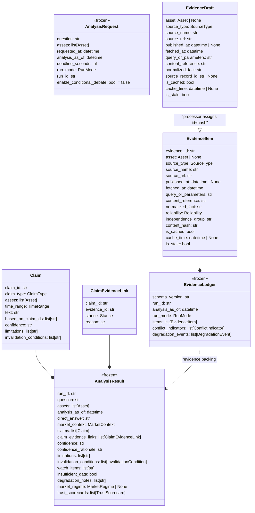

# Data Models

## Model Hierarchy



## Enumerations

| Enum | Values | Usage |
|---|---|---|
| `Asset` | `BTC`, `ETH`, `SOL`, `BNB`, `XRP` | Supported crypto assets |
| `RunMode` | `official`, `rehearsal`, `demo` | Execution mode |
| `SourceType` | `official`, `market`, `news`, `onchain`, `social`, `macro` | Evidence source classification |
| `Reliability` | `high`, `medium`, `low` | Static source reliability |
| `Stance` | `supports`, `opposes`, `neutral` | Claim-evidence link direction |
| `ClaimType` | `fact`, `inference`, `conclusion` | Claim layer in DAG |
| `TrustLevel` | `strong`, `moderate`, `weak`, `unavailable` | Trust scorecard dimension |
| `RegimeLabel` | `trending_up`, `trending_down`, `range_bound`, `high_volatility`, `mixed`, `unavailable` | Market state |
| `InvalidationOperator` | `lt`, `lte`, `gt`, `gte` | Quantified threshold comparison |

## Core Models (from `models.py`)

### AnalysisRequest

The immutable run input. Frozen after creation.

**Validation rules:**
- `assets`: 1–2 unique supported assets
- `run_id`: format `run_YYYYMMDD_HHMMSS_<suffix>`
- `analysis_as_of`: must be timezone-aware UTC
- `deadline_seconds`: (0, 900]
- `enable_conditional_debate`: default false (MVP always routes to Arbiter)
- Official mode rejects caller-supplied `analysis_as_of`

---

### EvidenceItem

A validated, processor-assigned evidence record.

**Key constraints:**
- `evidence_id`: format `ev_NNN` (3+ digits)
- `content_hash`: exactly 64 lowercase hex characters (SHA-256)
- `source_url`: valid HTTP(S) URL, no credentials
- `published_at`: may be null only when provider supplies no source time
- Cache consistency: `is_cached=false` requires `cache_time=null`; `is_cached=true` requires `cache_time`
- `extra="forbid"` — no undeclared fields allowed

---

### EvidenceDraft

Pre-processor form of evidence (no `evidence_id`, `reliability`, `independence_group`, `content_hash`). Produced by adapters and data layer.

**Key constraints:**
- Same URL/timestamp validation as EvidenceItem
- `source_record_id`: optional, for linking back to adapter fetch records
- No `stance` field — stance lives on ClaimEvidenceLink only

---

### EvidenceLedger

The frozen, validated collection of all evidence for a run.

**Invariants:**
- Items sorted by `evidence_id`
- No duplicate `evidence_id` values
- Empty ledger valid ONLY with `degradation_events` explaining why
- `schema_version` is non-blank

---

### Claim

A structured assertion in the fact→inference→conclusion DAG.

**Layering rules:**
- `fact`: `based_on_claim_ids` must be empty; requires ≥1 non-neutral evidence link
- `inference`: `based_on_claim_ids` must reference facts/inferences; requires supporting links
- `conclusion`: `based_on_claim_ids` must reference facts/inferences (not other conclusions); requires supporting links (unless `insufficient_data=true`)

**Additional constraints:**
- `claim_id`: format `cl_NNN`
- No self-dependency
- `assets` ⊆ result assets; `time_range.end` ≤ `analysis_as_of`
- No cycles in dependency graph

---

### ClaimEvidenceLink

Connects a claim to its supporting/opposing evidence.

**Rules:**
- Both `claim_id` and `evidence_id` must resolve in the result
- `reason` explains the relationship (not restating the evidence)
- One evidence item may support one claim and oppose another
- `neutral` provides context but cannot satisfy conclusion coverage

---

### AnalysisResult

The top-level output from the Arbiter. Frozen, with aggregate validators.

**Aggregate invariants:**
- `insufficient_data=true` → `confidence` must be `low`
- Claim graph is a DAG (no cycles)
- All claim `assets` ⊆ result `assets`
- All claim `time_range.end` ≤ `analysis_as_of`
- All link references resolve (both claim_id and evidence_id)
- Every conclusion has supporting (non-neutral) link (unless insufficient_data)
- Trust scorecards reference only conclusion claims

---

## Creativity Layer Models (Requirement 16)

### MarketRegime

```python
class MarketRegime(BaseModel):
    asset: Asset
    label: RegimeLabel
    as_of: str           # date string YYYY-MM-DD
    window_days: int     # > 0
    metrics: dict        # return_window, realized_vol_pctile, range_position
    thresholds: dict     # trend_return_abs_min, range_return_abs_max, high_vol_pctile
    evidence_id: str | None  # required unless label="unavailable"
```

### TrustScorecard

Produced per conclusion claim. All dimensions deterministic:

```python
class TrustScorecard(BaseModel):
    claim_id: str
    source_independence: SourceIndependenceDimension
    source_diversity: SourceDiversityDimension
    reliability_mix: ReliabilityMix
    consistency: ConsistencyDimension
    freshness: FreshnessDimension
    rationale: str
```

**Dimension mapping rules:**
- `source_independence`: strong≥3 groups, moderate=2, weak=1, unavailable=0
- `source_diversity`: strong≥3 types, moderate=2, weak=1, unavailable=0
- `consistency`: weak if material conflict; strong if no opposing; else moderate
- `freshness`: strong if within fresh window + no stale; weak if central stale; else moderate

---

### InvalidationCondition

```python
class InvalidationCondition(BaseModel):
    text: str                          # always present
    metric: str | None                 # optional structured
    operator: InvalidationOperator | None
    threshold: float | None
    basis_evidence_id: str | None      # must resolve in ledger
```

All-or-nothing: if any structured field is present, all must be present.

---

## Supporting Models

### ConflictIndicator

```python
class ConflictIndicator(BaseModel):
    claim_id: str
    supporting_evidence_ids: list[str]  # ev_NNN format
    opposing_evidence_ids: list[str]
    independence_groups: list[str]
    rule_version: str
```

Material conflict criteria: same claim has supports+opposes links from different independence groups with reliability ≥ medium.

---

### DegradationEvent

```python
class DegradationEvent(BaseModel):
    stage: str
    event_type: str
    source: str
    message: str
    timestamp: datetime  # UTC
```

---

### TimeRange / MarketContext

```python
class TimeRange(BaseModel):
    start: str  # YYYY-MM-DD
    end: str    # YYYY-MM-DD, must be ≥ start

class MarketContext(BaseModel):
    summary: str
    time_range: TimeRange
```

---

### EvidenceListRow (Projection)

```python
class EvidenceListRow(BaseModel, frozen=True):
    evidence_id: str
    source: str
    content_reference: str
    fetched_at: datetime
    related_claims: list[str]
```

Produced by `project_evidence_list(items, links)` for requirements AC 5.7.

---

## Runtime Models (Provisional Seams)

Located in `_provisional_seams.py` — will be split into `ports.py`, `clock.py`, and `models.py`:

### ExecutionEvent

One line of `execution_log.jsonl`:

```python
class ExecutionEvent(BaseModel):
    schema_version: str
    timestamp: datetime
    run_id: str
    run_mode: RunMode
    stage: str
    event_type: str
    status: str
    duration_ms: int | None
    provider_or_model: str | None
    parameters: dict | None
    attempt: int | None
    input_count: int | None
    output_count: int | None
    error_category: str | None
    message: str | None
```

### RunConfigSnapshot

Shape of `run_config.json`:

```python
class RunConfigSnapshot(BaseModel):
    schema_version: str
    prompt_versions: dict
    policy_versions: dict
    run_id: str
    run_mode: RunMode
    request: dict
    analysis_as_of: str
    deadline_seconds: int
    configured_sources: list[str]
    optional_keys_present: dict[str, bool]
    terminal_state: str | None
    stage_durations_ms: dict | None
    artifact_checksums: dict | None
    failures: list[str] | None
```

### RunContext

Immutable per-run facts:

```python
@dataclass(frozen=True)
class RunContext:
    run_id: str
    run_mode: RunMode
    question: str
    assets: tuple[Asset, ...]
    analysis_as_of: datetime
    deadline_seconds: int
```

### PipelineOutcome

Pipeline execution result:

```python
@dataclass
class PipelineOutcome:
    ledger: EvidenceLedger | None
    result: AnalysisResult | None
    terminal_state: TerminalState
    degradation_notes: list[str]
    stage_durations_ms: dict[str, int]
```

---

## Data Layer Types

### MarketBar (`data/types.py`)

```python
@dataclass(frozen=True)
class MarketBar:
    date: date
    open: float
    high: float
    low: float
    close: float
    volume: float
```

### WorkerResult (`data/market_worker.py`)

```python
@dataclass(frozen=True)
class WorkerResult:
    status: str              # "completed" | "partial" | "failed"
    drafts: list[EvidenceDraft]
    degradation_notes: list[str]
```

### MarketWindows (`data/market_worker.py`)

```python
@dataclass(frozen=True)
class MarketWindows:
    return_days: int = 14
    volatility_days: int = 30
    drawdown_days: int = 90
    volume_days: int = 30
```
