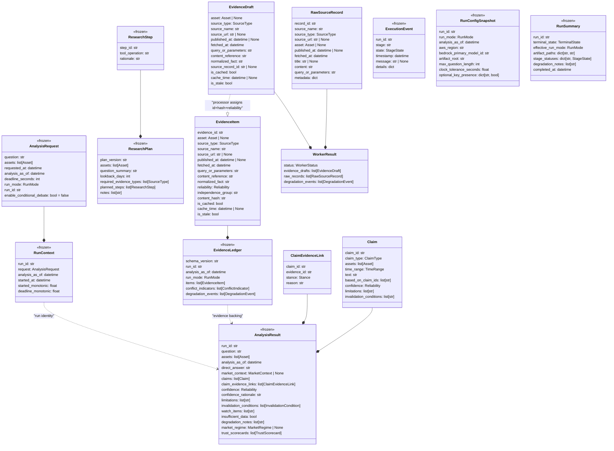

# Data Models

## Model Hierarchy



## Enumerations (13 total)

| Enum | Values | Usage |
|---|---|---|
| `Asset` | `BTC`, `ETH`, `SOL`, `BNB`, `XRP` | Supported crypto assets |
| `RunMode` | `official`, `rehearsal`, `demo` | Execution mode |
| `SourceType` | `official`, `market`, `news`, `onchain`, `social`, `macro` | Evidence source classification |
| `Reliability` | `high`, `medium`, `low` | Static source reliability + confidence level |
| `Stance` | `supports`, `opposes`, `neutral` | Claim-evidence link direction |
| `ClaimType` | `fact`, `inference`, `conclusion` | Claim layer in DAG |
| `TrustLevel` | `strong`, `moderate`, `weak`, `unavailable` | Trust scorecard dimension levels |
| `RegimeLabel` | `trending_up`, `trending_down`, `range_bound`, `high_volatility`, `mixed`, `unavailable` | Market state classification |
| `InvalidationOperator` | `lt`, `lte`, `gt`, `gte` | Quantified threshold comparison |
| `WorkerStatus` | `completed`, `partial`, `failed` | Worker execution outcome |
| `StageState` | `pending`, `running`, `completed`, `degraded`, `failed`, `cancelled` | Pipeline stage lifecycle |
| `TerminalState` | `completed`, `degraded`, `failed`, `cancelled` | Final run outcome |

All enums are `str`-backed for direct JSON serialization.


## Core Models (40 classes in `src/hoya_agent/models.py`)

### AnalysisRequest

The immutable run input. Frozen after creation.

**Validation rules:**
- `assets`: 1–2 unique supported assets
- `run_id`: format `run_YYYYMMDD_HHMMSS_<suffix>`
- `requested_at`, `analysis_as_of`: must be timezone-aware UTC (offset 00:00)
- `deadline_seconds`: (0, 900]
- `question`: stripped, non-blank
- `enable_conditional_debate`: default false (MVP always routes to Arbiter)
- Official mode rejects caller-supplied `analysis_as_of` (enforced in `build_run_context`)

---

### RunContext

Immutable run-scoped timing and request state. Created by `clock.build_run_context()`.

**Fields:**
- `run_id`: format `run_YYYYMMDD_HHMMSS_<suffix>`, must match `request.run_id`
- `request`: the frozen `AnalysisRequest`
- `analysis_as_of`: UTC datetime, must match `request.analysis_as_of`
- `started_at`: UTC datetime of run start
- `started_monotonic`: non-negative monotonic clock reading at start
- `deadline_monotonic`: must equal `started_monotonic + request.deadline_seconds`

**Model validator (`_consistent_with_request`):**
- `run_id == request.run_id`
- `analysis_as_of == request.analysis_as_of`
- In official mode: `analysis_as_of == started_at` (frozen to injected clock)
- `deadline_monotonic == started_monotonic + deadline_seconds`

---

### ResearchStep

A single planned operation in a research plan.

**Fields:**
- `step_id`: non-blank string
- `tool_operation`: non-blank string (from allowlist, validated at execution time)
- `rationale`: non-blank string explaining why this step is needed

---

### ResearchPlan

Bounded Planner output. Operation allowlisting is enforced at execution time, not in the model.

**Fields:**
- `plan_version`: non-blank, default `"planner-v1"`
- `assets`: 1–2 unique supported assets
- `question_summary`: non-blank summary of the input question
- `lookback_days`: positive integer, default 14
- `required_evidence_types`: list of `SourceType` values (may be empty)
- `planned_steps`: 1–8 steps with unique `step_id` values
- `asset_question_mismatch_warning`: optional non-blank string (logged when question text disagrees with assets)
- `notes`: list of non-blank strings


---

### EvidenceItem

A validated, processor-assigned evidence record.

**Key constraints:**
- `evidence_id`: format `ev_NNN` (3+ digits)
- `asset`: supported asset or `None` only for genuinely market-wide context (e.g. Fear & Greed)
- `content_hash`: exactly 64 lowercase hex characters (SHA-256)
- `source_url`: valid HTTP(S) URL without credentials, or `None`
- `published_at`: UTC or `None` (only when provider truly supplies no source time)
- `fetched_at`: required, UTC
- `query_or_parameters`: non-blank (reproducibility params, no credentials)
- `content_reference`: non-blank (short quotation/metric/range)
- `normalized_fact`: non-blank (one factual proposition, no recommendation)
- Cache consistency: `is_cached=false` requires `cache_time=None`; `is_cached=true` requires `cache_time`
- `extra="forbid"` — no undeclared fields allowed
- Note: `fetched_at` vs `published_at` ordering deferred to Evidence Processor (requires configured clock tolerance)

---

### EvidenceDraft

Pre-processor form of evidence. Produced by adapters and data layer before `evidence_id`, `reliability`, `independence_group`, and `content_hash` are assigned by the Evidence Processor.

**Fields (same as EvidenceItem minus processor-assigned fields, plus):**
- `source_record_id`: optional non-blank string, for linking back to the originating `RawSourceRecord`
- Same URL/timestamp/cache validation as EvidenceItem
- No `stance` field — stance lives on `ClaimEvidenceLink` only

---

### RawSourceRecord

Normalized provider record before Evidence admission. Carries full content for LLM extraction.

**Fields:**
- `record_id`: non-blank unique identifier from the adapter
- `source_name`: non-blank provider name
- `source_type`: `SourceType` enum
- `source_url`: valid HTTP(S) URL or `None`
- `asset`: supported `Asset` or `None`
- `published_at`: UTC datetime or `None`
- `fetched_at`: required UTC datetime
- `title`: optional non-blank string
- `content`: non-blank full text content
- `query_or_parameters`: non-blank (reproducibility, no credentials)
- `metadata`: `dict[str, str | int | float | bool | None]` (extensible adapter-specific metadata, default empty)

---

### WorkerResult

Outcome from Market Worker or Research Agent execution.

**Fields:**
- `status`: `WorkerStatus` enum (`completed` | `partial` | `failed`)
- `evidence_drafts`: list of `EvidenceDraft` (ready for processor admission)
- `raw_records`: list of `RawSourceRecord` (for LLM extraction or audit trail)
- `degradation_events`: list of `DegradationEvent` (failures/timeouts encountered)


---

### EvidenceLedger

The frozen, validated collection of all evidence for a run.

**Invariants:**
- Items sorted by `evidence_id`
- No duplicate `evidence_id` values
- Empty ledger valid ONLY with `degradation_events` explaining why
- `schema_version` is non-blank (default `"1.0"`)

---

### Claim

A structured assertion in the fact→inference→conclusion DAG.

**Layering rules:**
- `fact`: `based_on_claim_ids` must be empty; requires ≥1 non-neutral evidence link
- `inference`: `based_on_claim_ids` must reference earlier facts/inferences (not conclusions); requires supporting links
- `conclusion`: `based_on_claim_ids` must reference facts/inferences (not other conclusions); requires supporting links (unless `insufficient_data=true`)

**Additional constraints:**
- `claim_id`: format `cl_NNN`
- `confidence`: uses `Reliability` enum (`high` | `medium` | `low`)
- No self-dependency
- `assets`: 1–2 unique supported assets, must be ⊆ result assets
- `time_range.end` ≤ `analysis_as_of` date
- No cycles in dependency graph
- `limitations`, `invalidation_conditions`: list of non-blank strings

---

### ClaimEvidenceLink

Connects a claim to its supporting/opposing evidence.

**Rules:**
- `claim_id`: format `cl_NNN`, must resolve in result
- `evidence_id`: format `ev_NNN`, resolution against ledger deferred to Task 5/8
- `reason`: non-blank, explains the relationship (not restating the evidence)
- One evidence item may support one claim and oppose another
- `neutral` provides context but cannot satisfy conclusion coverage

---

### AnalysisResult

The top-level output from the Arbiter. Frozen, with extensive aggregate validators.

**Aggregate invariants (model validators):**
- `insufficient_data=true` → `confidence` must be `low`
- `assets`: 1–2 unique supported assets
- Claim graph is a DAG (no cycles, DFS coloring verification)
- All claim `assets` ⊆ result `assets`
- All claim `time_range.end` ≤ `analysis_as_of` date
- Inference deps must be listed earlier in claims array and be fact/inference type
- Conclusion deps must be fact/inference type (never conclusion)
- All `link.claim_id` references resolve within result's claims
- Every fact has ≥1 non-neutral link
- Every inference has ≥1 supporting link
- Every conclusion has ≥1 supporting link (unless `insufficient_data=true`)
- Trust scorecards reference only conclusion claims present in result

**Cross-artifact invariants (deferred, NOT validated here):**
- `link.evidence_id` resolution against ledger → Task 5/8
- Confidence caps from material conflict/independence groups → Task 5/6
- `InvalidationCondition.threshold` equality against ledger value → Task 6


---

## Runtime and Orchestration Models

### ExecutionEvent

One line of `execution_log.jsonl`. Frozen after creation.

**Fields:**
- `run_id`: format `run_YYYYMMDD_HHMMSS_<suffix>`
- `stage`: non-blank stage name
- `state`: `StageState` enum (`pending` | `running` | `completed` | `degraded` | `failed` | `cancelled`)
- `timestamp`: required UTC datetime
- `message`: optional non-blank string
- `details`: `dict[str, str | int | float | bool | None]` (default empty, for structured metadata)

---

### RunConfigSnapshot

Sanitized configuration persisted in `run_config.json`. Frozen after creation.

**Fields:**
- `run_id`: format `run_YYYYMMDD_HHMMSS_<suffix>`
- `run_mode`: `RunMode` enum
- `analysis_as_of`: UTC datetime
- `aws_region`: non-blank AWS region string
- `bedrock_primary_model_id`: non-blank model identifier
- `artifact_root`: non-blank path to artifact output directory
- `max_question_length`: integer (configured question length cap)
- `clock_tolerance_seconds`: float (fetched-vs-published slack tolerance)
- `optional_key_presence`: `dict[str, bool]` (records whether optional keys like `CRYPTOPANIC_API_TOKEN` are configured, never values)

---

### RunSummary

Final run outcome summary. Frozen after creation.

**Fields:**
- `run_id`: format `run_YYYYMMDD_HHMMSS_<suffix>`
- `terminal_state`: `TerminalState` enum (`completed` | `degraded` | `failed` | `cancelled`)
- `effective_run_mode`: `RunMode` enum
- `artifact_paths`: `dict[str, str]` mapping artifact names to paths (non-blank keys/values)
- `stage_statuses`: `dict[str, StageState]` mapping stage names to final states (non-blank keys)
- `degradation_notes`: list of non-blank strings
- `completed_at`: required UTC datetime


---

## Creativity Layer Models (Requirement 16)

### MarketRegime

Deterministic market state classification per §16.3.

**Fields:**
- `asset`: `Asset` enum
- `label`: `RegimeLabel` enum
- `as_of`: `str` (YYYY-MM-DD validated date)
- `window_days`: positive integer
- `metrics`: `dict[str, float]` (e.g. `return_window`, `realized_vol_pctile`, `range_position`)
- `thresholds`: `dict[str, float]` (e.g. `trend_return_abs_min`, `range_return_abs_max`, `high_vol_pctile`)
- `evidence_id`: `str | None` (format `ev_NNN`, required unless `label="unavailable"`)

**Payload shape validator:**
- When `label == "unavailable"`: metrics/thresholds may be empty, evidence_id may be None
- Any other label: metrics must be non-empty, thresholds must be non-empty, evidence_id required

---

### TrustScorecard

Produced per conclusion claim. All dimensions are deterministic.

**Fields:**
- `claim_id`: format `cl_NNN`, must reference a conclusion claim in result
- `source_independence`: `SourceIndependenceDimension`
- `source_diversity`: `SourceDiversityDimension`
- `reliability_mix`: `ReliabilityMix`
- `consistency`: `ConsistencyDimension`
- `freshness`: `FreshnessDimension`
- `rationale`: non-blank string

### SourceIndependenceDimension

- `level`: `TrustLevel` + `distinct_groups`: int ≥ 0
- Mapping: strong ≥ 3, moderate = 2, weak = 1, unavailable = 0

### SourceDiversityDimension

- `level`: `TrustLevel` + `distinct_source_types`: int ≥ 0
- Mapping: strong ≥ 3, moderate = 2, weak = 1, unavailable = 0

### ReliabilityMix

- `high`: int ≥ 0, `medium`: int ≥ 0, `low`: int ≥ 0

### ConsistencyDimension

- `level`: `TrustLevel` + `has_material_conflict`: bool + `opposing_count`: int ≥ 0
- Mapping: `has_material_conflict=true` → weak (requires opposing ≥ 1); `false` + opposing=0 → strong; `false` + opposing>0 → moderate

### FreshnessDimension

- `level`: `TrustLevel` + `newest_evidence_age_hours`: float | None + `has_stale`: bool
- `has_stale=true` precludes strong
- `newest_evidence_age_hours=None` ↔ `unavailable` (biconditional)

---

### InvalidationCondition

Quantified or qualitative invalidation condition per §16.4.

**Fields:**
- `text`: always present, non-blank
- `metric`: optional non-blank string
- `operator`: optional `InvalidationOperator` enum
- `threshold`: optional float
- `basis_evidence_id`: optional format `ev_NNN`

**All-or-nothing validator:** if any of (metric, operator, threshold, basis_evidence_id) is present, ALL must be present. Zero or four structured fields.


---

## Supporting Models

### ConflictIndicator

```python
class ConflictIndicator(BaseModel):
    claim_id: str                       # cl_NNN format
    supporting_evidence_ids: list[str]  # ev_NNN format
    opposing_evidence_ids: list[str]    # ev_NNN format
    independence_groups: list[str]      # non-blank
    rule_version: str                   # non-blank, default "1.0"
```

Material conflict criteria: same claim has supports+opposes links from different independence groups with reliability ≥ medium.

---

### DegradationEvent

```python
class DegradationEvent(BaseModel):
    stage: str           # non-blank
    event_type: str      # non-blank
    source: str          # non-blank
    message: str         # non-blank
    timestamp: datetime  # UTC
```

---

### TimeRange / MarketContext

```python
class TimeRange(BaseModel):
    start: str  # YYYY-MM-DD (validated as real calendar date)
    end: str    # YYYY-MM-DD, must be ≥ start

class MarketContext(BaseModel):
    summary: str         # non-blank
    time_range: TimeRange
```

---

### EvidenceListRow (Projection)

```python
class EvidenceListRow(BaseModel, frozen=True):
    source: str              # non-blank (from source_name)
    fetched_at: datetime     # UTC
    content_reference: str   # non-blank
    related_claim: list[str] # cl_NNN format, unique, sorted
```

Produced by `project_evidence_list(items, links)` for requirements AC 5.7. One row per EvidenceItem; `related_claim` collects all claim IDs that link to that evidence.

---

## Data Layer Types (from `data/types.py` and `evidence/drafts.py`)

### MarketBar (`data/types.py`)

```python
@dataclass(frozen=True)
class MarketBar:
    date: date
    open: float
    high: float
    low: float
    close: float
    volume: float
```

### MarketWindows (`data/market_worker.py`)

```python
@dataclass(frozen=True)
class MarketWindows:
    return_days: int = 14
    volatility_days: int = 30
    drawdown_days: int = 90
    volume_days: int = 30
```

---

## Provisional Seams (`_provisional_seams.py`)

The following types exist as temporary runtime stand-ins from Task 2. They coexist with the canonical models until the swap task merges them:

- `ExecutionEvent` (provisional) — wider log-format shape with `schema_version`, `event_type`, `duration_ms`, `provider_or_model`, `parameters`, `attempt`, `input_count`, `output_count`, `error_category`
- `RunConfigSnapshot` (provisional) — wider config shape with `schema_version`, `prompt_versions`, `policy_versions`, `configured_sources`, `terminal_state`, `stage_durations_ms`, `artifact_checksums`, `failures`
- `RunSummary` (provisional dataclass) — `run_id`, `terminal_state`, `run_mode`, `artifact_paths`
- `RunContext` (provisional dataclass) — `run_id`, `run_mode`, `question`, `assets`, `analysis_as_of`, `deadline_seconds`
- `PipelineOutcome` — `ledger`, `result`, `terminal_state`, `degradation_notes`, `stage_durations_ms`

The canonical Pydantic models in `models.py` (documented above) take precedence. The provisional seams will be removed once the swap task lands.

---

## Model Count Summary

| Category | Count | Classes |
|---|---|---|
| Enums | 13 | Asset, RunMode, SourceType, Reliability, Stance, ClaimType, TrustLevel, RegimeLabel, InvalidationOperator, WorkerStatus, StageState, TerminalState (+ 1 helper: `_ZERO_OFFSET`) |
| Core domain models | 11 | AnalysisRequest, RunContext, ResearchStep, ResearchPlan, EvidenceItem, EvidenceDraft, RawSourceRecord, WorkerResult, Claim, ClaimEvidenceLink, AnalysisResult |
| Ledger/artifact models | 4 | EvidenceLedger, ConflictIndicator, DegradationEvent, EvidenceListRow |
| Runtime models | 3 | ExecutionEvent, RunConfigSnapshot, RunSummary |
| Creativity layer | 9 | MarketRegime, TrustScorecard, SourceIndependenceDimension, SourceDiversityDimension, ReliabilityMix, ConsistencyDimension, FreshnessDimension, InvalidationCondition, MarketContext |
| Supporting | 1 | TimeRange |
| **Total** | **40** | (excluding helper function `project_evidence_list`) |

## 2026-08-01 model update

Runtime artifact models now carry the normative execution-log/run-config/UI fields. `RunContext` keeps immutable request/timing state and exposes run-mode/question/assets/deadline properties. Canonical regime supports explicit `unavailable`. See `s8-s9-s9b.md`.
