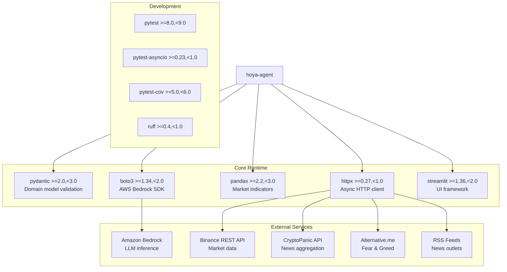

# Dependencies

## Dependency Overview

## Production Dependencies

| Package | Version Range | Purpose | Used In |
|---|---|---|---|
| `pydantic` | `>=2.0,<3.0` | Domain model validation with `extra="forbid"`, frozen models, field validators | `models.py`, `config.py`, `reasoning/schemas.py`, all shared contracts |
| `httpx` | `>=0.27,<1.0` | Async HTTP client for all external API calls | `adapters/binance.py`, `adapters/cryptopanic.py`, `adapters/rss.py`, `adapters/alternative_me.py`, `adapters/official.py`, `adapters/live_sources.py`, `adapters/port_adapters.py`, `application.py` |
| `pandas` | `>=2.2,<3.0` | DataFrame operations for deterministic market indicators | `data/indicators.py`, `data/price_analysis.py`, `data/regime.py`, `calc/indicators.py`, `calc/cross_asset.py` |
| `boto3` | `>=1.34,<2.0` | AWS SDK for Bedrock Runtime Converse API | `adapters/bedrock.py`, `composition.py` (via `BedrockLLMClient`) |
| `streamlit` | `>=1.36,<2.0` | Web UI framework (single-process with application) | `ui/streamlit_app.py` (Bronze UI, offline-only) |

## Core Infrastructure Modules

### `config.py` — Environment Parsing Boundary

The single place where environment variables are parsed into a typed, frozen Pydantic model. All downstream code receives a `Settings` instance — never raw `os.environ` lookups.

- **Entry point:** `Settings.from_env(env=None)` — reads from `os.environ` by default or an injected mapping.
- **Enforced hard caps:**
  - `llm_call_timeout_seconds` — max 45 seconds (validated ≤45)
  - `max_evidence_for_arbiter` — max 30 items (validated in [1, 30])
  - `max_question_length` — 2000 characters (default, used by `validate_request()`)
- **Sanitized output:** `Settings.sanitized_snapshot(request)` → `RunConfigSnapshot` for `run_config.json` (records key *presence*, never values).
- `Settings` has `ConfigDict(extra="forbid", frozen=True)` — no undeclared fields, immutable after creation.

### `ports.py` — Protocol Hub

Defines all async Protocol interfaces for dependency injection and testability. No concrete I/O lives here.

| Protocol | Purpose | Key Methods |
|---|---|---|
| `Clock` | UTC + monotonic time injection | `now_utc()`, `monotonic()` |
| `LLMClient` | Bedrock structured output abstraction | `converse_structured(operation, messages, schema, max_tokens, deadline, ...)` |
| `SourceAdapter[SourceT]` | Generic source fetcher | `fetch(context, **params)` |
| `MarketDataAdapter` | OHLCV bar provider | `fetch_daily_bars(asset, start, end, context)`, `fetch_snapshot(asset, context)` |
| `ResearchSourceAdapter` | News/RSS record provider | `fetch(operation, context, **params) → list[RawSourceRecord]` |
| `ProgressSink` | Execution event publishing | `publish(event)` |
| `ArtifactStore` | Artifact persistence | `write_text(...)`, `write_json(...)`, `append_event(...)` |
| `PersistencePort` | Run summary storage (future) | `save_summary(...)`, `get_summary(...)`, `save_artifact_references(...)` |
| `ToolRegistry` | Allowlisted operation dispatch | `operations()`, `is_allowed(op)`, `invoke(op, **params)` |

Also provides `StaticToolRegistry` — an immutable, configuration-backed implementation of `ToolRegistry` with duplicate/blank-name validation.

### `clock.py` — Time Injection

Provides `SystemClock` (production) and the `build_run_context(request, clock)` factory that:

1. Calls `clock.now_utc()` and validates it is timezone-aware UTC.
2. In `official` mode, freezes `analysis_as_of` to the current wall-clock time.
3. Records `started_monotonic` and computes `deadline_monotonic` from the request's `deadline_seconds`.
4. Returns an immutable `RunContext` used by all downstream stages.

Tests inject `FixedClock` (from `tests/fakes.py`) to eliminate real sleeps and wall-clock dependencies.

## Adapter Layer

### Provider Adapters (`adapters/`)

All external I/O is flat — one file per provider (11 files, excl. `__init__.py`):

| Adapter File | Provider | Auth | Reliability |
|---|---|---|---|
| `organizer_csv.py` | Competition OHLCV CSV | None | `high` |
| `binance.py` | Binance public REST klines | None | `high` |
| `cryptopanic.py` | CryptoPanic news aggregation | API token (optional) | `low` |
| `alternative_me.py` | Fear & Greed Index | None | `low` |
| `rss.py` | First-party news outlet RSS | None | `medium` |
| `official.py` | Official project announcement feeds | None | `high` (best-effort) |
| `live_sources.py` | Live Binance + Fear & Greed factories (Silver pipeline) | None | `high` / `low` |
| `bedrock.py` | AWS Bedrock Converse API | Instance role | N/A (not evidence) |
| `_assets.py` | Asset symbol utilities | — | — |
| `_errors.py` | Normalized timeout/http_error/malformed/rejected categories | — | — |

### `port_adapters.py` — Async Port Wrappers

Bridges P2's synchronous fetchers to the async `ports.py` Protocol interfaces using `asyncio.to_thread` for sync→async bridging. This avoids blocking the event loop during file I/O or synchronous HTTP calls.

| Adapter Class | Satisfies Protocol | Wraps |
|---|---|---|
| `CsvMarketAdapter` | `MarketDataAdapter` | `organizer_csv.load_organizer_csv` (sync file read via `asyncio.to_thread`) |
| `BinanceMarketAdapter` | `MarketDataAdapter` | `binance.fetch_binance_daily` (sync httpx via `asyncio.to_thread`) |
| `RssResearchAdapter` | `ResearchSourceAdapter` | `rss.fetch_rss_news` (sync httpx via `asyncio.to_thread`) → maps `EvidenceDraft` to `RawSourceRecord` |
| `CryptoPanicResearchAdapter` | `ResearchSourceAdapter` | `cryptopanic.fetch_cryptopanic_news` |
| `FearGreedResearchAdapter` | `ResearchSourceAdapter` | `alternative_me.fetch_fear_greed` (market-wide, `asset=None`) |
| `OfficialAnnouncementsResearchAdapter` | `ResearchSourceAdapter` | `official.fetch_official_announcements` (best-effort) |

Pattern: each wrapper calls `asyncio.to_thread(sync_function, ...)` so the underlying synchronous `httpx.Client` or file I/O does not block the orchestrator's event loop.

## Development Dependencies

| Package | Version Range | Purpose |
|---|---|---|
| `pytest` | `>=8.0,<9.0` | Test framework with markers (integration, acceptance, live) |
| `pytest-asyncio` | `>=0.23,<1.0` | Async test support (`asyncio_mode = "auto"`) |
| `pytest-cov` | `>=5.0,<6.0` | Code coverage reporting |
| `ruff` | `>=0.4,<1.0` | Linting (E, F, W, I rules) + formatting (py312, 120 chars) |

## External Services

### Amazon Bedrock (LLM)

- **SDK:** `boto3` Bedrock Runtime client
- **API:** Converse API with forced tool use for structured output
- **Auth:** EC2 instance role (no stored credentials)
- **Config keys:** `BEDROCK_PRIMARY_MODEL_ID`, `BEDROCK_FALLBACK_MODEL_ID`
- **Constraints:** ≤45s timeout per call (enforced by `Settings`), 1 retry for throttling, 1 schema repair attempt
- **Used by:** Planner, Research Agent, Arbiter (each 1 call per run)

### Binance Public REST API

- **Base URL:** `https://api.binance.com/api/v3/klines`
- **Auth:** None required (public endpoint)
- **Data:** Daily UTC klines (OHLCV)
- **Symbol mapping:** `{ASSET}USDT` (coin-agnostic)
- **Constraints:** ≤45s timeout, graceful degradation on failure
- **Used by:** Market Worker (via `BinanceMarketAdapter`)

### CryptoPanic API

- **Base URL:** `https://cryptopanic.com/api/v1/posts/`
- **Auth:** API token (optional — degrades gracefully without it)
- **Config key:** `CRYPTOPANIC_API_TOKEN`
- **Data:** Aggregated crypto news filtered by currency
- **Reliability:** Always `low` (aggregator, not original publisher)
- **Used by:** Research Agent (via adapter)

### Alternative.me Fear & Greed Index

- **Base URL:** `https://api.alternative.me/fng/`
- **Auth:** None
- **Data:** Whole-market sentiment index (not coin-specific)
- **Reliability:** Always `low` (social/aggregator)
- **Note:** `asset=None` in evidence drafts (market-wide context only)
- **Used by:** Research Agent (via adapter)

### RSS Feeds (configurable)

- **Sources:** CoinDesk, Decrypt, and other crypto news outlets
- **Auth:** None
- **Data:** News articles with publication timestamps
- **Reliability:** `medium` (original publishers with URL and timestamp)
- **Used by:** Research Agent (via `RssResearchAdapter`)

### Official Project Announcement Feeds

- **Sources:** Project-specific announcement feeds (`adapters/official.py::OFFICIAL_FEEDS`)
- **Auth:** None
- **Data:** Official project announcements (best-effort fetch)
- **Reliability:** `high` when present (original publisher), best-effort delivery
- **Used by:** Research Agent (via `OfficialAnnouncementsResearchAdapter`)

## Standard Library Usage

Key stdlib modules used (no additional packages needed):

| Module | Usage |
|---|---|
| `asyncio` | Pipeline orchestration, fork-join, deadlines; `asyncio.to_thread` for sync→async in `port_adapters.py` |
| `datetime` | Timezone-aware UTC timestamps throughout |
| `pathlib` | File path handling |
| `hashlib` | SHA-256 for content dedup and artifact checksums |
| `time` | `time.monotonic()` for deadline arithmetic (via `Clock` protocol) |
| `json` | Artifact serialization |
| `re` | ID format validation (run_id, ev_id, cl_id patterns) |
| `enum` | Asset, RunMode, SourceType, Reliability, etc. |
| `dataclasses` | Frozen dataclasses for evidence/worker types |
| `collections` | Graph traversal helpers |
| `os` | `os.replace()` for atomic file writes |

## Dependency Constraints

### What's NOT Allowed (per tech steering)

The following frameworks/libraries are explicitly excluded from the project:

- **LangGraph** — no agent orchestration framework
- **AWS Strands Agents** — no agent framework
- **FastAPI** — Streamlit is the only web framework
- **Celery / Redis** — no task queue or message broker
- **Vector databases** — no embedding storage
- **CoinGecko** — listed as post-hackathon Future Work only
- **Any additional LLM framework** — raw Bedrock Converse only

### Version Pinning Strategy

- All dependencies use **bounded ranges** (lower + upper bound)
- A reproducible lock file is required before deployment (not yet generated)
- No open-ended version ranges (e.g., no `>=2.0` without upper bound)

## Implicit Dependencies (via boto3/pandas)

These are transitive dependencies that come with the declared packages:

| Parent | Notable Transitive | Relevance |
|---|---|---|
| `boto3` | `botocore`, `s3transfer`, `jmespath` | AWS request signing, response parsing |
| `pandas` | `numpy`, `python-dateutil`, `pytz`/`tzdata` | Numerical computation, date handling |
| `pydantic` | `pydantic-core`, `typing-extensions` | Validation engine |
| `httpx` | `httpcore`, `certifi`, `idna`, `sniffio`, `anyio` | HTTP/2, TLS, async I/O |
| `streamlit` | `tornado`, `protobuf`, `altair`, `click` | Web server, UI components |

## Data Dependencies

### Competition Dataset

- **Path:** `HOYA_BIT_crypto_market_dataset/`
- **Contents:** Daily OHLCV CSVs for BTC, ETH, SOL, BNB, XRP
- **File pattern:** `{ASSET}_daily_ohlcv.csv`
- **Source label:** `public_market_data` (never attributed to any exchange)
- **Used as:** Offline baseline data via `adapters/organizer_csv.py` → `CsvMarketAdapter`

### Prompt Files

- **Path:** `prompts/`
- **Files:** `planner-v1.md`, `research-extraction-v1.md`, `arbiter-v1.md`
- **Format:** Markdown with YAML frontmatter (prompt_id, version, schema, operation, language)
- **Loaded by:** `reasoning/prompt_library.py`
- **Language:** Traditional Chinese (zh-Hant)

## Environment Variables

| Variable | Required | Purpose | Parsed By |
|---|---|---|---|
| `AWS_REGION` | Yes | Bedrock endpoint region | `Settings.from_env()` |
| `BEDROCK_PRIMARY_MODEL_ID` | Yes | Primary Bedrock model ARN/ID | `Settings.from_env()` |
| `ARTIFACT_ROOT` | Yes | Base path for run artifact directories | `Settings.from_env()` |
| `BEDROCK_FALLBACK_MODEL_ID` | No | Optional fallback model for throttling | `Settings.from_env()` |
| `CRYPTOPANIC_API_TOKEN` | No | CryptoPanic API access (degrades without) | `Settings.from_env()` |
| `HOYA_DATA_DIR` | No | Override path to competition dataset | `adapters/organizer_csv.py` |
| `HTTP_CONNECT_TIMEOUT_SECONDS` | No | httpx connect timeout (default 5.0) | `Settings.from_env()` |
| `HTTP_READ_TIMEOUT_SECONDS` | No | httpx read timeout (default 20.0) | `Settings.from_env()` |
| `MAX_EVIDENCE_FOR_ARBITER` | No | Evidence cap for Arbiter (default 30, hard max 30) | `Settings.from_env()` |
| `LLM_CALL_TIMEOUT_SECONDS` | No | Per-call LLM timeout (default 45, hard max 45) | `Settings.from_env()` |
| `ALLOW_RECORDED_DEMO_FALLBACK` | No | Enable demo mode recorded bundles | `Settings.from_env()` |
| `LOG_LEVEL` | No | Logging verbosity (default INFO) | `Settings.from_env()` |
| `RUN_LIVE_TESTS` | No (test only) | Gate for `tests/live/` network/Bedrock tests (set `=1`) | `tests/live/conftest.py` (`os.getenv`) |

**Security rules:**
- `.env` is local-only, excluded from Git
- `run_config.json` records key *presence* (bool), never values
- No credentials in image layers, compose files, or artifacts
