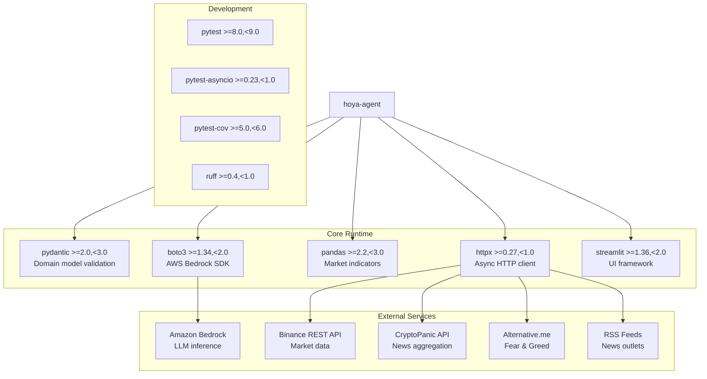

# Dependencies

## Dependency Overview

## Production Dependencies

| Package | Version Range | Purpose | Used In |
|---|---|---|---|
| `pydantic` | `>=2.0,<3.0` | Domain model validation with `extra="forbid"`, frozen models, field validators | `models.py`, `_provisional_seams.py`, all shared contracts |
| `httpx` | `>=0.27,<1.0` | Async HTTP client for all external API calls | `adapters/binance.py`, `adapters/cryptopanic.py`, `adapters/rss.py`, `adapters/alternative_me.py` |
| `pandas` | `>=2.2,<3.0` | DataFrame operations for deterministic market indicators | `data/indicators.py`, `data/price_analysis.py`, `data/regime.py` |
| `boto3` | `>=1.34,<2.0` | AWS SDK for Bedrock Runtime Converse API | `adapters/bedrock.py` |
| `streamlit` | `>=1.36,<2.0` | Web UI framework (single-process with application) | `streamlit_app.py` (not yet implemented) |

## Development Dependencies

| Package | Version Range | Purpose |
|---|---|---|
| `pytest` | `>=8.0,<9.0` | Test framework with markers (integration, acceptance, live) |
| `pytest-asyncio` | `>=0.23,<1.0` | Async test support (`asyncio_mode = "auto"`) |
| `pytest-cov` | `>=5.0,<6.0` | Code coverage reporting |
| `ruff` | `>=0.4,<1.0` | Linting (E, F, W, I rules) + formatting (py312, 120 chars) |

## External Services

### Amazon Bedrock (LLM)

- **SDK:** `boto3` Bedrock Runtime client
- **API:** Converse API with forced tool use for structured output
- **Auth:** EC2 instance role (no stored credentials)
- **Config keys:** `BEDROCK_PRIMARY_MODEL_ID`, `BEDROCK_FALLBACK_MODEL_ID`
- **Constraints:** ≤45s timeout per call, 1 retry for throttling, 1 schema repair attempt
- **Used by:** Planner, Research Agent, Arbiter (each 1 call per run)

### Binance Public REST API

- **Base URL:** `https://api.binance.com/api/v3/klines`
- **Auth:** None required (public endpoint)
- **Data:** Daily UTC klines (OHLCV)
- **Symbol mapping:** `{ASSET}USDT` (coin-agnostic)
- **Constraints:** ≤45s timeout, graceful degradation on failure
- **Used by:** Market Worker (via adapter)

### CryptoPanic API

- **Base URL:** `https://cryptopanic.com/api/v1/posts/`
- **Auth:** API token (optional — degrades gracefully without it)
- **Config key:** `CRYPTOPANIC_API_TOKEN`
- **Data:** Aggregated crypto news filtered by currency
- **Reliability:** Always `low` (aggregator, not original publisher)
- **Used by:** Research Agent (via adapter)

### Alternative.me Fear & Greed Index

- **Base URL:** `https://api.alternative.me/fng/`
- **Auth:** None
- **Data:** Whole-market sentiment index (not coin-specific)
- **Reliability:** Always `low` (social/aggregator)
- **Note:** `asset=None` in evidence drafts (market-wide context only)
- **Used by:** Research Agent (via adapter)

### RSS Feeds (configurable)

- **Sources:** CoinDesk, Decrypt, and other crypto news outlets
- **Auth:** None
- **Data:** News articles with publication timestamps
- **Reliability:** `medium` (original publishers with URL and timestamp)
- **Used by:** Research Agent (via adapter)

## Standard Library Usage

Key stdlib modules used (no additional packages needed):

| Module | Usage |
|---|---|
| `asyncio` | Pipeline orchestration, fork-join, deadlines |
| `datetime` | Timezone-aware UTC timestamps throughout |
| `pathlib` | File path handling |
| `hashlib` | SHA-256 for content dedup and artifact checksums |
| `time` | `time.monotonic()` for deadline arithmetic |
| `json` | Artifact serialization |
| `re` | ID format validation (run_id, ev_id, cl_id patterns) |
| `enum` | Asset, RunMode, SourceType, Reliability, etc. |
| `dataclasses` | Frozen dataclasses for evidence/worker types |
| `collections` | Graph traversal helpers |
| `os` | `os.replace()` for atomic file writes |

## Dependency Constraints

### What's NOT Allowed (per tech steering)

The following frameworks/libraries are explicitly excluded from the project:

- **LangGraph** — no agent orchestration framework
- **AWS Strands Agents** — no agent framework
- **FastAPI** — Streamlit is the only web framework
- **Celery / Redis** — no task queue or message broker
- **Vector databases** — no embedding storage
- **CoinGecko** — listed as post-hackathon Future Work only
- **Any additional LLM framework** — raw Bedrock Converse only

### Version Pinning Strategy

- All dependencies use **bounded ranges** (lower + upper bound)
- A reproducible lock file is required before deployment (not yet generated)
- No open-ended version ranges (e.g., no `>=2.0` without upper bound)

## Implicit Dependencies (via boto3/pandas)

These are transitive dependencies that come with the declared packages:

| Parent | Notable Transitive | Relevance |
|---|---|---|
| `boto3` | `botocore`, `s3transfer`, `jmespath` | AWS request signing, response parsing |
| `pandas` | `numpy`, `python-dateutil`, `pytz`/`tzdata` | Numerical computation, date handling |
| `pydantic` | `pydantic-core`, `typing-extensions` | Validation engine |
| `httpx` | `httpcore`, `certifi`, `idna`, `sniffio`, `anyio` | HTTP/2, TLS, async I/O |
| `streamlit` | `tornado`, `protobuf`, `altair`, `click` | Web server, UI components |

## Data Dependencies

### Competition Dataset

- **Path:** `HOYA_BIT_crypto_market_dataset/`
- **Contents:** Daily OHLCV CSVs for BTC, ETH, SOL, BNB, XRP
- **File pattern:** `{ASSET}_daily_ohlcv.csv`
- **Source label:** `public_market_data` (never attributed to any exchange)
- **Used as:** Offline baseline data via `adapters/organizer_csv.py`

### Prompt Files

- **Path:** `prompts/`
- **Files:** `planner-v1.md`, `research-extraction-v1.md`, `arbiter-v1.md`
- **Format:** Markdown with YAML frontmatter (prompt_id, version, schema, operation, language)
- **Loaded by:** `reasoning/prompt_library.py`
- **Language:** Traditional Chinese (zh-Hant)

## Environment Variables

| Variable | Required | Purpose |
|---|---|---|
| `BEDROCK_PRIMARY_MODEL_ID` | Yes | Primary Bedrock model ARN/ID |
| `BEDROCK_FALLBACK_MODEL_ID` | No | Optional fallback model for throttling |
| `CRYPTOPANIC_API_TOKEN` | No | CryptoPanic API access (degrades without) |
| `AWS_REGION` | Yes (via instance) | Bedrock endpoint region |
| `HOYA_DATA_DIR` | No | Override path to competition dataset |

**Security rules:**
- `.env` is local-only, excluded from Git
- `run_config.json` records key *presence* (bool), never values
- No credentials in image layers, compose files, or artifacts
