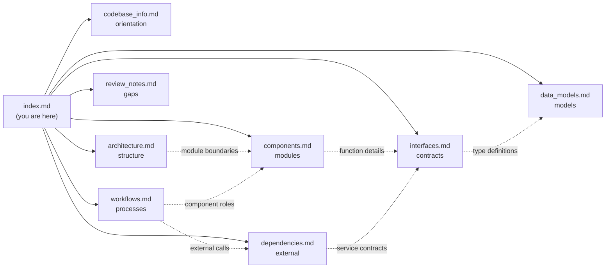

# Knowledge Base Index

## How to Use This Documentation

This index is designed as the **primary context file** for AI assistants working with the HOYA Market Agent codebase. By reading this file, you gain enough metadata to determine which detailed documentation file contains the information needed for any given question.

### Quick Routing Guide

| If you need to... | Consult |
|---|---|
| Understand what this project does and its tech stack | `codebase_info.md` |
| See the overall system design, pipeline flow, or deployment model | `architecture.md` |
| Find a specific module's responsibility or what it does | `components.md` |
| Look up a function signature, protocol, or API contract | `interfaces.md` |
| Understand a Pydantic model, its fields, or validation rules | `data_models.md` |
| Trace how a run executes, how errors are handled, or how artifacts are written | `workflows.md` |
| Check which packages are used, what services are called, or env vars needed | `dependencies.md` |
| Find gaps, inconsistencies, or areas needing attention | `review_notes.md` |

---

## File Summaries

### codebase_info.md
**Purpose:** Project identity, technology choices, layout, and key design decisions at a glance.

**Contains:**
- Project name, language, architecture style, current status
- Full technology stack table
- Supported assets (BTC/ETH/SOL/BNB/XRP)
- Competition constraints (900s deadline, 4 artifacts)
- Run modes (official/rehearsal/demo)
- Directory structure overview
- Key metrics (file counts, model counts, adapter counts)
- 7 core design decisions with rationale

**Use when:** You need a quick orientation, want to know what technologies are in play, or need to understand the project layout.

---

### architecture.md
**Purpose:** System structure, layer boundaries, pipeline flow, deadline management, error handling philosophy, and deployment model.

**Contains:**
- Full system overview Mermaid diagram (all layers and their connections)
- Layered architecture with dependency direction rules
- H2-Lite pipeline sequence diagram (6 phases)
- Deadline Gantt chart (stage budgets within 900s)
- Error handling flowchart (degradation-first philosophy)
- Module ownership table (what each module owns and must NOT do)
- Deployment architecture (Docker → ECR → EC2)
- List of frozen paths (do not modify without owner consent)
- `config.py`, `clock.py`, and `ports.py` as implemented core seams
- `port_adapters.py` as the async adapter bridge layer

**Use when:** You need to understand how components connect, what the execution flow looks like, how deadlines work, or where a new piece of code should go.

---

### components.md
**Purpose:** Detailed description of every major module — what it does, its key behaviors, and its constraints.

**Contains:**
- Component relationship Mermaid diagram
- 18+ component descriptions covering:
  - ApplicationService (entry point, run identity, artifact ordering)
  - Settings / config.py (typed environment parsing, sanitized snapshots, validation)
  - SystemClock / clock.py (injectable UTC/monotonic clock, official cutoff freeze)
  - Ports / ports.py (Protocol interfaces: Clock, LLMClient, SourceAdapter, MarketDataAdapter, ResearchSourceAdapter, ProgressSink, ArtifactStore, ToolRegistry, PersistencePort)
  - Port Adapters / port_adapters.py (CsvMarketAdapter, BinanceMarketAdapter, RssResearchAdapter)
  - Planner (bounded plan generation with deterministic fallback)
  - Research Agent (adapter execution + LLM extraction)
  - Arbiter (claim generation, structural validation, confidence caps)
  - Market Worker (deterministic indicators → evidence drafts)
  - Regime Classifier (market state labels)
  - Price Analysis (cross-asset comparison, anomalies, attribution)
  - Evidence Processor (rank, dedup, ID assignment)
  - Evidence Policies (reliability, independence, confidence caps)
  - Renderer (11-section Traditional Chinese report)
  - Artifact Store (atomic writes, streaming log)
  - BedrockLLMClient (structured output, repair, fallback)
  - Pipeline (current CSV-only increment + contract bridge)
  - Prompt Library (versioned prompt loading)
  - Conflict Extension (disabled H3 stub)
  - StaticToolRegistry (immutable operation map with allowlist enforcement)

**Use when:** You need to understand what a specific module does, what it can and cannot do, or how it relates to other modules.

---

### interfaces.md
**Purpose:** All function signatures, Protocol definitions, adapter contracts, and external API specifications.

**Contains:**
- Protocol hierarchy diagram (AnalysisPipeline, Clock, ProgressSink, LLMClient, MarketDataAdapter, ResearchSourceAdapter, ArtifactStore, PersistencePort, ToolRegistry)
- Core protocol definitions with full Python signatures (now in `ports.py`)
- `build_run_context()` function signature (clock.py — official cutoff freeze)
- `Settings.from_env()` and `Settings.sanitized_snapshot()` signatures (config.py)
- Market data adapter signatures (binance, organizer_csv) and port-adapter wrappers (CsvMarketAdapter, BinanceMarketAdapter)
- News/research adapter signatures (cryptopanic, rss, alternative_me) and port-adapter wrapper (RssResearchAdapter)
- Common return type: WorkerResult
- Data layer interfaces (indicators, market_worker, regime)
- Evidence layer interfaces (processor, policies)
- Reasoning layer interfaces (Planner, ResearchAgent, Arbiter)
- Reporting interfaces (renderer, artifact store)
- External API contracts (Binance, CryptoPanic, Alternative.me, Bedrock)
- Artifact output contracts (4 fixed files with write timing)

**Use when:** You need exact function signatures, want to know what a protocol requires, or need to understand an external API contract.

---

### data_models.md
**Purpose:** Complete Pydantic model documentation — every field, enum, validation rule, and invariant.

**Contains:**
- Model hierarchy class diagram (showing relationships)
- Enumeration table (12 enums with all values: Asset, RunMode, SourceType, Reliability, Stance, ClaimType, TrustLevel, RegimeLabel, InvalidationOperator, WorkerStatus, StageState, TerminalState)
- 40 model/class definitions total across:
  - Core request/evidence/claim models (AnalysisRequest, EvidenceItem, EvidenceDraft, EvidenceLedger, Claim, ClaimEvidenceLink, AnalysisResult)
  - Research planning models (ResearchStep, ResearchPlan)
  - Creativity layer models (MarketRegime, TrustScorecard, InvalidationCondition, plus 5 dimension sub-models)
  - Supporting models (ConflictIndicator, DegradationEvent, TimeRange, MarketContext, EvidenceListRow, RawSourceRecord)
  - Runtime models (ExecutionEvent, RunConfigSnapshot, RunContext, RunSummary, WorkerResult)
  - Data layer types (MarketBar, MarketWindows)
  - Configuration model (Settings with frozen fields + validators)
- `project_evidence_list()` helper function

**Use when:** You need to construct or validate a model instance, understand field constraints, or check the relationship between models.

---

### workflows.md
**Purpose:** Step-by-step process diagrams for all key system behaviors.

**Contains:**
- Complete analysis run sequence (end-to-end, 6 phases)
- LLM failure degradation (repair → fallback → deterministic default)
- Adapter failure degradation (graceful, never crashes)
- Evidence processing (rank → dedup → ID assignment → selection)
- Confidence cap application (deterministic post-LLM adjustments)
- Artifact write workflow (atomic tmp+replace with fsync)
- Development workflow (Red-Green-Refactor with test gates)
- Deployment workflow (Docker → ECR → EC2)
- Cross-asset comparison (Requirement 17 balanced evidence)
- Timeout and skip logic (escalating skip order under pressure)

**Use when:** You need to trace execution flow, understand error recovery paths, or implement a new stage that must fit the existing pattern.

---

### dependencies.md
**Purpose:** What external packages, services, and data sources the project uses and how they're configured.

**Contains:**
- Dependency graph (Mermaid showing package → service connections)
- Production dependency table (5 packages with versions and usage locations)
- Development dependency table (4 packages)
- External service contracts (Bedrock, Binance, CryptoPanic, Alternative.me, RSS)
- Standard library usage table
- Explicit exclusions (what's NOT allowed: LangGraph, FastAPI, etc.)
- Version pinning strategy
- Transitive dependency notes
- Data dependencies (competition dataset, prompt files)
- Environment variable reference (including new vars: HTTP_CONNECT_TIMEOUT_SECONDS, HTTP_READ_TIMEOUT_SECONDS, MAX_EVIDENCE_FOR_ARBITER, LLM_CALL_TIMEOUT_SECONDS, ALLOW_RECORDED_DEMO_FALLBACK, LOG_LEVEL)

**Use when:** You need to add a dependency, configure an external service, check what env vars are available, or understand what's explicitly excluded.

---

## Cross-Document Relationships

---

## Key Concepts Quick Reference

| Concept | Definition | Relevant Files |
|---|---|---|
| **H2-Lite** | Single-pass bounded workflow (Plan→Gather→Process→Reason→Render) | `architecture.md`, `workflows.md` |
| **Evidence-first** | Every factual claim traces to a validated EvidenceItem; LLM output is never evidence | `components.md`, `data_models.md` |
| **Deterministic fallback** | All LLM stages produce usable results without the model | `workflows.md`, `components.md` |
| **Coin-agnostic** | Pipeline takes asset as parameter; no per-coin branching | `codebase_info.md`, `components.md` |
| **Material conflict** | Same claim has supports+opposes from different groups with reliability ≥ medium | `data_models.md`, `workflows.md` |
| **Confidence caps** | Deterministic post-LLM ceiling on confidence (never loosened) | `workflows.md`, `data_models.md` |
| **Atomic writes** | tmp file + fsync + os.replace pattern for crash safety | `workflows.md`, `components.md` |
| **Static reliability** | Source reliability assigned by policy table, never by LLM | `components.md`, `dependencies.md` |
| **Independence group** | Deduplicated upstream source identity (prevents counting reposts) | `data_models.md`, `interfaces.md` |

---

## Example Queries

Here are examples of how to use this documentation effectively:

- **"How does the Arbiter handle invalid LLM output?"** → `components.md` (Arbiter section) + `workflows.md` (LLM failure degradation)
- **"What fields does EvidenceItem require?"** → `data_models.md` (EvidenceItem section)
- **"What happens when Binance times out?"** → `workflows.md` (Adapter failure) + `components.md` (Market Worker)
- **"Where should I add a new adapter?"** → `architecture.md` (module boundaries) + `interfaces.md` (adapter signatures)
- **"What env vars do I need for deployment?"** → `dependencies.md` (Environment Variables section)
- **"How are confidence levels determined?"** → `workflows.md` (Confidence cap workflow) + `data_models.md` (ConfidenceSignals)
- **"What's the report structure?"** → `components.md` (Renderer) + `interfaces.md` (Renderer interface)
- **"How does config.py parse settings?"** → `components.md` (Settings) + `interfaces.md` (Settings.from_env)
- **"What protocols must a new adapter implement?"** → `interfaces.md` (MarketDataAdapter/ResearchSourceAdapter) + `components.md` (Port Adapters)
- **"How is the official cutoff frozen?"** → `components.md` (SystemClock) + `interfaces.md` (build_run_context)
