# Interfaces

## Interface Overview

```mermaid
classDiagram
    class AnalysisPipeline {
        <<Protocol>>
        +execute(context: RunContext, emit: EventEmitter) PipelineOutcome
    }
    
    class Clock {
        <<Protocol>>
        +now_utc() datetime
        +monotonic() float
    }
    
    class ProgressSink {
        <<Protocol>>
        +publish(event: ExecutionEvent) None
    }
    
    class LLMClient {
        <<Protocol>>
        +converse_structured(operation, messages, schema, max_tokens, deadline, system_prompt) BaseModel
    }

    class SourceAdapter~SourceT~ {
        <<Protocol>>
        +fetch(context, **params) SourceT
    }

    class MarketDataAdapter {
        <<Protocol>>
        +fetch_daily_bars(asset, start, end, context) object
        +fetch_snapshot(asset, context) object
    }

    class ResearchSourceAdapter {
        <<Protocol>>
        +fetch(operation, context, **params) list~RawSourceRecord~
    }

    class ArtifactStore {
        <<Protocol>>
        +write_text(run_id, filename, content) str
        +write_json(run_id, filename, payload) str
        +append_event(run_id, event) str
    }

    class PersistencePort {
        <<Protocol>>
        +save_summary(summary) None
        +get_summary(run_id) RunSummary | None
        +save_artifact_references(run_id, references) None
    }

    class ToolRegistry {
        <<Protocol>>
        +operations() tuple~str~
        +is_allowed(operation) bool
        +invoke(operation, **params) object
    }

    class LocalArtifactStore {
        +write_text(name, text) bool
        +write_json(name, payload) bool
        +append_event(event) bool
        +checksums() dict
        +disclose_missing(terminal_state) None
    }

    ApplicationService --> AnalysisPipeline
    ApplicationService --> Clock
    ApplicationService --> LocalArtifactStore
    Planner --> LLMClient
    Planner --> ToolRegistry
    ResearchAgent --> LLMClient
    ResearchAgent --> ResearchSourceAdapter
    Arbiter --> LLMClient
    MarketWorker --> MarketDataAdapter
```



## Core Protocols

### Clock

**Location:** `src/hoya_agent/ports.py` (runtime_checkable)

```python
@runtime_checkable
class Clock(Protocol):
    def now_utc(self) -> datetime: ...
    def monotonic(self) -> float: ...
```

**Purpose:** Injects time so tests use fixed clocks without patching `datetime.now()`.

**Rules:**
- `now_utc()` returns timezone-aware UTC datetime (never naive)
- `monotonic()` returns `time.monotonic()` equivalent for deadline arithmetic
- Official mode freezes `analysis_as_of` from `now_utc()` at run start

**Concrete implementation:** `SystemClock` in `src/hoya_agent/clock.py`

---

### LLMClient

**Location:** `src/hoya_agent/ports.py` (runtime_checkable)

```python
@runtime_checkable
class LLMClient(Protocol):
    async def converse_structured(
        self,
        *,
        operation: str,
        messages: Sequence[Mapping[str, Any]],
        schema: type[ModelT],
        max_tokens: int,
        deadline: float,
        system_prompt: str = "",
    ) -> ModelT: ...
```

**Consumers:** Planner, ResearchAgent, Arbiter (each makes exactly 1 call per run)

**Guarantees:**
- Output validates against `schema` before returning
- At most 1 repair attempt within the same `deadline`
- At most 1 model fallback switch for retryable errors
- Raises typed exceptions: `LLMSchemaError`, `LLMTimeoutError`, `LLMUnavailableError`
- Never logs prompt text, credentials, or chain-of-thought

**Concrete implementation:** `BedrockLLMClient` in `src/hoya_agent/adapters/bedrock.py`

---

### SourceAdapter[SourceT]

**Location:** `src/hoya_agent/ports.py`

```python
SourceT = TypeVar("SourceT", covariant=True)

class SourceAdapter(Protocol[SourceT]):
    async def fetch(self, *, context: RunContext, **params: object) -> SourceT: ...
```

**Purpose:** Generic fetch boundary for any external source. Specializations (`MarketDataAdapter`, `ResearchSourceAdapter`) extend this pattern with typed methods.

---

### MarketDataAdapter

**Location:** `src/hoya_agent/ports.py`

```python
class MarketDataAdapter(Protocol):
    async def fetch_daily_bars(
        self,
        *,
        asset: Asset,
        start: date,
        end: date,
        context: RunContext,
    ) -> object: ...

    async def fetch_snapshot(self, *, asset: Asset, context: RunContext) -> object: ...
```

**Purpose:** Typed boundary for OHLCV bar sources. Returns bars filtered to the requested range.

**Concrete implementations:**
- `CsvMarketAdapter` in `src/hoya_agent/adapters/port_adapters.py` — organizer Daily OHLCV CSV (offline, deterministic)
- `BinanceMarketAdapter` in `src/hoya_agent/adapters/port_adapters.py` — Binance public klines (live baseline)

---

### ResearchSourceAdapter

**Location:** `src/hoya_agent/ports.py`

```python
class ResearchSourceAdapter(Protocol):
    async def fetch(
        self,
        *,
        operation: str,
        context: RunContext,
        **params: object,
    ) -> list[RawSourceRecord]: ...
```

**Purpose:** Typed boundary for news/research sources. Returns normalized `RawSourceRecord` items for downstream evidence admission.

**Concrete implementation:** `RssResearchAdapter` in `src/hoya_agent/adapters/port_adapters.py`

---

### ProgressSink

**Location:** `src/hoya_agent/ports.py` (runtime_checkable)

```python
@runtime_checkable
class ProgressSink(Protocol):
    async def publish(self, event: ExecutionEvent) -> None: ...
```

**Purpose:** Receives execution events for streaming to `execution_log.jsonl` and optional UI progress display.

---

### ArtifactStore

**Location:** `src/hoya_agent/ports.py`

```python
class ArtifactStore(Protocol):
    async def write_text(self, run_id: str, filename: str, content: str) -> str: ...
    async def write_json(self, run_id: str, filename: str, payload: object) -> str: ...
    async def append_event(self, run_id: str, event: ExecutionEvent) -> str: ...
```

**Purpose:** Async boundary for artifact persistence. Returns the path/reference where the content was stored.

---

### PersistencePort

**Location:** `src/hoya_agent/ports.py`

```python
class PersistencePort(Protocol):
    """Future-facing port; S1 intentionally supplies no persistent backend."""
    async def save_summary(self, summary: RunSummary) -> None: ...
    async def get_summary(self, run_id: str) -> RunSummary | None: ...
    async def save_artifact_references(self, run_id: str, references: Mapping[str, str]) -> None: ...
```

**Alias:** `RunPersistence = PersistencePort`

---

### ToolRegistry

**Location:** `src/hoya_agent/ports.py`

```python
class ToolRegistry(Protocol):
    def operations(self) -> tuple[str, ...]: ...
    def is_allowed(self, operation: str) -> bool: ...
    async def invoke(self, operation: str, **params: object) -> object: ...
```

**Purpose:** Configuration-backed allowlist of finite local operations the Planner may reference.

**Concrete implementation:** `StaticToolRegistry` in `src/hoya_agent/ports.py`

```python
class StaticToolRegistry:
    """Immutable, configuration-backed map of finite local operations."""

    def __init__(self, operations: Mapping[str, ToolOperation]) -> None: ...
    def operations(self) -> tuple[str, ...]: ...
    def is_allowed(self, operation: str) -> bool: ...
    async def invoke(self, operation: str, **params: object) -> object: ...
```

**Validation rules:**
- Operation names must not be blank
- Duplicate names raise `ValueError`
- Non-callable handlers raise `TypeError`
- Invoking a disallowed operation raises `PermissionError`

---

### AnalysisPipeline

**Location:** `src/hoya_agent/orchestration/pipeline.py`

```python
@runtime_checkable
class AnalysisPipeline(Protocol):
    async def execute(
        self,
        context: RunContext,
        emit: Callable[[ExecutionEvent], None],
    ) -> PipelineOutcome: ...
```

**Implementors:**
- `DeadlineAwarePipeline` (plan → market/research fork-join → ledger → Arbiter)
- `OrganizerCsvPipeline` (offline, CSV-only, no LLM; also used as the market branch)

**Contract:**
- Must respect `context.deadline_seconds` hard stop
- Must produce a valid `PipelineOutcome` even on total failure
- Must emit stage start/end events via `emit`
- `ledger` in outcome may be empty but must carry degradation events explaining why
- May raise `asyncio.CancelledError`; `ApplicationService` finalizes the four
  artifacts as `cancelled` and re-raises it

---

### DeadlineManager

**Location:** `src/hoya_agent/orchestration/deadline.py`

```python
class Stage(str, Enum):
    planner = "planner"
    gather = "gather"
    evidence = "evidence_processor"
    reason = "reason"
    artifact = "artifact"


class DeadlineManager:
    def __init__(self, clock: Clock, total_seconds: float, *,
                 started_monotonic: float | None = None,
                 analysis_hard_stop_seconds: float = 720.0) -> None: ...

    @classmethod
    def for_run(cls, context: RunContext, clock: Clock) -> DeadlineManager: ...

    def deadline_for(self, stage: Stage | None = None) -> float: ...
    def remaining(self, stage: Stage | None = None) -> float: ...
    def budget_for(self, stage: Stage | None = None, *,
                   timeout_seconds: float | None = None) -> float: ...
    def can_start(self, *, reserve_seconds: float = 0.0) -> bool: ...
    def budget_seconds(self) -> dict[str, float]: ...

    async def run(self, awaitable: Awaitable[T], *, stage: Stage | None = None,
                  timeout_seconds: float | None = None) -> T: ...


class OptionalWork(str, Enum):
    conditional_debate = "conditional_debate"          # H3 — never scheduled
    optional_context = "optional_context"
    counter_signal_second_search = "counter_signal_second_search"


SKIP_ORDER: tuple[OptionalWork, ...]   # the order work is *given up* in


def plan_optional_work(
    pending: Iterable[OptionalWork | str], *,
    remaining_seconds: float,
    default_cost_seconds: float,
    cost_seconds: Mapping[OptionalWork, float] | None = None,
) -> OptionalWorkPlan: ...            # .keep / .skipped / .reasons


def skip_note(work: OptionalWork) -> str: ...
```

**Contract:**
- Milestones are Features §5.6 offsets held as fractions of a reference 720-second
  window, so a shorter request deadline scales every stage
- Finalize reserve is `max(20% of total, min(60 s, half the run))`
- `remaining()` never returns a negative value; `run()` closes an un-started
  coroutine and raises `DeadlineExceeded` when the budget is already gone
- Callers receive a budget and never extend one
- `Stage` values are budget milestones, **not** execution-log stage names
- `plan_optional_work` drops from the front of `SKIP_ORDER` until the kept items fit;
  costs come from the caller, unknown work raises `ValueError`, and the result is
  deterministic. Enforcement is the pipeline's job, not the policy's.

---

### RunStateMachine

**Location:** `src/hoya_agent/orchestration/run_state.py`

```python
def stage_state_for(status: WorkerStatus | str) -> StageState: ...

def derive_terminal_state(states: Iterable[StageState], *,
                          run_cancelled: bool = False) -> TerminalState: ...


class RunStateMachine:
    def __init__(self, *, context: RunContext, clock: Clock,
                 emit: EventEmitter | None = None) -> None: ...

    def state_of(self, stage: str) -> StageState: ...
    def start(self, stage: str, *, message: str = "") -> None: ...
    def settle(self, stage: str, state: StageState, *, message: str = "",
               output_count: int | None = None,
               error_category: str | None = None) -> StageState: ...
    def settle_from_worker(self, stage: str, status: WorkerStatus | str, *,
                           message: str = "",
                           output_count: int | None = None) -> StageState: ...
    def cancel(self, stage: str, *, message: str = "") -> StageState: ...
    def cancel_run(self, *, message: str = "") -> TerminalState: ...
    def stage_durations_ms(self) -> dict[str, int]: ...
    def terminal_state(self) -> TerminalState: ...
```

**Contract:**
- `pending → running → {completed|degraded|failed|cancelled}`; illegal transitions
  raise `ValueError`. Settling without starting is legal (skipped optional work).
- `WorkerStatus.partial` maps to `StageState.degraded` — never to `completed`
- One cancelled/failed branch beside a completed sibling yields a **degraded** run;
  `cancel_run()` or all-cancelled yields **cancelled**; all-failed yields **failed**
- Stage keys are execution-log stage names (`market_worker`, `research_agent`, ...)

---

## Configuration Interfaces

### Settings

**Location:** `src/hoya_agent/config.py`

```python
class Settings(BaseModel):
    model_config = ConfigDict(extra="forbid", frozen=True)

    aws_region: str
    bedrock_primary_model_id: str
    artifact_root: Path
    bedrock_fallback_model_id: str | None = None
    cryptopanic_api_token: str | None = None
    http_connect_timeout_seconds: float = 5.0
    http_read_timeout_seconds: float = 20.0
    max_evidence_for_arbiter: int = 30
    llm_call_timeout_seconds: float = 45.0
    allow_recorded_demo_fallback: bool = False
    log_level: str = "INFO"
    max_question_length: int = 2000
    clock_tolerance_seconds: float = 5.0
    optional_key_presence: dict[str, bool]

    @classmethod
    def from_env(cls, env: Mapping[str, str] | None = None) -> "Settings": ...
    def validate_request(self, request: AnalysisRequest) -> None: ...
    def sanitized_snapshot(self, request: AnalysisRequest) -> RunConfigSnapshot: ...
```

**Key methods:**
- `from_env(env=None)` — parses from `os.environ` or provided mapping; raises `ValueError` on missing required vars
- `validate_request(request)` — enforces `max_question_length`; raises `ValueError`
- `sanitized_snapshot(request)` — produces a `RunConfigSnapshot` safe for artifact persistence (no secrets)

**Required environment variables:** `AWS_REGION`, `BEDROCK_PRIMARY_MODEL_ID`, `ARTIFACT_ROOT`

**Optional environment variables:** `BEDROCK_FALLBACK_MODEL_ID`, `CRYPTOPANIC_API_TOKEN`, `HTTP_CONNECT_TIMEOUT_SECONDS`, `HTTP_READ_TIMEOUT_SECONDS`, `MAX_EVIDENCE_FOR_ARBITER`, `LLM_CALL_TIMEOUT_SECONDS`, `ALLOW_RECORDED_DEMO_FALLBACK`, `LOG_LEVEL`

---

### SystemClock and build_run_context

**Location:** `src/hoya_agent/clock.py`

```python
class SystemClock:
    def now_utc(self) -> datetime: ...
    def monotonic(self) -> float: ...

def build_run_context(request: AnalysisRequest, clock: Clock) -> RunContext:
    """Create immutable timing state, freezing official cutoff from clock."""
```

**Rules:**
- `SystemClock` satisfies the `Clock` protocol from `ports.py`
- `build_run_context` freezes `analysis_as_of` to `clock.now_utc()` in `official` mode
- Raises `ValueError` if clock returns naive or non-UTC datetime
- Computes `deadline_monotonic = started_monotonic + request.deadline_seconds`

---

## Port Adapter Implementations

**Location:** `src/hoya_agent/adapters/port_adapters.py`

### CsvMarketAdapter

```python
class CsvMarketAdapter:
    """MarketDataAdapter over the organizer Daily OHLCV CSV (deterministic, offline)."""
    async def fetch_daily_bars(self, *, asset: Asset, start: date, end: date, context: RunContext): ...
    async def fetch_snapshot(self, *, asset: Asset, context: RunContext): ...
```

### BinanceMarketAdapter

```python
class BinanceMarketAdapter:
    """MarketDataAdapter over Binance public klines (live baseline)."""
    def __init__(self, client: httpx.Client | None = None) -> None: ...
    async def fetch_daily_bars(self, *, asset: Asset, start: date, end: date, context: RunContext): ...
    async def fetch_snapshot(self, *, asset: Asset, context: RunContext): ...
```

### RssResearchAdapter

```python
class RssResearchAdapter:
    """ResearchSourceAdapter over a first-party outlet RSS feed → RawSourceRecord[]."""
    def __init__(self, *, feed_url: str, source_name: str, publisher_domain: str,
                 client: httpx.Client | None = None) -> None: ...
    async def fetch(self, *, operation: str, context: RunContext, **params: object) -> list[RawSourceRecord]: ...
```

---

## Adapter Function Signatures

All adapters live in `src/hoya_agent/adapters/` and follow a common pattern:

### Market Data Adapters

```python
# binance.py
async def fetch_binance_daily(
    asset: str,
    analysis_as_of: datetime,
    client: httpx.AsyncClient,
    limit: int = 90,
    timeout: float = 30.0,
) -> tuple[list[MarketBar], list[str]]:
    """Returns (bars, degradation_notes). Never raises on HTTP failure."""

# organizer_csv.py
def load_organizer_csv(path: Path) -> list[MarketBar]:
    """Strict validation. Raises ValueError on bad data."""

def default_data_dir() -> Path:
    """Locates dataset directory via env var or filesystem traversal."""
```

### News/Research Adapters

```python
# cryptopanic.py
async def fetch_cryptopanic_news(
    assets: Sequence[str],
    analysis_as_of: datetime,
    client: httpx.AsyncClient,
    api_token: str | None,
    lookback_days: int = 7,
    timeout: float = 30.0,
) -> WorkerResult:
    """Returns WorkerResult with EvidenceDrafts. Never raises."""

# rss.py
async def fetch_rss_news(
    asset: str,
    analysis_as_of: datetime,
    client: httpx.AsyncClient,
    feed_url: str,
    source_name: str,
    publisher_domain: str,
    lookback_days: int = 7,
    timeout: float = 30.0,
) -> WorkerResult:
    """Returns WorkerResult. Never raises on HTTP/parse failure."""

# alternative_me.py
async def fetch_fear_greed(
    analysis_as_of: datetime,
    client: httpx.AsyncClient,
    limit: int = 7,
    timeout: float = 15.0,
) -> WorkerResult:
    """Returns whole-market Fear & Greed. asset=None in drafts."""
```

### Common Return Type: WorkerResult

```python
@dataclass(frozen=True)
class WorkerResult:
    status: str          # "completed" | "partial" | "failed"
    drafts: list[EvidenceDraft]
    degradation_notes: list[str]
```

---

## Data Layer Interfaces

### Indicator Functions

```python
# data/indicators.py — all pure functions, raise ValueError on insufficient data
def simple_return(closes: Sequence[float], window: int) -> float
def realized_volatility(closes: Sequence[float], window: int) -> float
def max_drawdown(closes: Sequence[float], window: int) -> float
def rolling_volume_zscore(volumes: Sequence[float], window: int) -> float
def daily_returns(closes: Sequence[float]) -> list[float]
def relative_change(a: float, b: float) -> float
```

### Market Worker

```python
# data/market_worker.py
def build_market_evidence(
    asset: str,
    bars: list[MarketBar],
    analysis_as_of: datetime,
    windows: MarketWindows = MarketWindows(),
) -> WorkerResult:
    """Computes 4 metrics independently. Each becomes a high-reliability draft."""
```

### Regime Classification

```python
# data/regime.py
def classify_regime(
    asset: str,
    bars: list[MarketBar],
    analysis_as_of: datetime,
    thresholds: RegimeThresholds = RegimeThresholds(),
) -> MarketRegime | None:
    """Returns None when insufficient bars."""
```

---

## Evidence Layer Interfaces

### Evidence Processor

```python
# evidence/processor.py
def build_ledger(
    drafts: list[EvidenceDraft],
    max_for_arbiter: int = 30,
) -> EvidenceLedger:
    """Rank, dedup, assign stable IDs. Fully deterministic."""
```

### Evidence Policies

```python
# evidence/policies.py
def reliability_for(source_class: SourceClass) -> str
def news_reliability(original_page_fetched: bool) -> str
def independence_group(
    original_publisher: str | None,
    source_url: str | None,
    provider_id: str | None,
) -> str
def max_confidence(signals: ConfidenceSignals) -> str
def registered_domain(url: str) -> str
```

---

## Reasoning Layer Interfaces

### Planner

```python
# reasoning/planner.py
class Planner:
    async def run(
        self,
        request: AnalysisRequest,
        tool_registry: ToolRegistry,
        deadline: float,
    ) -> tuple[Plan, list[str]]:
        """Returns (plan, degradation_notes). Never raises."""
```

### Research Agent

```python
# reasoning/research_agent.py
class ResearchAgent:
    async def run(
        self,
        plan: Plan,
        request: AnalysisRequest,
        deadline: float,
    ) -> ResearchOutcome:
        """Executes plan steps + 1 LLM extraction. Never raises."""
```

### Arbiter

```python
# reasoning/arbiter.py
class Arbiter:
    async def run(
        self,
        ledger: EvidenceLedger,
        request: AnalysisRequest,
        conflict_indicators: list[ConflictIndicator],
        deadline: float,
    ) -> tuple[AnalysisResult, list[str]]:
        """Returns (result, degradation_notes). Never raises."""
```

---

## Reporting Interfaces

### Renderer

```python
# reporting/renderer.py
def render(
    result: AnalysisResult,
    ledger: EvidenceLedger,
    *,
    lint: LintHook | None = None,
) -> str:
    """Deterministic Markdown rendering. Raises ValueError if lint fails."""

LintHook = Callable[[str], Sequence[str]]

def build_insufficient_data_result(
    request: AnalysisRequest,
    ledger: EvidenceLedger,
    reason: str,
) -> AnalysisResult:
    """Creates a low-confidence fallback result."""
```

### Artifact Store (Local Implementation)

```python
# reporting/artifacts.py
class LocalArtifactStore:
    def write_text(self, name: str, text: str) -> bool
    def write_json(self, name: str, payload: dict) -> bool
    def append_event(self, event: ExecutionEvent) -> bool
    def checksums(self) -> dict[str, str]
    def missing_artifacts(self) -> list[str]
    def disclose_missing(self, terminal_state: TerminalState) -> None
```

---

## External API Contracts

### Binance REST API

- **Endpoint:** `GET https://api.binance.com/api/v3/klines`
- **Parameters:** `symbol={ASSET}USDT`, `interval=1d`, `limit=N`
- **Auth:** None required
- **Timeout:** ≤45s

### CryptoPanic API

- **Endpoint:** `GET https://cryptopanic.com/api/v1/posts/`
- **Parameters:** `auth_token`, `currencies={asset}`, `kind=news`
- **Auth:** API token (optional — graceful degradation without it)
- **Timeout:** ≤30s

### Alternative.me Fear & Greed

- **Endpoint:** `GET https://api.alternative.me/fng/`
- **Parameters:** `limit=N`
- **Auth:** None
- **Timeout:** ≤15s

### Amazon Bedrock Converse API

- **Service:** `bedrock-runtime`
- **Operation:** `converse` with forced tool use
- **Auth:** EC2 instance role (IAM)
- **Models:** Primary + optional fallback (configured via env vars)
- **Config keys:** `BEDROCK_PRIMARY_MODEL_ID`, `BEDROCK_FALLBACK_MODEL_ID`

---

## Artifact Output Contracts

All runs produce exactly these 4 files:

| Artifact | Format | Written When |
|---|---|---|
| `run_config.json` | JSON | Run start (initial), finalized at end |
| `execution_log.jsonl` | JSONL (streaming) | Throughout run (append per event) |
| `evidence.json` | JSON | After Evidence Processor completes |
| `final_report.md` | Markdown (zh-Hant) | Last (after renderer completes) |

## 2026-08-01 interface update

Application/artifact consumers now use canonical `ExecutionEvent`, `RunConfigSnapshot`, `RunSummary`, `RunContext`, `Clock`, and `ProgressSink`. Pipeline outcomes live in `orchestration.pipeline`; provisional seams are deleted. See `s8-s9-s9b.md`.

## S8 Effective Data Mode Handoff

`PipelineOutcome.effective_data_mode: DataMode | None` carries the data origin that
actually completed the run. `ApplicationService` uses the requested mode when the
field is `None`, otherwise persists this effective value to both
`run_config.json` and `RunSummary`. The final snapshot is rebuilt with
`RunConfigSnapshot.model_validate`; `model_copy(update=...)` is prohibited here
because it skips validation and could allow an official run to claim fixture or
recorded data.
