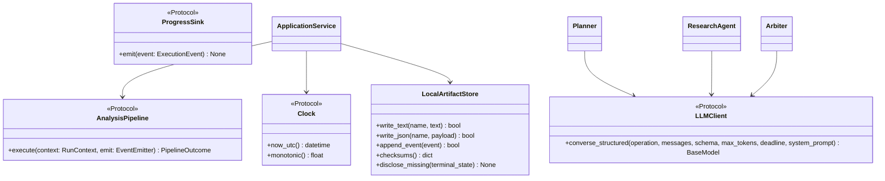

# Interfaces

## Interface Overview



## Core Protocols

### AnalysisPipeline

**Location:** `src/hoya_agent/_provisional_seams.py` (will move to `ports.py`)

```python
@runtime_checkable
class AnalysisPipeline(Protocol):
    async def execute(
        self,
        context: RunContext,
        emit: Callable[[ExecutionEvent], None],
    ) -> PipelineOutcome: ...
```

**Implementors:**
- `OrganizerCsvPipeline` (current — offline, CSV-only, no LLM)
- Full pipeline (planned — with Market Worker + Research Agent fork-join)

**Contract:**
- Must respect `context.deadline_seconds` hard stop
- Must produce a valid `PipelineOutcome` even on total failure
- Must emit stage start/end events via `emit`
- `ledger` in outcome may be empty but must carry degradation events explaining why

---

### Clock

**Location:** `src/hoya_agent/_provisional_seams.py` (will move to `clock.py`)

```python
@runtime_checkable
class Clock(Protocol):
    def now_utc(self) -> datetime: ...
    def monotonic(self) -> float: ...
```

**Purpose:** Injects time so tests use fixed clocks without patching `datetime.now()`.

**Rules:**
- `now_utc()` returns timezone-aware UTC datetime (never naive)
- `monotonic()` returns `time.monotonic()` equivalent for deadline arithmetic
- Official mode freezes `analysis_as_of` from `now_utc()` at run start

---

### ProgressSink

**Location:** `src/hoya_agent/_provisional_seams.py` (will move to `ports.py`)

```python
@runtime_checkable
class ProgressSink(Protocol):
    def emit(self, event: ExecutionEvent) -> None: ...
```

**Purpose:** Receives execution events for streaming to `execution_log.jsonl` and optional UI progress display.

---

### LLMClient (via BedrockLLMClient)

**Location:** `src/hoya_agent/adapters/bedrock.py`

```python
async def converse_structured(
    self,
    *,
    operation: str,
    messages: list[dict],
    schema: type[BaseModel],
    max_tokens: int,
    deadline: float,
    system_prompt: str,
) -> BaseModel: ...
```

**Consumers:** Planner, ResearchAgent, Arbiter (each makes exactly 1 call per run)

**Guarantees:**
- Output validates against `schema` before returning
- At most 1 repair attempt within the same `deadline`
- At most 1 model fallback switch for retryable errors
- Raises typed exceptions: `LLMSchemaError`, `LLMTimeoutError`, `LLMUnavailableError`
- Never logs prompt text, credentials, or chain-of-thought

---

## Adapter Function Signatures

All adapters live in `src/hoya_agent/adapters/` and follow a common pattern:

### Market Data Adapters

```python
# binance.py
async def fetch_binance_daily(
    asset: str,
    analysis_as_of: datetime,
    client: httpx.AsyncClient,
    limit: int = 90,
    timeout: float = 30.0,
) -> tuple[list[MarketBar], list[str]]:
    """Returns (bars, degradation_notes). Never raises on HTTP failure."""

# organizer_csv.py
def load_organizer_csv(path: Path) -> list[MarketBar]:
    """Strict validation. Raises ValueError on bad data."""

def default_data_dir() -> Path:
    """Locates dataset directory via env var or filesystem traversal."""
```

### News/Research Adapters

```python
# cryptopanic.py
async def fetch_cryptopanic_news(
    assets: Sequence[str],
    analysis_as_of: datetime,
    client: httpx.AsyncClient,
    api_token: str | None,
    lookback_days: int = 7,
    timeout: float = 30.0,
) -> WorkerResult:
    """Returns WorkerResult with EvidenceDrafts. Never raises."""

# rss.py
async def fetch_rss_news(
    asset: str,
    analysis_as_of: datetime,
    client: httpx.AsyncClient,
    feed_url: str,
    source_name: str,
    publisher_domain: str,
    lookback_days: int = 7,
    timeout: float = 30.0,
) -> WorkerResult:
    """Returns WorkerResult. Never raises on HTTP/parse failure."""

# alternative_me.py
async def fetch_fear_greed(
    analysis_as_of: datetime,
    client: httpx.AsyncClient,
    limit: int = 7,
    timeout: float = 15.0,
) -> WorkerResult:
    """Returns whole-market Fear & Greed. asset=None in drafts."""
```

### Common Return Type: WorkerResult

```python
@dataclass(frozen=True)
class WorkerResult:
    status: str          # "completed" | "partial" | "failed"
    drafts: list[EvidenceDraft]
    degradation_notes: list[str]
```

---

## Data Layer Interfaces

### Indicator Functions

```python
# data/indicators.py — all pure functions, raise ValueError on insufficient data
def simple_return(closes: Sequence[float], window: int) -> float
def realized_volatility(closes: Sequence[float], window: int) -> float
def max_drawdown(closes: Sequence[float], window: int) -> float
def rolling_volume_zscore(volumes: Sequence[float], window: int) -> float
def daily_returns(closes: Sequence[float]) -> list[float]
def relative_change(a: float, b: float) -> float
```

### Market Worker

```python
# data/market_worker.py
def build_market_evidence(
    asset: str,
    bars: list[MarketBar],
    analysis_as_of: datetime,
    windows: MarketWindows = MarketWindows(),
) -> WorkerResult:
    """Computes 4 metrics independently. Each becomes a high-reliability draft."""
```

### Regime Classification

```python
# data/regime.py
def classify_regime(
    asset: str,
    bars: list[MarketBar],
    analysis_as_of: datetime,
    thresholds: RegimeThresholds = RegimeThresholds(),
) -> MarketRegime | None:
    """Returns None when insufficient bars."""
```

---

## Evidence Layer Interfaces

### Evidence Processor

```python
# evidence/processor.py
def build_ledger(
    drafts: list[EvidenceDraft],
    max_for_arbiter: int = 30,
) -> EvidenceLedger:
    """Rank, dedup, assign stable IDs. Fully deterministic."""
```

### Evidence Policies

```python
# evidence/policies.py
def reliability_for(source_class: SourceClass) -> str
def news_reliability(original_page_fetched: bool) -> str
def independence_group(
    original_publisher: str | None,
    source_url: str | None,
    provider_id: str | None,
) -> str
def max_confidence(signals: ConfidenceSignals) -> str
def registered_domain(url: str) -> str
```

---

## Reasoning Layer Interfaces

### Planner

```python
# reasoning/planner.py
class Planner:
    async def run(
        self,
        request: AnalysisRequest,
        tool_registry: ToolRegistry,
        deadline: float,
    ) -> tuple[Plan, list[str]]:
        """Returns (plan, degradation_notes). Never raises."""
```

### Research Agent

```python
# reasoning/research_agent.py
class ResearchAgent:
    async def run(
        self,
        plan: Plan,
        request: AnalysisRequest,
        deadline: float,
    ) -> ResearchOutcome:
        """Executes plan steps + 1 LLM extraction. Never raises."""
```

### Arbiter

```python
# reasoning/arbiter.py
class Arbiter:
    async def run(
        self,
        ledger: EvidenceLedger,
        request: AnalysisRequest,
        conflict_indicators: list[ConflictIndicator],
        deadline: float,
    ) -> tuple[AnalysisResult, list[str]]:
        """Returns (result, degradation_notes). Never raises."""
```

---

## Reporting Interfaces

### Renderer

```python
# reporting/renderer.py
def render(
    result: AnalysisResult,
    ledger: EvidenceLedger,
    *,
    lint: LintHook | None = None,
) -> str:
    """Deterministic Markdown rendering. Raises ValueError if lint fails."""

LintHook = Callable[[str], Sequence[str]]

def build_insufficient_data_result(
    request: AnalysisRequest,
    ledger: EvidenceLedger,
    reason: str,
) -> AnalysisResult:
    """Creates a low-confidence fallback result."""
```

### Artifact Store

```python
# reporting/artifacts.py
class LocalArtifactStore:
    def write_text(self, name: str, text: str) -> bool
    def write_json(self, name: str, payload: dict) -> bool
    def append_event(self, event: ExecutionEvent) -> bool
    def checksums(self) -> dict[str, str]
    def missing_artifacts(self) -> list[str]
    def disclose_missing(self, terminal_state: TerminalState) -> None
```

---

## External API Contracts

### Binance REST API

- **Endpoint:** `GET https://api.binance.com/api/v3/klines`
- **Parameters:** `symbol={ASSET}USDT`, `interval=1d`, `limit=N`
- **Auth:** None required
- **Timeout:** ≤45s

### CryptoPanic API

- **Endpoint:** `GET https://cryptopanic.com/api/v1/posts/`
- **Parameters:** `auth_token`, `currencies={asset}`, `kind=news`
- **Auth:** API token (optional — graceful degradation without it)
- **Timeout:** ≤30s

### Alternative.me Fear & Greed

- **Endpoint:** `GET https://api.alternative.me/fng/`
- **Parameters:** `limit=N`
- **Auth:** None
- **Timeout:** ≤15s

### Amazon Bedrock Converse API

- **Service:** `bedrock-runtime`
- **Operation:** `converse` with forced tool use
- **Auth:** EC2 instance role (IAM)
- **Models:** Primary + optional fallback (configured via env vars)
- **Config keys:** `BEDROCK_PRIMARY_MODEL_ID`, `BEDROCK_FALLBACK_MODEL_ID`

---

## Artifact Output Contracts

All runs produce exactly these 4 files:

| Artifact | Format | Written When |
|---|---|---|
| `run_config.json` | JSON | Run start (initial), finalized at end |
| `execution_log.jsonl` | JSONL (streaming) | Throughout run (append per event) |
| `evidence.json` | JSON | After Evidence Processor completes |
| `final_report.md` | Markdown (zh-Hant) | Last (after renderer completes) |
