# Workflows

## Gold local Exit workflow

Run `PYTHONPATH=src python scripts/run_acceptance.py` for two independent BTC/ETH
offline rehearsal runs. The acceptance suite checks asset allowlisting, market-data
degradation, fixed artifact parsing/checksums, Evidence provenance, deterministic
rendering, and the minute-12 deadline/finalize reserve. See
`docs/rehearsals/run-log.md` for the recorded verification.

## Primary Workflow: Complete Analysis Run

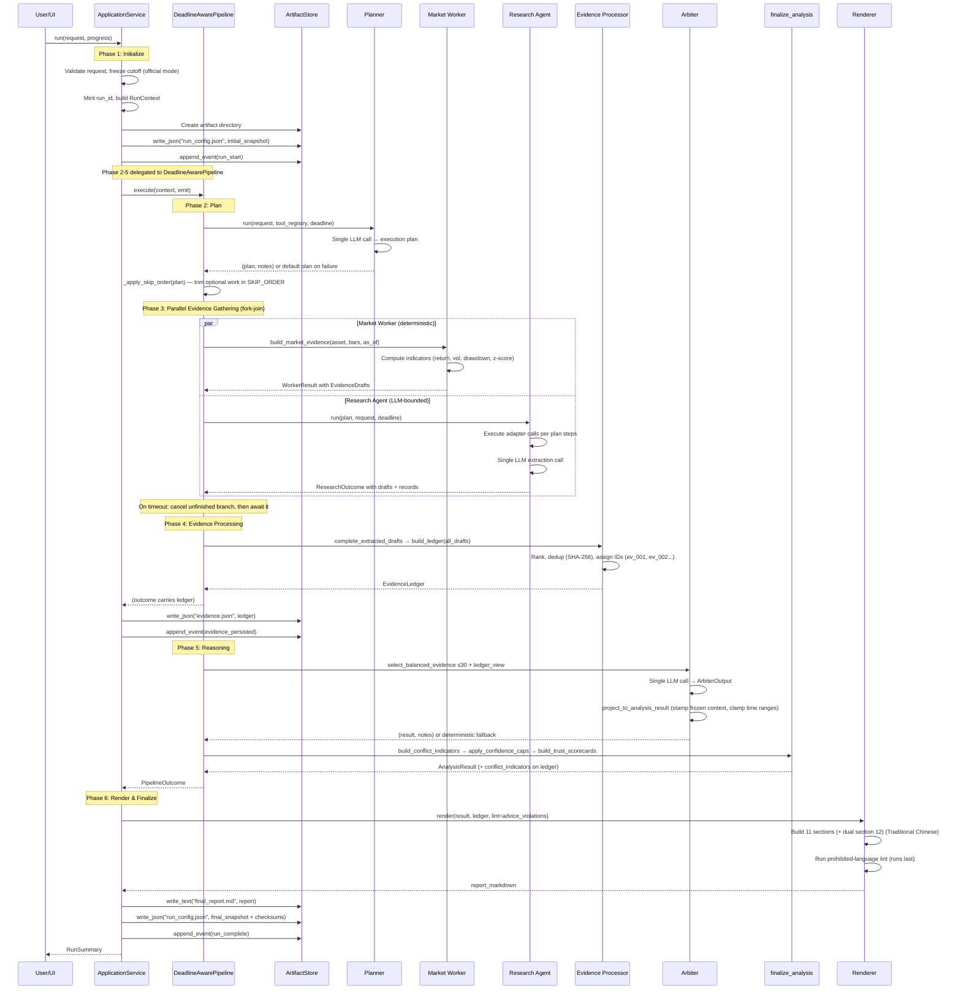

---

## Degradation Workflow: LLM Failure

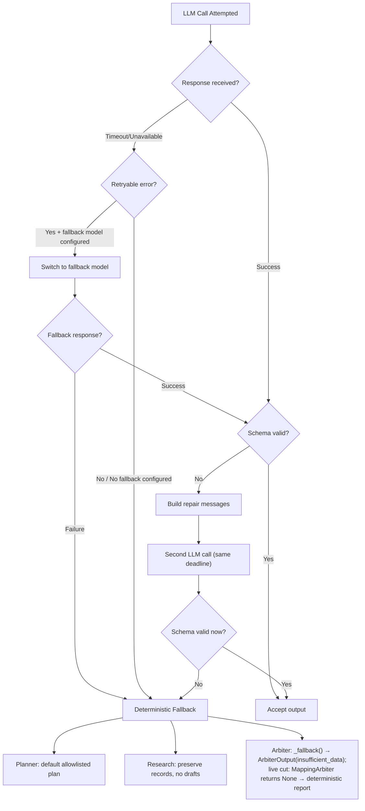

---

## Degradation Workflow: Adapter Failure

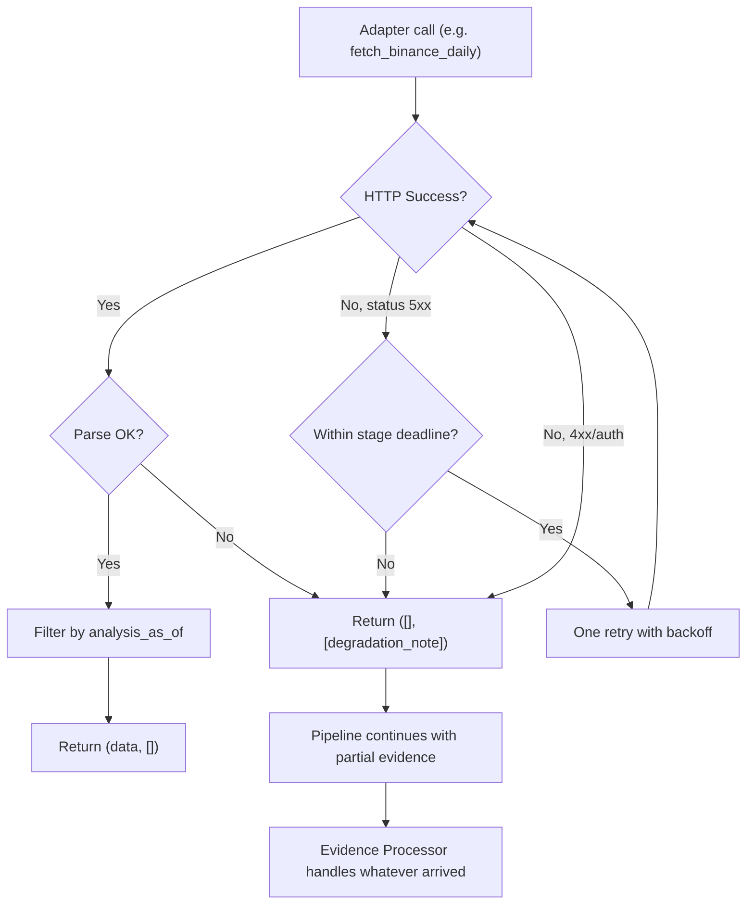

---

## Deadline and Fork-Join Workflow

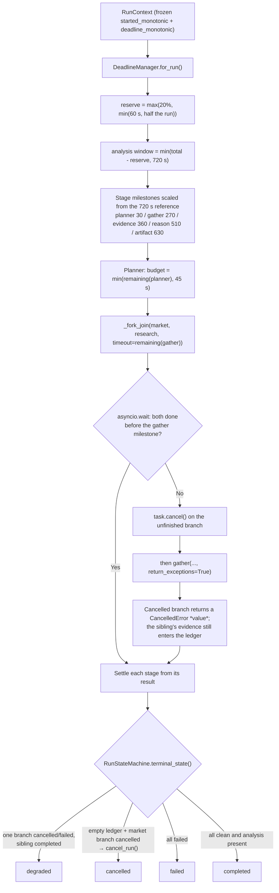

**Caller-initiated cancellation** takes a different route, in `application.py`:

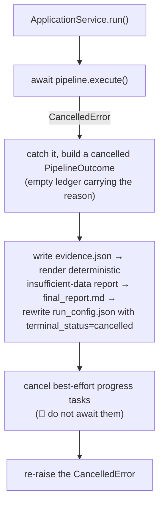

**Why the finalize path must be await-free:** inside an already-cancelled task, the
next `await` raises `CancelledError` again immediately, so the remaining artifact
writes would never happen. Every step between the catch and the re-raise is
synchronous, and `progress_tasks` are cancelled rather than awaited.
Finalizing is not suppressing — the error is always re-raised.

**Invariants:**
- `time.monotonic()` drives every budget; UTC timestamps are only persisted
- The acquisition window has exactly one owner (the fork-join). Branches clamp only
  their own per-call timeout, because two clamps on the same milestone make
  "which one cancelled this branch" a race
- Cancel first, then await. No pending task reaches the Evidence stage
- `asyncio.CancelledError` is never suppressed — outer cancellation tears the
  children down and re-raises
- Below `MIN_ARBITER_SECONDS` (5 s) the Arbiter is skipped so the deterministic
  finalize keeps its reserve; the run falls back deterministically and discloses it

**Now triggered in a real run:** `application.build_research_pipeline()` declares the
source lists — baseline (`fetch_rss_news`), optional context (`fetch_fear_greed`,
`fetch_official_announcements`) and counter-signal (`fetch_cryptopanic_news`) — which
is what makes the fixed skip order fire in a real run instead of only in its unit
tests. A non-allowlisted research host is rejected at registry construction, before
any request. The live cut (`composition.build_live_pipeline`) runs without a
Planner/Research branch, so the skip order does not apply there.

---

## Optional-Work Skip Order

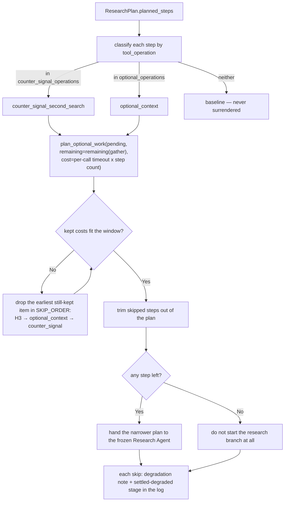

**Invariants:**
- The order is owned in one place (`deadline.SKIP_ORDER`); no caller may reorder it
- Costs come from the caller (configured per-call timeout × planned calls) — the policy
  invents no estimates
- Baseline research is never surrendered. If every planned step was optional and none
  fits, the branch is not started rather than run as bookkeeping
- H3 is in the order's vocabulary but is never classified or scheduled, so it is never
  reported as skipped — that would imply the run had a debate stage to give up
- Enforcement uses the existing interface (a narrower `ResearchPlan`), so the frozen
  `reasoning/research_agent.py` is untouched

---

## Evidence Processing Workflow

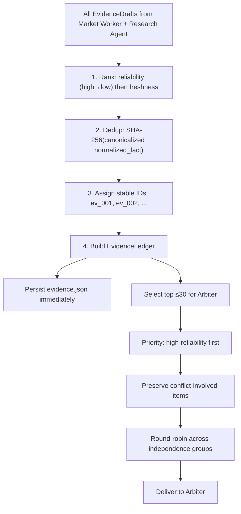

---

## Confidence Cap Workflow

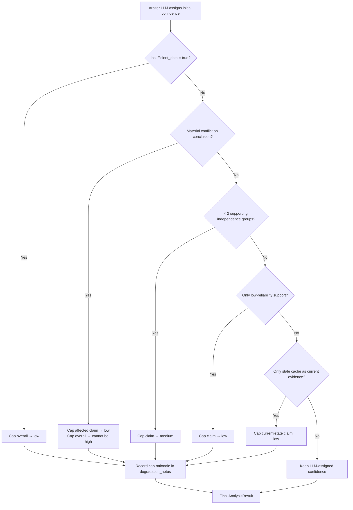

---

## Artifact Write Workflow

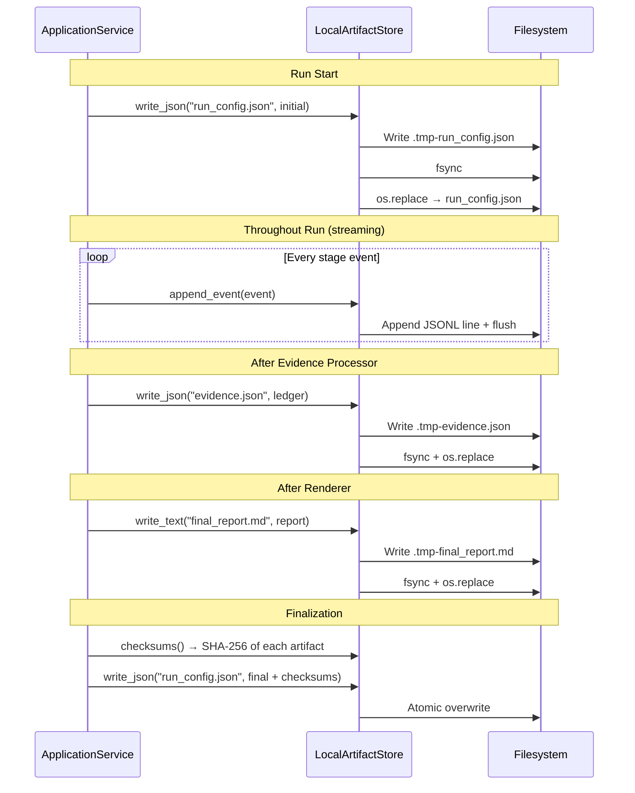

---

## Development Workflow: Red-Green-Refactor

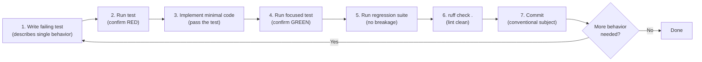

### Test Infrastructure

- **`tests/conftest.py`** — Handles `sys.path` bootstrap, inserting the `src/` directory so that `hoya_agent` is importable from any test without requiring an editable install. This is the root-level conftest loaded by pytest before any test module.

- **`tests/fakes.py`** — Provides shared deterministic fakes used across all test layers (unit, contract, integration, acceptance):

  | Fake | Satisfies Protocol | Purpose |
  |---|---|---|
  | `FixedClock` | `Clock` | Returns a fixed UTC `now_utc()` and monotonic value; supports `advance(seconds)` for deadline tests |
  | `FakeLLM` | `LLMClient` | Pops pre-configured `BaseModel` responses (or raises exceptions) from a queue; records all calls |
  | `FakeSourceAdapter` | `SourceAdapter` | Returns a canned result and records call parameters |
  | `FakeMarketDataAdapter` | `MarketDataAdapter` | Returns canned bars/snapshot; records `(method, params)` tuples |
  | `InMemoryProgressSink` | `ProgressSink` | Collects `ExecutionEvent` instances in a list |
  | `InMemoryArtifactStore` | `ArtifactStore` | Stores artifacts in a `dict` keyed by `(run_id, filename)` |

  Additional helpers: `InMemoryRunPersistence` (satisfies `PersistencePort`), `FakeResearchSourceAdapter` (typed variant of `FakeSourceAdapter`), `fake_tool_registry(**ops)` (builds a `StaticToolRegistry`), and `UTC_EPOCH` constant.

---

## Deployment Workflow

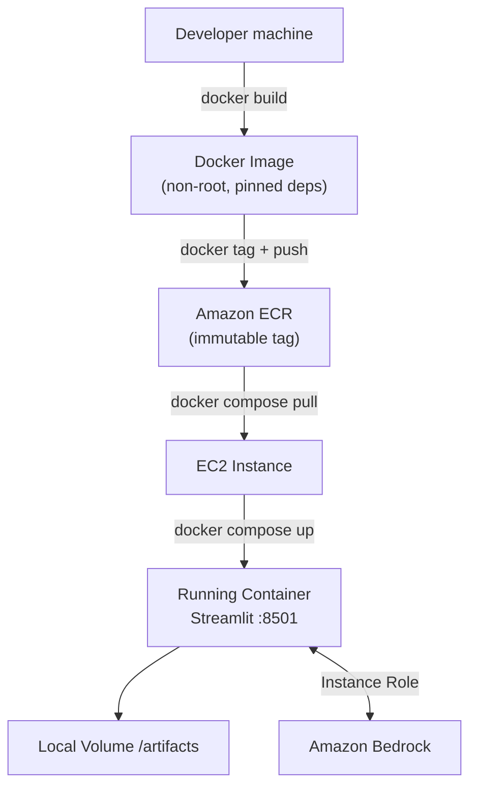

---

## Cross-Asset Comparison Workflow (Requirement 17)

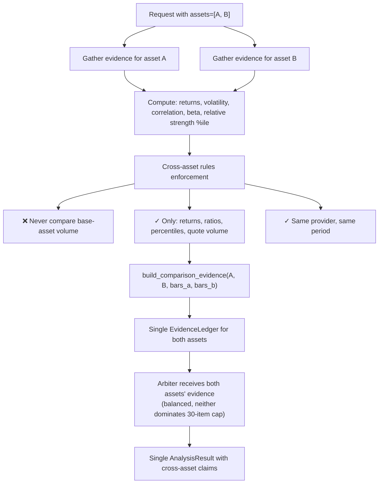

---

## Timeout and Skip Workflow

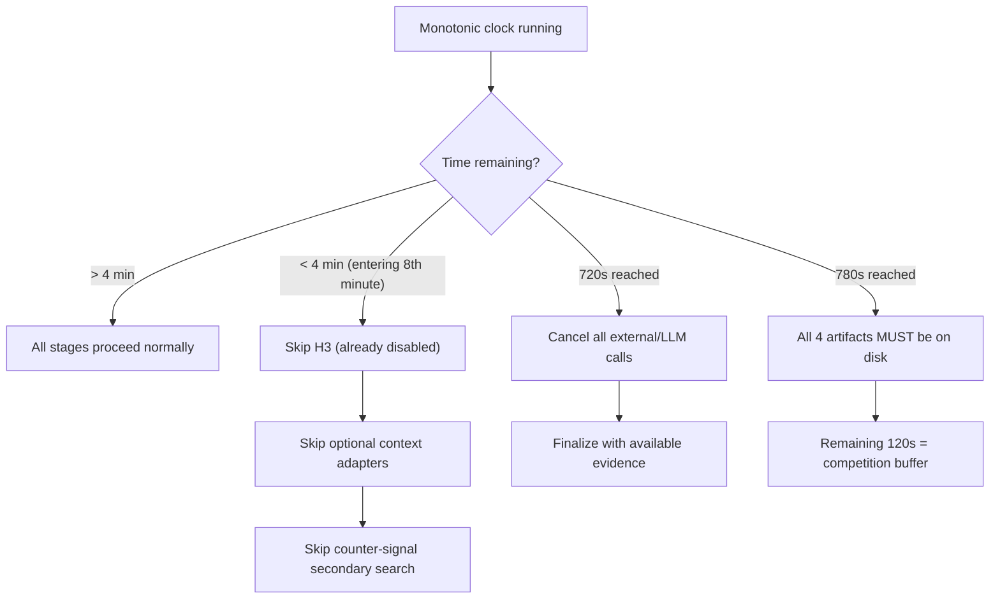

## 2026-08-01 workflow update

`_provisional_seams.py` is retired; `application.py`, `reporting/artifacts.py`, and
orchestration consume the canonical seams in `models.py` / `ports.py` / `clock.py`.
Analysis calls stop at 720 seconds, leaving artifact finalization budget. Market and
Research execute as an independent fork-join (cancel-then-await); failures degrade
honestly. Dual assets share one run/cutoff/ledger, aligned UTC bars, and a balanced
Arbiter projection. The Reason stage crosses an explicit `ArbiterOutput` boundary
(`project_to_analysis_result` stamps frozen context; `mapping.py` does the same for
the live `ArbiterGeneration` cut). See `s8-s9-s9b.md`.

## 2026-08-01 workflow update (S6 second pass)

Two stages of the primary workflow gained deterministic steps.

**Evidence stage — extraction completion before merge.** Research drafts now pass through
`research_extractor.complete_extracted_drafts()` first. The bounded LLM call supplies wording
only; reliability comes from the static table (a feed item whose original page was not fetched
stays `low`), `independence_group` from `policies.independence_group()`, and every timestamp
from the fetched record. One record may yield several facts, so one article becomes several
Evidence items. A fact citing a `record_id` that was never fetched is dropped with a
disclosure — previously such drafts were rejected wholesale at merge time, which is why
extracted research never reached the ledger.

**Post-Arbiter — material conflict, then caps, then scorecards.** `finalize_analysis()` runs
after the Arbiter and before the outcome is returned:

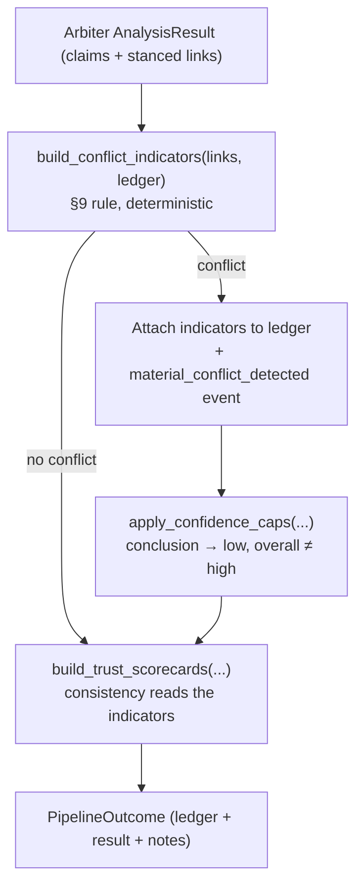

Conflict detection has to run here rather than inside the Evidence Processor because stance
lives on `ClaimEvidenceLink`, so the rule is undecidable until claims exist. H3 stays disabled
and is never consulted; the conflict is preserved regardless. Both `DeadlineAwarePipeline` and
`OrganizerCsvPipeline` apply the pass, so the offline path surfaces conflicts too.

**Composition — the skip order now has its source lists.** `application.build_research_pipeline()`
declares baseline (`fetch_rss_news`), optional context (`fetch_fear_greed`,
`fetch_official_announcements`) and counter-signal (`fetch_cryptopanic_news`) operations, which
is what makes the fixed skip order fire in a real run instead of only in its unit tests.
A non-allowlisted research host is rejected at registry construction, before any request.

## 2026-08-01 workflow update (S8 third pass — Arbiter boundary)

The Reason stage gained an explicit boundary crossing:

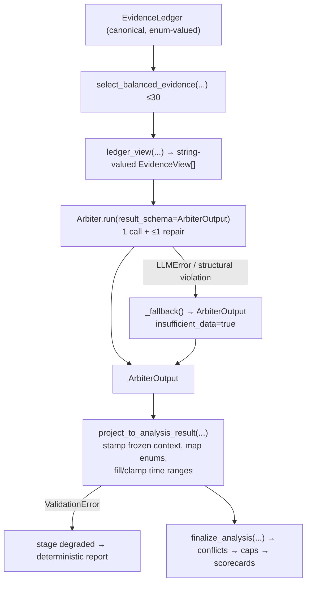

Why the view exists: the frozen reasoning layer reads attributes through `str(...)`, so
enum-valued items make `_reliability_rank()` return unknown. Left unfixed, `select_evidence()`
loses its high-first priority and the deterministic fallback emits a report with no claims and
no evidence links — a silent loss of exactly the traceability the fallback exists to provide.
The same reasoning applies to the output schema's `Literal` strings and
`apply_confidence_caps()`'s string comparisons.

## Run/Data-Mode Finalization

The pipeline reports its actual `effective_data_mode` at completion. Finalization
validates the complete `RunConfigSnapshot` again before rewriting
`run_config.json`. Rehearsal may remain `fixture`; demo may degrade from requested
`live` to `recorded_fallback`; official plus any non-live effective data mode is
rejected by the canonical model validator instead of being silently copied into an
artifact. Integration coverage lives in `tests/integration/test_run_modes.py`.

## Research Extraction Provenance Bridge

The baseline research adapter records the *provenance* an extracted fact needs —
`original_publisher` and `original_page_fetched` — in `RawSourceRecord.metadata`
before the LLM boundary. It does not record reliability or independence group:
those are the Evidence Processor's to assign (see the S6 fifth-pass note above), so
a producer can never state its own trustworthiness. The Research Agent returns only
extracted fact fields plus `record_id`, as the frozen prompt requires.
`research_extractor.complete_extracted_drafts()` then joins the fetched record back
by `record_id`, derives the source class (and therefore reliability) and the
independence group deterministically, and drops — with a disclosure — any fact that
cannot be joined or validated. This keeps source policy deterministic while allowing
the canonical extraction schema to enter the ledger.

## Bronze UI Workflow (Streamlit)

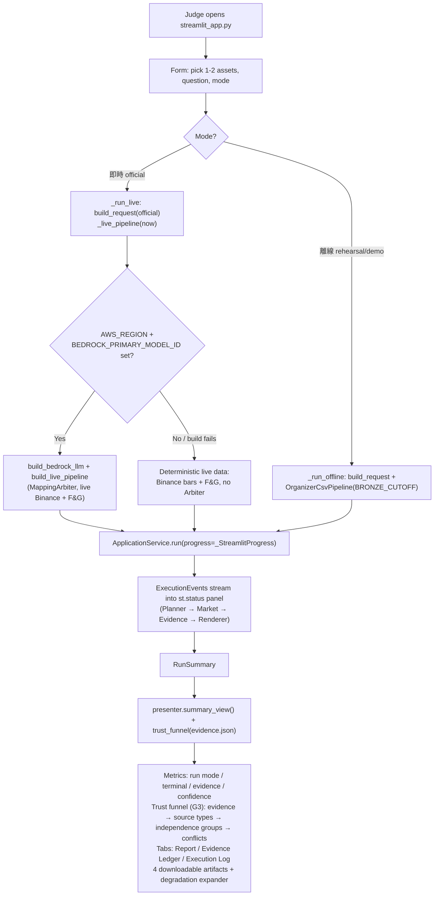

**Invariants:**
- Business logic lives in `application.py` / `presenter.py`; `streamlit_app.py` is glue only
- `presenter.py` is framework-free (no Streamlit import) so it is unit-testable
- One submit == one `ApplicationService` call (form disabled while a run is in flight)
- H3 multi-agent debate is explicitly out of Bronze scope (caption in the UI)
- The renderer runs `advice_lint`, so rendered text is safe by construction

## Skills / CLI Analysis Workflow (src/skills + scripts/analyze.py)

A deterministic, parallel analysis surface that does NOT participate in the
`DeadlineAwarePipeline`. It is a dev/inspection entry point over the organizer
dataset and deliberately does **not** implement the run-artifact contract.

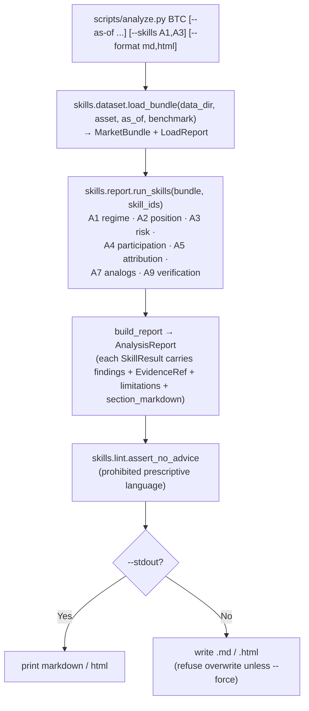

**Invariants:**
- A skill never raises — missing data is an outcome (`UNAVAILABLE`), not an exception
- A skill never invents a number — absent fields + a limitation say so
- No skill calls a model; every number originates in `src/calc/`
- `src/skills/` and `src/calc/` do not import `hoya_agent`; the two analysis surfaces are independent
- This flow produces plain named files, not the 4 fixed run artifacts
