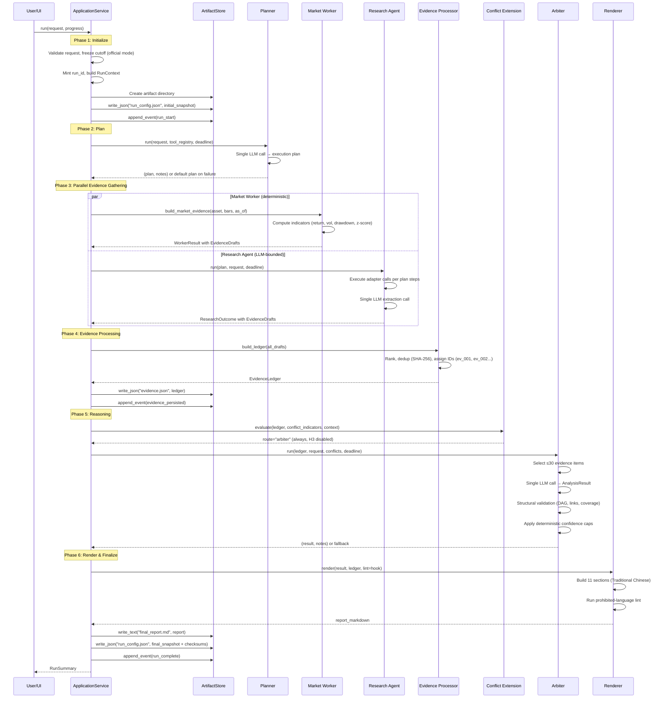
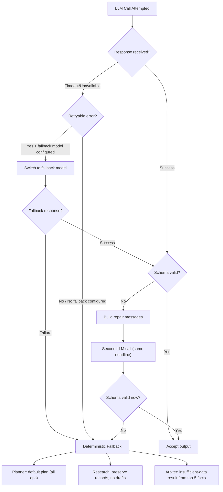
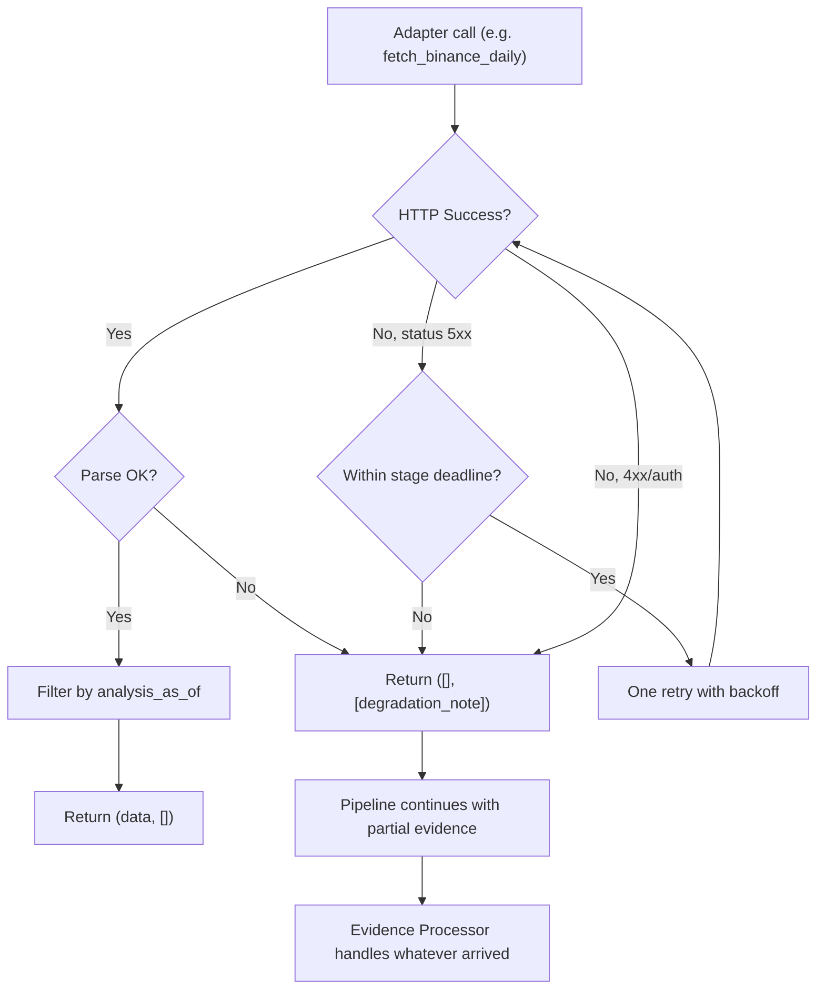
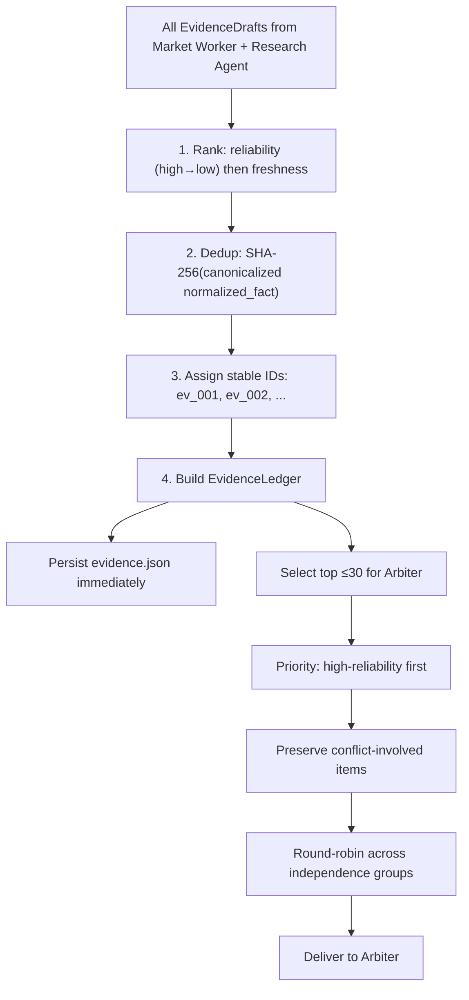
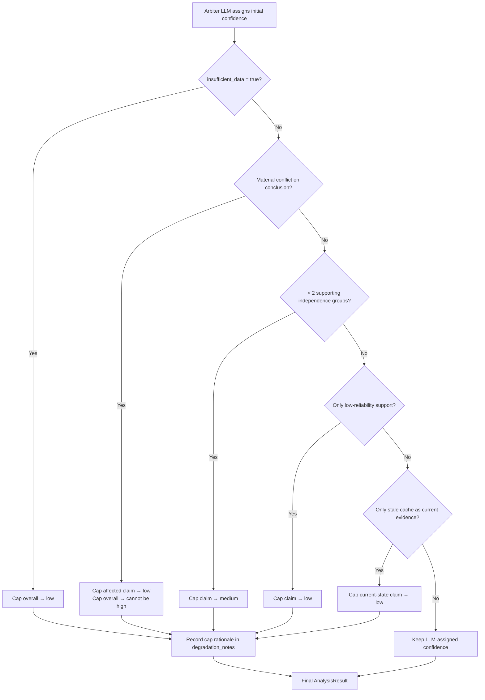
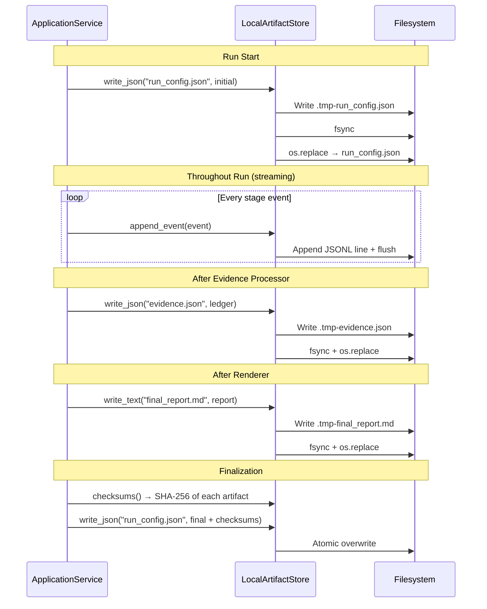
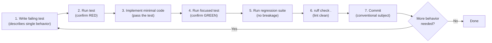
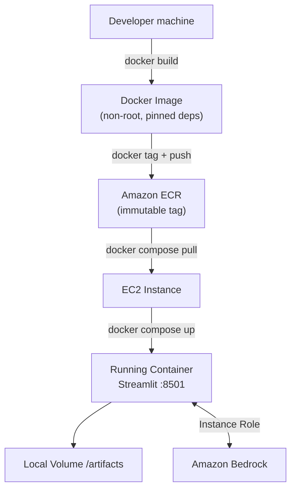
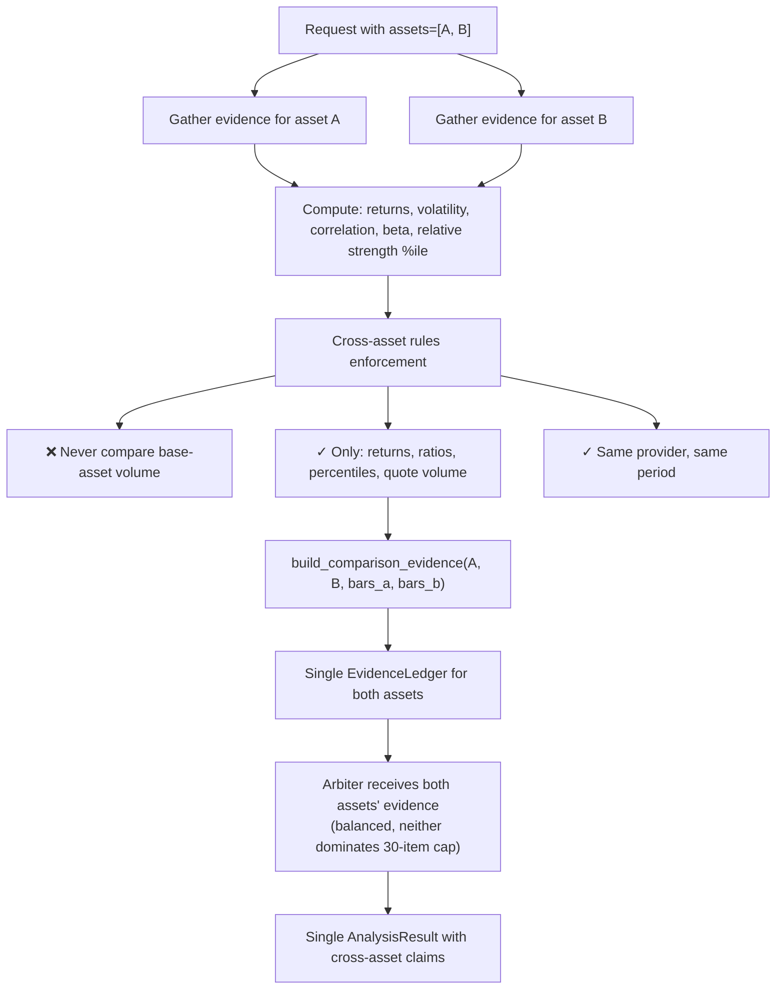
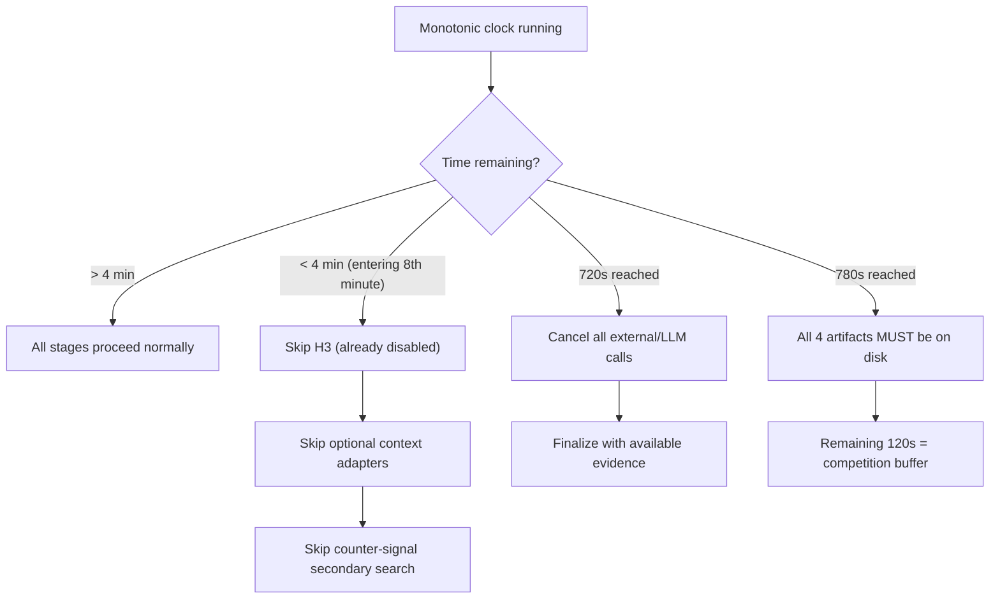

# Workflows

## Primary Workflow: Complete Analysis Run

---

## Degradation Workflow: LLM Failure

---

## Degradation Workflow: Adapter Failure

---

## Evidence Processing Workflow

---

## Confidence Cap Workflow

---

## Artifact Write Workflow

---

## Development Workflow: Red-Green-Refactor

### Test Infrastructure

- **`tests/conftest.py`** — Handles `sys.path` bootstrap, inserting the `src/` directory so that `hoya_agent` is importable from any test without requiring an editable install. This is the root-level conftest loaded by pytest before any test module.

- **`tests/fakes.py`** — Provides shared deterministic fakes used across all test layers (unit, contract, integration, acceptance):

  | Fake | Satisfies Protocol | Purpose |
  |---|---|---|
  | `FixedClock` | `Clock` | Returns a fixed UTC `now_utc()` and monotonic value; supports `advance(seconds)` for deadline tests |
  | `FakeLLM` | `LLMClient` | Pops pre-configured `BaseModel` responses (or raises exceptions) from a queue; records all calls |
  | `FakeSourceAdapter` | `SourceAdapter` | Returns a canned result and records call parameters |
  | `FakeMarketDataAdapter` | `MarketDataAdapter` | Returns canned bars/snapshot; records `(method, params)` tuples |
  | `InMemoryProgressSink` | `ProgressSink` | Collects `ExecutionEvent` instances in a list |
  | `InMemoryArtifactStore` | `ArtifactStore` | Stores artifacts in a `dict` keyed by `(run_id, filename)` |

  Additional helpers: `InMemoryRunPersistence` (satisfies `PersistencePort`), `FakeResearchSourceAdapter` (typed variant of `FakeSourceAdapter`), `fake_tool_registry(**ops)` (builds a `StaticToolRegistry`), and `UTC_EPOCH` constant.

---

## Deployment Workflow

---

## Cross-Asset Comparison Workflow (Requirement 17)

---

## Timeout and Skip Workflow

## 2026-08-01 workflow update

Analysis calls stop at 720 seconds, leaving artifact finalization budget. Market and Research execute as an independent fork-join; failures degrade honestly. Dual assets share one run/cutoff/ledger, aligned UTC bars, and a balanced Arbiter projection. See `s8-s9-s9b.md`.
