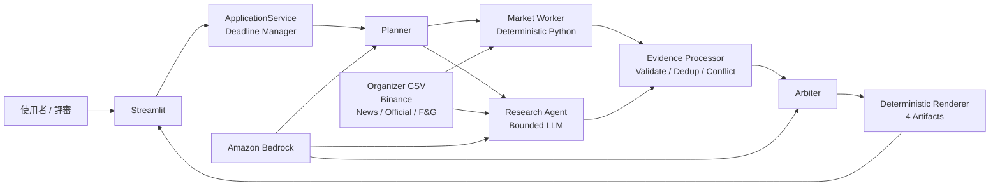

# HOYA BIT Hackathon AI Agent

預計在兩天內完成的 H2-Lite 加密市場研究 Agent：在現場題目與指定幣種下，整合 deterministic 市場指標與多源 Evidence，產出可回溯、可誠實降級的繁體中文報告。

> **Current status:** requirements、system design、Kiro spec 與四人分工已核准。原始碼樹已落地於 `src/hoya_agent/`（gate `fc517e7`，2026-08-01），四份平行任務進行中——目前進度以 [Active Work](docs/ACTIVE_WORK.md) 為準。H3 debate、S3、CloudWatch、ECS 不屬於 MVP 承諾。

## Start Here

| Need | Document |
|---|---|
| **開工前先看**：誰正在做什麼、哪些路徑已凍結、下一個可認領的工作 | [Active Work](docs/ACTIVE_WORK.md) |
| **這憑什麼叫 Agent、憑什麼可信**：三層架構、四道邊界、LLM 出現的三個位置 | [Agent Architecture](docs/agent-architecture.md) |
| 快速了解 FR、NFR、API、HLD、時序、AWS 與 failure design | [System Design](docs/system-design.md) |
| 四人現在怎麼開 branch、怎麼用 Kiro、怎麼交接 | [Kiro Team Playbook](docs/kiro-team-playbook.md) |
| 核准產品邊界與競賽策略 | [Product Spec](docs/superpowers/specs/2026-07-17-hoya-bit-hackathon-agent-design.md) |
| Functional requirements / acceptance criteria | [Kiro Requirements](.kiro/specs/hoya-market-agent/requirements.md) |
| Detailed component design | [Kiro Design](.kiro/specs/hoya-market-agent/design.md) |
| Dependency-safe implementation tasks | [Kiro Tasks](.kiro/specs/hoya-market-agent/tasks.md) |
| Ownership、branch 與 two-day checkpoints | [Four-Person Workflow](docs/superpowers/specs/2026-07-17-four-person-team-workflow-design.md) |
| Evidence/Claim fixed contracts | [Evidence Contracts](.kiro/steering/evidence-contracts.md) |
| Kiro always-on 開發規則 | [Development Workflow](.kiro/steering/development-workflow.md) |
| 真實 Kiro 使用證據 | [Kiro Evidence Ledger](docs/evidence/kiro/README.md) |
| 主辦方五幣 Daily OHLCV fixtures | [Dataset Guide](HOYA_BIT_crypto_market_dataset/README.md) |

## System at a Glance

完整元件責任、domain model、sequence diagram、deadline 與 EC2 deployment diagram 見 [System Design](docs/system-design.md)。
Agent 的決策邊界、信任邊界與 LLM／deterministic 分區見 [Agent Architecture](docs/agent-architecture.md)。

## MVP Contract

### Functional targets

- 接受自然語言題目與 BTC、ETH、SOL、BNB、XRP 中一至兩個 assets；UI 預設單幣。
- Planner 建立固定 schema plan，Market Worker 與 Research Agent 以 `asyncio` 並行取證。
- 市場數值只由 Python 計算；LLM 不得補寫價格、報酬、波動或量能。
- Evidence Processor 驗證、exact dedup、靜態 reliability、來源獨立性與 material conflict。
- Arbiter 只根據 Evidence 產生 fact -> inference -> conclusion；無證據則標示 insufficient data。
- Artifact volume 可寫時，每次 run 交付 `run_config.json`、`execution_log.jsonl`、`evidence.json`、`final_report.md`。
- 外部 API 或 Bedrock 失敗時保留 partial results，並以 deterministic fallback 完成可交付報告。

### Non-functional targets

- 720 秒停止分析、780 秒完成 artifacts、900 秒競賽上限。
- 每個外部呼叫不超過 45 秒，最多一次且受同一 deadline 約束的 retry。
- 正常 live run 以三種 source types、三個 independence groups、一個第一手來源為目標；不足時揭露而不造假。
- `official | rehearsal | demo` 永遠可見；official 不得靜默載入 fixture 或 recorded result。
- 單一 EC2 instance 同時間只接受一個 active run；MVP 不承諾 production auth、HA 或 high concurrency。

## Technology

| Area | Choice |
|---|---|
| Core | Python 3.12, Pydantic v2, `asyncio`, `httpx`, pandas |
| LLM | Amazon Bedrock Converse API through a thin `LLMClient` port |
| UI | Streamlit in the same process as `ApplicationService` |
| Deploy | One Docker image -> Amazon ECR -> one Amazon EC2 instance |
| Test | pytest, pytest-asyncio, golden fixtures, fake adapters, Bedrock Stubber |

## Team Ownership

| Role | Owns | Starts with |
|---|---|---|
| P1 Integration / Release | Contracts, orchestration, artifacts, merge/release gates | Task 1 now |
| P2 Data / Evidence | OHLCV, indicators, source adapters, Evidence Processor | Read-only review; Task 4 after Task 2 |
| P3 Reasoning / Report | Bedrock, Planner, Arbiter, prompts, report semantics | Read-only review; pair Task 2, then Task 6 |
| P4 UI / Demo Support | Service preflight, Streamlit, runbooks, rehearsals | Task 0 now; P1 accompanies AWS |

Exact branches, Kiro prompts, task closing commands and handoff gates are in the [Kiro Team Playbook](docs/kiro-team-playbook.md). Do not use Kiro `Run all Tasks` for this repository.

## Repository Policy

Competition PDFs and ZIP archives remain local and are not committed. Extracted OHLCV CSV files stay tracked as reproducible fixtures. Secrets remain in local environment variables or the EC2 runtime; never commit `.env`, AWS credentials, API tokens, cached official responses, or participant data.

This system produces research-oriented analysis and does not provide investment advice.
