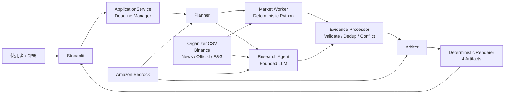

# HOYA BIT Hackathon AI Agent

預計在兩天內完成的 H2-Lite 加密市場研究 Agent：在現場題目與指定幣種下，整合 deterministic 市場指標與多源 Evidence，產出可回溯、可誠實降級的繁體中文報告。

> **Current status（2026-08-02）：Feature Freeze 已生效。** S0–S9B 完成，S8 live Silver Exit 已過。
> S10 的自動 acceptance 與 S11 的本地交付層（CI、smoke test、Docker runtime、secret scan）已完成；
> ECR/EC2 部署與 15 分鐘計時彩排尚未執行。**Bedrock 帳號未開通**，live run 目前只有 deterministic
> 市場證據、無推論結論（誠實降級，四項 artifacts 仍齊全）。詳情以 [Active Work](docs/ACTIVE_WORK.md)
> 為準。H3 debate、S3、CloudWatch、ECS 不屬於 MVP 承諾。

## Start Here

| Need | Document |
|---|---|
| **開工前先看**：誰正在做什麼、哪些路徑已凍結、下一個可認領的工作 | [Active Work](docs/ACTIVE_WORK.md) |
| **一頁看懂**：pipeline、LLM 在哪不在哪、deadline、部署拓撲、刻意不做的東西 | [Architecture](docs/architecture.md) |
| **怎麼上線**：環境變數、ECR/EC2、healthcheck、rollback、secret scan | [Deployment](docs/deployment.md) |
| **評審當天怎麼跑**：15 分鐘逐步腳本、降級話術、fallback | [Demo Runbook](docs/demo-runbook.md) |
| **這憑什麼叫 Agent、憑什麼可信**：三層架構、四道邊界、LLM 出現的三個位置 | [Agent Architecture](docs/agent-architecture.md) |
| 快速了解 FR、NFR、API、HLD、時序、AWS 與 failure design | [System Design](docs/system-design.md) |
| 這個產品做得到什麼、契約詞彙表在哪 | [Features](docs/Features.md)（design-pipeline ① 入口，②–④ 由此串接） |
| 動工前必須鎖死的技術決定、依賴規則、第一個里程碑 | [Tech-Stack-Plan](docs/Tech-Stack-Plan.md) |
| 每個檔做什麼、跟誰互動、**現在存不存在** | [Architecture-FileMap](docs/Architecture-FileMap.md) |
| 分階段建置順序、每階段現況與 Definition-of-Done | [Implementation-Plan](docs/Implementation-Plan.md) |
| 四人現在怎麼開 branch、怎麼用 Kiro、怎麼交接 | [Kiro Team Playbook](docs/kiro-team-playbook.md) |
| 核准產品邊界與競賽策略 | [Product Spec](docs/superpowers/specs/2026-07-17-hoya-bit-hackathon-agent-design.md) |
| Functional requirements / acceptance criteria | [Kiro Requirements](.kiro/specs/hoya-market-agent/requirements.md) |
| Detailed component design | [Kiro Design](.kiro/specs/hoya-market-agent/design.md) |
| Dependency-safe implementation tasks | [Kiro Tasks](.kiro/specs/hoya-market-agent/tasks.md) |
| Ownership、branch 與 two-day checkpoints | [Four-Person Workflow](docs/superpowers/specs/2026-07-17-four-person-team-workflow-design.md) |
| Evidence/Claim fixed contracts | [Evidence Contracts](.kiro/steering/evidence-contracts.md) |
| Kiro always-on 開發規則 | [Development Workflow](.kiro/steering/development-workflow.md) |
| 真實 Kiro 使用證據 | [Kiro Evidence Ledger](docs/evidence/kiro/README.md) |
| 主辦方五幣 Daily OHLCV fixtures | [Dataset Guide](HOYA_BIT_crypto_market_dataset/README.md) |

## System at a Glance



完整元件責任、domain model、sequence diagram、deadline 與 EC2 deployment diagram 見 [System Design](docs/system-design.md)。
Agent 的決策邊界、信任邊界與 LLM／deterministic 分區見 [Agent Architecture](docs/agent-architecture.md)。

## MVP Contract

### Functional targets

- 接受自然語言題目與 BTC、ETH、SOL、BNB、XRP 中一至兩個 assets；UI 預設單幣。
- Planner 建立固定 schema plan，Market Worker 與 Research Agent 以 `asyncio` 並行取證。
- 市場數值只由 Python 計算；LLM 不得補寫價格、報酬、波動或量能。
- Evidence Processor 驗證、exact dedup、靜態 reliability、來源獨立性與 material conflict。
- Arbiter 只根據 Evidence 產生 fact -> inference -> conclusion；無證據則標示 insufficient data。
- Artifact volume 可寫時，每次 run 交付 `run_config.json`、`execution_log.jsonl`、`evidence.json`、`final_report.md`。
- 外部 API 或 Bedrock 失敗時保留 partial results，並以 deterministic fallback 完成可交付報告。

### Non-functional targets

- 720 秒停止分析、780 秒完成 artifacts、900 秒競賽上限。
- 每個外部呼叫不超過 45 秒，最多一次且受同一 deadline 約束的 retry。
- 正常 live run 以三種 source types、三個 independence groups、一個第一手來源為目標；不足時揭露而不造假。
- `official | rehearsal | demo` 永遠可見；official 不得靜默載入 fixture 或 recorded result。
- 單一 EC2 instance 同時間只接受一個 active run；MVP 不承諾 production auth、HA 或 high concurrency。

## Run it

需要 Python 3.12。

```bash
python -m pip install -e ".[dev]"

# Streamlit UI（離線模式不需要任何金鑰、不需要網路）
streamlit run src/hoya_agent/ui/streamlit_app.py     # → http://localhost:8501

# 或用容器（同樣離線可跑）
docker compose up --build                            # → http://localhost:8501
```

三種模式在畫面上一眼可辨：**即時 official**（🔴 打 Binance ＋ 恐懼貪婪指數，設了
`AWS_REGION` ＋ `BEDROCK_PRIMARY_MODEL_ID` 才會加上 Bedrock 推理）、
**離線 rehearsal**（🟡 只用官方 CSV）、**離線 demo**（⚪ recorded fallback，UI 與報告都標示）。
三者都產出四個固定 artifact。

## Test

```bash
# 正規閘門（tasks.md Final Required Gate，逐字）
python -m pytest tests/unit tests/contract tests/integration tests/acceptance -m "not live" -q
ruff check .
docker compose config
git status --short

# Live 測試是 opt-in，需要憑證
RUN_LIVE_TESTS=1 python -m pytest tests/live -m live -vv
```

CI（`.github/workflows/ci.yml`）在每次 push 跑三個 job：**verify**（Ruff ＋ 非 live 測試）、
**container**（compose config ＋ image build ＋ 容器內 smoke ＋ 非 root／無 `.env` 檢查）、
**secret-scan**（gitleaks 掃追蹤內容）。三者都不需要 AWS 憑證。

## Configuration

環境變數只記名稱，不記值；`run_config.json` 只記「有沒有設」的布林值，永遠不記內容。

| Variable | Required | Notes |
|---|---|---|
| `AWS_REGION` | Bedrock 才需要 | `us-west-2`（`us.` inference profile 只在美國區可用） |
| `BEDROCK_PRIMARY_MODEL_ID` | 推理才需要 | 沒設 → 即時模式仍可跑，只是沒有推論與結論 |
| `BEDROCK_FALLBACK_MODEL_ID` | 否 | throttling fallback |
| `CRYPTOPANIC_API_TOKEN` | 否 | 沒有就誠實揭露缺口 |
| `HOYA_DATA_DIR` | 否 | 覆寫資料集路徑；容器內已設好 |

憑證本身走標準 AWS 鏈：本機用 profile、EC2 用 instance role。🚫 機器上不放 access key。
完整清單見 [`.env.example`](.env.example) 與 [Deployment](docs/deployment.md)。

## Artifacts

每次 run 產出四個**固定檔名**的檔案，共用同一個 `run_id`，寫入方式是 tmp → fsync →
`os.replace`（不會有半寫檔）：

| File | Content |
|---|---|
| `final_report.md` | 11 段繁體中文報告；每個數字都可回溯到 Evidence ID |
| `evidence.json` | Evidence Ledger — 來源、時間、查詢參數、reliability、獨立上游、content hash |
| `execution_log.jsonl` | 每個 stage 的事件、狀態、耗時、錯誤分類（🚫 不含 prompt 內容） |
| `run_config.json` | 模式、cutoff、deadline、prompt/policy 版本、金鑰**存在與否** |

UI 提供四個下載鈕；離線 run 也照樣產出這四份。

## Technology

| Area | Choice |
|---|---|
| Core | Python 3.12, Pydantic v2, `asyncio`, `httpx`, pandas |
| LLM | Amazon Bedrock Converse API through a thin `LLMClient` port |
| UI | Streamlit in the same process as `ApplicationService` |
| Deploy | One Docker image -> Amazon ECR -> one Amazon EC2 instance |
| Test | pytest, pytest-asyncio, golden fixtures, fake adapters, Bedrock Stubber |

## Team Ownership

| Role | Owns | Starts with |
|---|---|---|
| P1 Integration / Release | Contracts, orchestration, artifacts, merge/release gates | Task 1 now |
| P2 Data / Evidence | OHLCV, indicators, source adapters, Evidence Processor | Read-only review; Task 4 after Task 2 |
| P3 Reasoning / Report | Bedrock, Planner, Arbiter, prompts, report semantics | Read-only review; pair Task 2, then Task 6 |
| P4 UI / Demo Support | Service preflight, Streamlit, runbooks, rehearsals | Task 0 now; P1 accompanies AWS |

Exact branches, Kiro prompts, task closing commands and handoff gates are in the [Kiro Team Playbook](docs/kiro-team-playbook.md). Do not use Kiro `Run all Tasks` for this repository.

## Repository Policy

Competition PDFs and ZIP archives remain local and are not committed. Extracted OHLCV CSV files stay tracked as reproducible fixtures. Secrets remain in local environment variables or the EC2 runtime; never commit `.env`, AWS credentials, API tokens, cached official responses, or participant data.

This system produces research-oriented analysis and does not provide investment advice.
