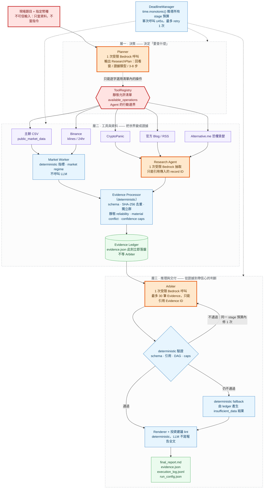

# Agent 架構 — HOYA Market Agent（H2-Lite）

> Status: 與凍結契約對齊的視覺化說明，**不是**新的設計權威
> Last updated: 2026-08-01
> 權威來源：[Kiro Design](../.kiro/specs/hoya-market-agent/design.md)、[Evidence Contracts](../.kiro/steering/evidence-contracts.md)、[Tech Rules](../.kiro/steering/tech.md)
> 相關：[System Design](system-design.md)（元件圖／時序圖／部署圖）、[Active Work](ACTIVE_WORK.md)

本頁只回答兩個問題：**這憑什麼叫 Agent？這個 Agent 憑什麼可信？**
元件責任、domain model、AWS 部署請看 [System Design](system-design.md)。

---

## 1. 一句話

現場給「幣種 + 未知題目」，這個**有界推理 Agent**在 900 秒內自行規劃蒐證範圍、並行取回多源資料、
把每筆事實固化成可回溯的證據，再以受限推理產出帶信心分級的繁體中文分析 —
做不到的部分誠實標示，而不是編。

## 2. 「有界」是什麼意思

一般 Agent 的賣點是「它能自己決定做什麼」。這裡的賣點相反：**它能自己決定做什麼，但它能做的事情是一個有限且事先固定的集合。**

| | 這個 Agent 會做 | 這個 Agent 不能做 |
|---|---|---|
| 工具 | 從靜態允許清單中挑選操作 | 自造 provider、拼湊 API 網址、開啟任意連結 |
| 迴圈 | 固定五個階段跑一次 | 自由 agent loop、自主遞迴呼叫工具 |
| 數字 | 引用 deterministic 工具算出的值 | 補值、猜值、產生任何未經工具計算的市場數字 |
| 事實 | 引用 Evidence ID | 把自己的輸出當成證據來源 |
| 時間 | 在 deterministic 預算內盡量做 | 因為 retry 或 schema repair 而延長 deadline |

換句話說，**LLM 在這個系統裡有裁量權，但沒有權限**。裁量權的範圍由 deterministic Python 事先劃定，
而且劃定範圍的那段程式不接受 LLM 或外部內容的修改。

## 3. 架構總覽

**圖例**：🟠 受限 LLM 呼叫（全系統只有 3 個）　🔵 deterministic Python　🔴 信任邊界　🟣 外部來源 adapter　🟢 可交付產出

## 4. 三層各自的職責

| 層 | 做什麼 | 誰在做 | 用 LLM？ |
|---|---|---|---|
| **一 · 決策** | 讀題目，決定回看窗、需要哪些證據類型、3–8 個蒐證步驟 | Planner + ToolRegistry | ✅ 1 次 |
| **二 · 工具與資料** | 取回原始資料 → 抽成事實 → 固化成無立場、可查證的證據 | 5 個 adapter、Market Worker、Research Agent、Evidence Processor | ✅ 1 次（僅語意抽取） |
| **三 · 推理與交付** | 建立 fact → inference → conclusion，權衡後給出帶信心的判斷並渲染報告 | Arbiter、Renderer、Artifact Builder | ✅ 1 次 |

市場數值、去重、可信度、獨立性、矛盾判定、信心上限、報告文字、artifact 落盤、deadline —— **全部 deterministic**。

## 5. 四道硬邊界

這四道是「憑什麼可信」的實體，也是圖上紅色與藍色節點的意義。

**① 輸入信任邊界** — 題目文字與外部回傳內容一律視為**資料**，不是指令。
題目裡若出現「忽略上述規則」「改用某某網站」，一律當成題目的字面內容處理，不改變工具選擇。
外部 payload 在通過 schema 驗證前只是 bytes，驗不過就記成 typed degradation，永遠不會變成事實進入 Claim 或報告。

**② 工具邊界** — `ToolRegistry` 是靜態設定檔映射，**無** runtime plugin discovery、遠端 registry、動態註冊，
也不接受外部內容修改。LLM 與取回的內容都不能新增 provider、operation、domain、host 或 URL。

**③ 證據邊界** — LLM 產物**永遠不是**證據來源。每個 EvidenceItem 都帶
`source / fetched_at / content_reference / related_claim` + `reliability / independence_group / content_hash`。
reliability 來自靜態表，**LLM 不得調整**；轉載未取原頁一律 `low`。
Evidence 本身**無立場** —— `supports | opposes | neutral` 只存在於 `ClaimEvidenceLink`。

**④ 時間邊界** — 所有預算由 `time.monotonic()` 推導，UTC 只用於落盤時間戳。
schema repair **不是額外預算**，它花的是 Arbiter 階段剩餘時間。跳過順序固定：H3 → optional context adapter → 反方訊號二次搜尋。

## 6. LLM 只出現在三個地方

| 呼叫 | 收到什麼 | 必須產出什麼 | 明文不能做 |
|---|---|---|---|
| **Planner** | 只有 request 與支援的 capabilities | `ResearchPlan` | 給市場判斷或結論；指定清單外的工具／網域／URL |
| **Research 抽取** | 有界的 source records | 引用 record ID 的 `EvidenceDraft[]` | 瀏覽、自創 URL、捏造文章內容 |
| **Arbiter** | 排序後最多 30 筆 Evidence | 引用 Evidence ID 的 `AnalysisResult` | 自造市場數值；繞過 Evidence ID；改寫 reliability |

三次呼叫全部走 Bedrock Converse 的 structured output，**輸出先通過 Pydantic 驗證才准進入系統核心**。
驗不過最多修一次，再驗不過就走 deterministic fallback。

## 7. 每一種失敗都有 deterministic 出口

| 失敗 | Agent 的反應 | 評審看得到什麼 |
|---|---|---|
| Planner 逾時或 schema 錯 | 改用依 assets 與預設回看窗產生的 deterministic plan | Planner degraded event |
| 單一來源逾時／429／5xx | 至多一次 bounded retry，然後產生 typed gap | 來源名稱、錯誤類別、fallback 紀錄 |
| baseline 市場源失敗 | 誠實 partial／degraded；**MVP 沒有第二個 live provider 可切換** | 缺口揭露，不宣稱換了來源 |
| Research 抽取無效 | 不產生 LLM 自創事實，只留 deterministic 市場證據 | Extraction failure event |
| Arbiter 兩次都無效 | 由 ledger 產生 low-confidence、列出所有缺失能力的結果 | Fallback 報告與原因 |
| 少於三個獨立群 | 照常完成報告但壓低 confidence；核心結論撐不住就標 `insufficient_data` | 多樣性計數與缺口 |
| material conflict | 雙方證據**都保留**，該結論 confidence 鎖到 `low` | Conflict indicator 與反方段落 |
| 720 秒 | 取消所有剩餘外部／LLM 呼叫，進入 finalization | Deadline event |
| Artifact 寫入失敗 | bounded retry；仍失敗則在 stdout 與所有還能寫的檔案記下確切檔名 | Missing-artifact 清單 |

**沒有任何一條路徑會讓系統交不出東西。** 只要 artifact 目錄還能寫，四個檔案就一定齊全 —— 內容可能是「我沒做到，以下是原因」，但一定齊全。

## 8. 時間預算

| 里程碑 | 絕對秒數 | 到點時的行為 |
|---|---:|---|
| Planner 完成 | 30 s | 改用 deterministic default plan |
| 並行取證完成 | 270 s | 取消未完成的 adapter／抽取任務，保留部分結果 |
| Evidence Processor 完成 | 360 s | 驗證並落盤所有可用證據 |
| Arbiter + 渲染完成 | 510 s | 需要時改用 deterministic fallback |
| Artifact 驗證目標 | 630 s | 進入保留時間，不再加任何 optional 工作 |
| **分析硬停** | **720 s** | 取消每一個剩餘的外部／LLM 呼叫 |
| **Artifact 硬停** | **780 s** | 四個固定檔名全部完成（原子寫入） |
| 競賽上限 | 900 s | 保留給 UI 與評審操作 |

## 9. 兩個容易被誤解的地方

**「Planner 分配 900 秒」是錯的。** 所有 stage deadline 由 `DeadlineManager` 從 `time.monotonic()` deterministic 推導，
Planner 完全不碰時間預算 —— 它只輸出回看窗、證據類型與步驟清單。把預算交給 LLM 正好是這個設計刻意避免的事。

**「Arbiter 權衡矛盾」講得太軟。** material conflict 由 deterministic 規則先判定並鎖定
（同一 claim、不同獨立群、reliability ≥ medium 的 supports 與 opposes 同時存在）。
Arbiter 只能在「雙方並陳、該結論 confidence 鎖 low」的前提下作結 —— 它沒有把矛盾抹平的權限。

## 10. 這張圖刻意不畫的東西

以下都**不在** MVP，畫出來就是虛報：H3 Bull/Bear/Judge 實作（只有預設關閉的 stub）、
鏈上／宏觀／額外社群 adapter、第二個 live 市場 provider、S3／CloudWatch／ECS、
近似語意去重、動態 reliability、自由 agent loop、向量資料庫、message broker。

## 11. 幣種無關

Pipeline 以 `{asset}` 為參數，五幣共用同一條路徑，**沒有 per-coin 分支或特調**。
來源的入選標準是「用幣種符號就能查五幣」；需要為每個幣各寫一套的來源一律 best-effort 或跳過，缺漏誠實揭露。
現場抽到哪一個幣，跑的都是這張圖。

---

## 附錄：每項主張的契約出處

| 主張 | 出處 |
|---|---|
| H2-Lite 固定五階段 | `.kiro/specs/hoya-market-agent/design.md` §3、`requirements.md` Requirement 7.1 |
| 只有 Planner／Research 抽取／Arbiter 用 LLM | `design.md:89` |
| ToolRegistry 為靜態允許清單，不可被外部內容修改 | `design.md:174`、`design.md:336-338` |
| Planner 只收 request 與 capabilities | `.kiro/steering/tech.md:96` |
| Planner 不得下判斷／不得指定清單外來源／題目為不可信輸入 | `prompts/planner-v1.md:15-21` |
| Research 抽取須引用 record ID，不得瀏覽或自創 URL | `tech.md:97` |
| Arbiter 上限 30 筆 Evidence，須引用 Evidence ID | `tech.md:98` |
| 一次 schema repair，失敗走 deterministic fallback | `design.md:359`、`tech.md:102` |
| evidence.json 不等 Arbiter，立即落盤 | `design.md:99` |
| reliability 靜態表，LLM 不得調整 | `tech.md:110`、`.kiro/steering/evidence-contracts.md` §4、`competition-rules.md` §Static Reliability Table |
| Evidence 無立場，stance 只在 ClaimEvidenceLink | `evidence-contracts.md` §3／§8、`requirements.md` Requirement 6.3 |
| conclusion 無支持證據則標 insufficient-data | `requirements.md` Requirement 6.4 |
| material conflict 為 deterministic，confidence 鎖 low | `evidence-contracts.md:174`、`tech.md:111` |
| Renderer deterministic，LLM 不重寫報告 | `tech.md:117-118` |
| 時間里程碑 | `design.md:246-256` |
| 單次呼叫 ≤45s、retry 1 次、repair 不加預算 | `design.md:265-267` |
| MVP 無第二個 live 市場 provider | `design.md:305-309`、`tech.md:84` |
| 幣種無關來源政策 | `.kiro/steering/competition-rules.md` §Coin-Agnostic Source Policy |
| MVP 排除清單 | `design.md:637`、`competition-rules.md` §MVP Exclusions |
