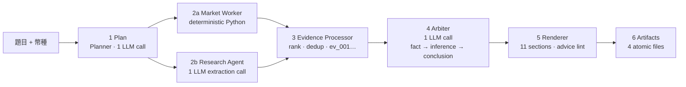
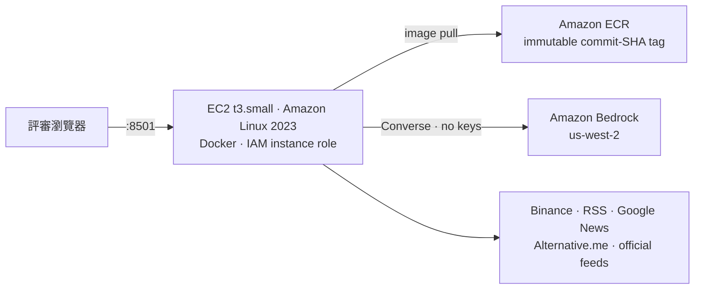

# Architecture — one page

Judge-facing summary: what runs, where it runs, and which parts are allowed to be
wrong. Deeper material lives in [System Design](system-design.md) (components,
sequence diagrams, failure design) and [Agent Architecture](agent-architecture.md)
(decision boundaries, trust boundaries). This page does not repeat them.

## The one-sentence claim

Every number in the report was computed by Python from a named source and carries an
Evidence ID; the language model is allowed to *select and connect* that evidence, never
to produce a number.

## Pipeline

Six fixed stages, single pass, one run per request.



Stages 2a and 2b run concurrently under one deadline and are cancelled independently.
A branch that dies leaves a disclosed gap, not a crash.

## Where the LLM is, and is not

| | Deterministic Python | LLM |
|---|---|---|
| Market numbers (return, volatility, drawdown, volume z-score, regime) | ✅ | 🚫 never |
| Which sources to query | plan allowlist | proposes within the allowlist |
| Turning a news article into a normalized fact | schema + grounding check | extracts, must quote the source |
| Reliability, independence group, Evidence ID, content hash | ✅ sole assigner | 🚫 never sees these fields |
| Claims and their evidence links | structural validation | ✅ generates |
| Confidence | caps applied **after** the model, downward only | proposes |
| Report text and ordering | ✅ fully deterministic | 🚫 |

Exactly one LLM call per reasoning stage, at most one schema repair, all inside the
stage's own budget. Prompt bodies never reach logs or artifacts — only version ids.

## Deadlines

| Milestone | s | Rule |
|---|---:|---|
| Analysis hard stop | 720 | cancel all external and LLM calls (minute 12) |
| Artifact deadline | 780 | all four files on disk (minute 13) |
| Competition limit | 900 | run terminates |
| Per external call | ≤45 | at most one retry, same stage budget |

Skip order under time pressure is fixed: H3 → optional context adapters → counter-signal
second search. Baseline work is never surrendered.

## Deployment



- One Docker image, one tag, one host. The tag deployed is the git commit SHA, byte-identical
  to what was pushed to ECR.
- **No access keys anywhere.** The container inherits the EC2 instance role through the
  standard AWS credential chain. No SSH: administration goes through SSM Session Manager.
- The container runs as `appuser` (uid 10001), never root. No `.env` is baked into the image.
- Secrets are environment variables at runtime only; `run_config.json` records key
  *presence* as a boolean and never a value.

Procedure and verification: [deployment.md](deployment.md). Demo script: [demo-runbook.md](demo-runbook.md).

## Frozen paths

Complete; changing them needs the owner's agreement plus a regression test.

```text
src/hoya_agent/adapters/bedrock.py
src/hoya_agent/reasoning/           (entire package)
src/hoya_agent/evidence/policies.py
src/hoya_agent/models.py · config.py · clock.py · ports.py
prompts/ · tests/contract/ · tests/unit/reasoning/ · tests/unit/evidence/test_policies.py
```

## Deliberately not implemented

Labelled as such in the UI, the report and here — not omitted quietly.

| | Status |
|---|---|
| **H3 conditional debate** | interface exists, permanently disabled, `DisabledConflictExtension` only |
| CoinGecko second live provider | post-hackathon; a failed baseline market source degrades honestly rather than claiming a switch |
| Five-asset validation matrix / per-coin calibration | post-hackathon; two assets prove coin-agnosticism |
| PDF/HTML export, extra visualizations, S3 mirroring, CloudWatch, ECS | post-hackathon |

## Invariant

**The pipeline always produces four valid artifacts** — `run_config.json`,
`execution_log.jsonl`, `evidence.json`, `final_report.md` — even on total external
failure, even when cancelled mid-run. Every write is tmp → fsync → `os.replace`, so a
crash cannot leave a half-written file. If a file genuinely cannot be written, the run
says which one and why rather than claiming it exists.
