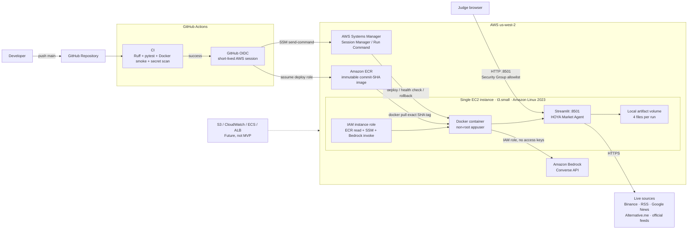

# HOYA AWS 架構圖

這是 HOYA Market Agent 目前 MVP 的雲端部署架構。實線是目前的部署路徑；虛線是刻意排除在 MVP 外的未來擴充。



## Runtime data path

```text
Judge question + asset
        ↓
Streamlit / ApplicationService
        ↓
Plan → Market Worker ‖ Research Agent
        ↓
Evidence Processor → Evidence Ledger
        ↓
Arbiter → deterministic Renderer
        ↓
Local artifact volume
```

## Deployment guarantees

- 每次部署使用 commit SHA 作為 immutable ECR tag。
- EC2 只從 ECR 拉取該精確 tag；health check 失敗會 rollback。
- Bedrock 權限透過 EC2 IAM instance role 取得，不把長期 AWS access key 放入 image 或 repository。
- GitHub Actions 使用 OIDC，不保存長期 AWS credentials。
- EC2 透過 SSM 管理，不需要開 SSH port 22。
- Container 以 non-root user 執行，artifact 寫入本機 volume。

## MVP 邊界

目前刻意不使用 S3、CloudWatch、ECS、ALB、queue、database、Redis 或 horizontal scaling。MVP 是單一 EC2、單一 container，同時間只保證一個 active run。

詳細部署步驟請見 [`deployment.md`](deployment.md)；系統與 pipeline 設計請見 [`system-design.md`](system-design.md)。
