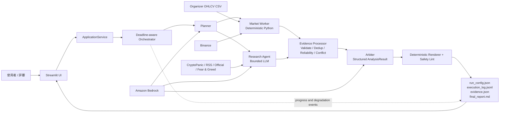
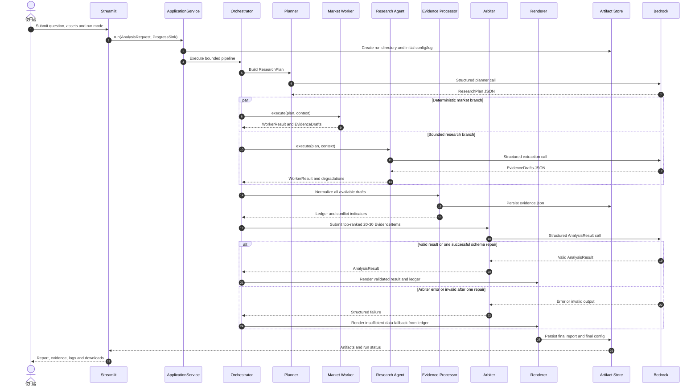
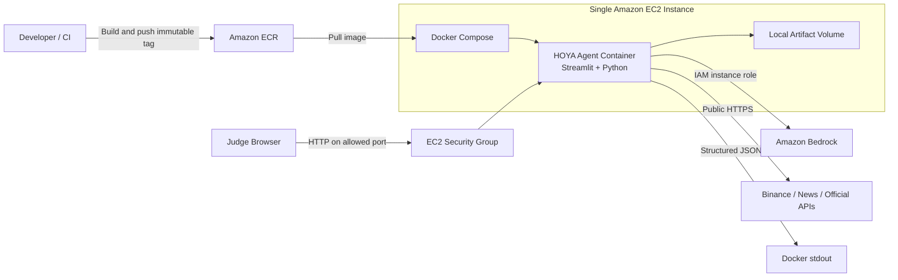

# HOYA Market Agent System Design

> Status: approved H2-Lite MVP target；原始碼樹已落地（gate `fc517e7`），實作進行中  
> Last updated: 2026-08-02（新增 live composition root、`reasoning/mapping`+`schemas`、UI trust funnel、calc/skills 平行工具；Silver live Exit 已過）  
> Detailed sources: [approved product spec](superpowers/specs/2026-07-17-hoya-bit-hackathon-agent-design.md), [Kiro requirements](../.kiro/specs/hoya-market-agent/requirements.md), [Kiro technical design](../.kiro/specs/hoya-market-agent/design.md), [EC2 deployment guide](deploy-ec2.md)

## 1. Problem Statement

競賽現場會指定一至兩個支援幣種與臨時問題。系統必須在 15 分鐘內整合市場資料、新聞與官方來源，產出可回溯 Evidence、清楚區分事實／推論／結論的繁體中文分析，並在外部 API 或 LLM 失敗時誠實降級。

核心價值不是預測價格，而是讓評審能驗證：資料從哪裡來、系統如何推論、哪些證據互相衝突、哪些限制會影響結論。

## 2. Goals and Non-goals

### Goals

- 支援 BTC、ETH、SOL、BNB、XRP，UI 預設單幣，資料契約相容一至兩幣。
- 固定執行 H2-Lite：Planner -> 並行 Market Worker / Research Agent -> Evidence Processor -> Arbiter -> Renderer。
- 所有市場數值由 deterministic Python 計算，LLM 不得補寫數值。
- 每個 conclusion 可回溯至 Evidence，否則明確標示 insufficient data。
- 第 12 分鐘結束分析，第 13 分鐘前完成 artifacts，保留至第 15 分鐘的現場緩衝。
- 以單一 Docker image 部署至 ECR 與單一 EC2。

### Non-goals

- 自動交易、下單、投資組合配置或個人化投資建議。
- 短期價格預測的精確機率。
- 自由循環的 Agent swarm、多輪 debate 或 LLM 自主工具遞迴。
- 完整鏈上 indexer、宏觀資料平台、一般社群 adapters、S3、CloudWatch 或 ECS。
- Production authentication/TLS、多租戶、高可用、高併發或水平擴充架構。

H3 Conditional Debate 只保留 disabled extension interface，不屬於 MVP 實作承諾。Evidence Processor 仍會偵測 material conflict 並交給 Arbiter；H3 disabled 不代表系統忽略衝突。

## 3. Constraints and Assumptions

| Item | Decision |
|---|---|
| Team and schedule | 4 位 junior，2 天開發 |
| Run deadline | 900 秒外部硬上限；720 秒 analysis hard stop；780 秒 artifact hard stop |
| Run capacity | 每個 instance 同時間最多一個 active run |
| Supported assets | BTC、ETH、SOL、BNB、XRP；每次一至兩個 |
| Historical baseline | 主辦方 Daily OHLCV CSV，不推定其上游交易所 |
| Live market source | Binance 為唯一 baseline；失敗時誠實 partial／degraded，MVP 無第二個 live provider |
| Research sources | CryptoPanic、RSS、官方來源、Alternative.me Fear & Greed |
| LLM | Amazon Bedrock Converse API，primary/fallback model ID 可配置 |
| UI/API boundary | Streamlit 與 application service 同進程；MVP 不建立 FastAPI |
| Persistence | 每次 run 的本機 artifact directory；不以 S3 為必要依賴 |
| Time standard | persisted timestamp 使用 ISO 8601 UTC；deadline 使用 monotonic clock |

## 4. Functional Requirements

| ID | Requirement | Acceptance summary |
|---|---|---|
| FR-01 | 建立分析請求 | 接受問題、1-2 個 allowlisted assets、run mode，建立唯一 `run_id` |
| FR-02 | 凍結分析時間與模式 | `official` 使用當下 UTC；`rehearsal` 可用 fixture；`demo` 必須標示 recorded fallback |
| FR-03 | 計算市場指標 | 以 deterministic code 計算報酬、波動、drawdown、rolling 指標並記錄參數 |
| FR-04 | 多源取證 | 正常 run 以 3 種 source types、3 個 independence groups、1 個第一手來源為目標 |
| FR-05 | 建立 Evidence Ledger | 正規化來源、時間、查詢參數、fact、reliability、hash、cache/stale 狀態 |
| FR-06 | 建立 Claim graph | Claim 分為 fact／inference／conclusion，並以 Claim-Evidence Link 表達 stance |
| FR-07 | 處理 material conflict | 不同獨立來源的 medium/high 支持與反對同時存在時保留雙方；該 Claim confidence 固定為 low，overall 不得為 high |
| FR-08 | 執行 bounded H2-Lite | 兩個 evidence branches 並行，元件只交換固定 schema，無自由循環 |
| FR-09 | 產生安全報告 | 繁體中文、區分事實／推論／結論、揭露反方／限制，禁止交易指令 |
| FR-10 | 增量產生 artifacts | 固定產生 `run_config.json`、`execution_log.jsonl`、`evidence.json`、`final_report.md` |
| FR-11 | 顯示與下載 | Streamlit 顯示 stage、來源狀態、降級狀態、報告與四項下載 |
| FR-12 | 誠實降級 | 單一 branch、所有 live sources 或 Arbiter 失敗時仍產生 partial/fallback result |
| FR-13 | 安全跨幣比較與雙幣比較產出 | 禁止直接比較 base-asset volume；只用可比較的報酬、波動、z-score/百分位或同 provider quote volume。雙幣 run 以單一 run 產出比較型 Claim 與「跨幣比較」段落（Requirement 17） |
| FR-14 | 保留 H3 邊界 | Debate extension 預設 disabled，flag 不改變 H2-Lite route；material conflict 仍保留 |
| FR-15 | 部署與驗收 | Docker -> ECR -> EC2 Compose；五幣 fixture、故障矩陣與三次 timed rehearsal |

完整 EARS acceptance criteria 位於 [Kiro requirements](../.kiro/specs/hoya-market-agent/requirements.md)。

## 5. Non-functional Requirements

| ID | Attribute | Measurable requirement |
|---|---|---|
| NFR-01 | Latency | 分析在 720 秒內停止；artifact volume 可寫時四項 artifacts 在 780 秒前存在；整體不超過 900 秒 |
| NFR-02 | Resilience | 任一 evidence branch timeout 不丟棄另一 branch；Arbiter 失敗仍有 deterministic report |
| NFR-03 | Traceability | 100% conclusions 有可解析 Evidence/Claim references，或 `insufficient_data=true` |
| NFR-04 | Reproducibility | 保存來源、UTC 範圍、參數、model ID、prompt/schema/policy version 與指標 window |
| NFR-05 | Correctness | Pydantic v2 驗證、unknown fields rejected、claim DAG 無 cycle、所有 IDs 必須 resolve |
| NFR-06 | Security | UI、logs、artifacts、repo 中 secrets 數量為零；不記錄完整 prompt 或 hidden reasoning |
| NFR-07 | Explainability | confidence 只用 high／medium／low 與 rubric 理由，不使用未校準的精確機率 |
| NFR-08 | Deployability | 單一 pinned Docker image、immutable ECR tag、單一 Compose service 可重建 |
| NFR-09 | Testability | network/Bedrock 可由 fixtures 和 fakes 取代；deadline 測試不得依賴 real sleep |
| NFR-10 | Usability | 核心 UI 與報告使用繁體中文，run mode、partial、cached、stale 狀態必須可見 |
| NFR-11 | Capacity boundary | 單 instance 僅保證一個 active run、最多 30 筆 Evidence 送入 Arbiter |
| NFR-12 | Copyright safety | Evidence 只保存短引用、metric/range 或 bounded summary，不保存完整新聞全文 |

## 6. Interface and API Design

### 6.1 API Boundary

MVP 沒有對外 REST API。Streamlit 只呼叫一個 Python application-service contract，避免兩天內增加 FastAPI、跨服務 schema 與額外部署故障面。

```python
class ApplicationService(Protocol):
    async def run(
        self,
        request: AnalysisRequest,
        progress: ProgressSink | None = None,
    ) -> RunSummary: ...
```

同一個表單 submit 只能建立一次 invocation；Streamlit rerun 不得重複啟動分析。

### 6.2 Worker and Adapter Interfaces

```python
class MarketWorker(Protocol):
    async def execute(
        self, plan: ResearchPlan, context: RunContext
    ) -> WorkerResult: ...

class ResearchAgent(Protocol):
    async def execute(
        self, plan: ResearchPlan, context: RunContext
    ) -> WorkerResult: ...

class MarketDataAdapter(Protocol):
    async def fetch_daily_bars(...) -> SourceResult[list[MarketBar]]: ...
    async def fetch_snapshot(...) -> SourceResult[MarketSnapshot]: ...

class ResearchSourceAdapter(Protocol):
    async def fetch(...) -> SourceResult[list[RawSourceRecord]]: ...

class LLMClient(Protocol):
    async def converse_structured(
        self, *, operation: str, messages: list[dict],
        schema: type[BaseModel], max_tokens: int, deadline: float
    ) -> BaseModel: ...
```

`WorkerResult.status` 為 `completed | partial | failed`，並攜帶 EvidenceDrafts 與 degradation events。Provider-specific payload 與錯誤只存在 adapter boundary；core modules 只接收 validated models。

`ProgressSink` 與 adapter 的完整 method parameters 會在 Kiro Task 1 的 `models.py`／`ports.py` 凍結；此處只定義責任邊界，不虛構尚未核准的欄位。

## 7. Domain Data Model

### 7.1 Run input

| Field | Meaning |
|---|---|
| `question` | 現場題目原文；不得由系統改寫其核心語意 |
| `assets` | 1 至 2 個支援幣種；若題目文字與欄位不一致，以結構化 `assets` 為準並記錄 warning |
| `analysis_as_of` | 單次 run 建立時凍結的 UTC 基準時間；只有可重現的 rehearsal/demo 可顯式指定 |
| `run_mode` | `official`、`rehearsal` 或 `demo`；三者的資料與揭露規則不可混用 |
| `run_id` | 一次執行與四項 artifacts 的共同識別碼 |

### 7.2 Evidence and claims

Evidence 與 Claim 的關係遵循 [Evidence Contracts](../.kiro/steering/evidence-contracts.md)：

- `EvidenceItem` 保存來源、擷取時間、事件時間、適用幣種、數值／文字摘要、可靠度、獨立來源群組與 cache 狀態；它本身不帶立場。
- `Claim` 明確標示 `fact | inference | conclusion`、適用幣種與時間範圍，並透過 links 連回 Evidence。
- Claim-Evidence link 才保存 `supports | opposes | neutral`，同一 Evidence 因此可對不同 Claim 具有不同作用。
- `based_on_claim_ids` 表達 fact -> inference -> conclusion 的推論依賴。
- 同一 Claim 若同時有來自不同 `independence_group`、可靠度至少 medium 的支持與反對 links，即標示 material conflict。
- `independence_group` 依序取原始發布者、原始 URL 的註冊網域、configured provider ID；不做兩天內難以驗證的語意相似分群。

完整欄位、enum 與 validation rules 由 Kiro Task 1 轉為 Pydantic models；此文件不建立第二份可能漂移的 schema。

### 7.3 Required artifacts

| Artifact | Persistence point | Purpose |
|---|---|---|
| `run_config.json` | run 建立時先寫，結束時更新 | 輸入、模式、時間、版本與最終狀態 |
| `execution_log.jsonl` | 全程 append | stage、source、degradation、deadline 與錯誤事件 |
| `evidence.json` | Evidence Processor 完成後立即寫 | 可回溯、去重、衝突與缺口 |
| `final_report.md` | Renderer 完成後寫 | 繁中報告；必要時為 deterministic fallback |

四項 artifacts 是正常與可降級執行的交付契約，前提是 artifact volume 可寫。若儲存層不可寫，run 必須回報 `partial` 或 `failed`、記錄精確缺失路徑，不得宣稱四項均已產生。

`final_report.html` 由同一 validated result/ledger deterministic 產生，是自包含、離線可開啟的主要人類可讀報告；既有固定提交 artifacts（含 `evidence_list.json`）維持不變。

## 8. High-Level Design



上圖是**元件視角**。若要看 Agent 視角——決策／工具／推理三層、四道信任邊界、LLM 與 deterministic 的分區——見 [Agent Architecture](agent-architecture.md)。

### Component responsibilities

| Component | Responsibility | Must not do |
|---|---|---|
| Streamlit UI | 收集輸入、呈現 stage 狀態、報告與下載、trust funnel（G3） | 直接呼叫 concrete LLM/Bedrock adapter 或重寫分析邏輯 |
| ApplicationService | 唯一 application entry point、run 生命週期、並發拒絕、offline/research pipeline 組裝 | 內嵌 provider-specific payload |
| `composition.py`（live composition root） | 組裝 live pipeline：Binance ＋ Fear & Greed → `MappingArbiter`（凍結 Arbiter ＋ `reasoning/mapping`） | 取代 `ApplicationService`；只能由需要 live Bedrock 路徑的呼叫端使用 |
| Orchestrator | `asyncio` fork/join、deadlines、取消、部分成功、dual-asset projection、`finalize_analysis`（conflicts→caps→scorecards） | 自由循環或無界 retry |
| Planner | 將題目轉成固定 schema 的 ResearchPlan | 抓資料、產生結論 |
| Market Worker | CSV/live market 載入、UTC cutoff、指標與跨幣防呆 | 呼叫 LLM、把 base volume 直接跨幣比較 |
| Research Agent | 有界查詢與結構化取證（`reasoning/research_extractor` deterministic 補完） | 把搜尋摘要當事實、捏造缺失來源 |
| Evidence Processor | schema validation、去重、可靠度、衝突、ledger、**fact-grounding（G1）** | 改寫原始市場數值 |
| Arbiter | 依 ledger 組成 facts/inferences/conclusions 與 confidence；輸出經 `reasoning/mapping` 投影為嚴格 `AnalysisResult` | 產生無 Evidence 支撐的結論或買賣建議 |
| Renderer | deterministic Markdown、citation、safety lint、fallback、Trust/Regime/invalidation 與雙幣第 12 段 | 再次呼叫 LLM |

## 9. Key Execution Sequence



任一取證 branch 失敗不會取消另一 branch；join 只處理在 stage deadline 前已取得的 validated results。所有 schema repair 仍受原 stage deadline 限制，不會額外延長執行。

## 10. Deadline and Cancellation Budget

| Milestone | Elapsed time | Required behavior |
|---|---:|---|
| Planner target | 30 sec | 失敗則使用 deterministic default plan |
| Parallel acquisition target | 270 sec | 到點取消未完成 adapters，保留 partial results |
| Evidence ledger target | 360 sec | 立即寫入 `evidence.json` |
| Arbiter and report target | 510 sec | 失敗則切 deterministic fallback report |
| Validation target | 630 sec | 停止 optional work，只做必要檢查與落盤 |
| Analysis hard stop | 720 sec | 取消全部外部呼叫，不再啟動 H3/optional adapter |
| Artifact hard stop | 780 sec | 結束 run 並回傳實際 artifact 狀態 |
| Competition ceiling | 900 sec | 保留 UI 顯示、檢查與評審操作緩衝 |

單一外部呼叫 timeout 不超過 45 秒；每個 operation 最多一次 bounded retry，且 timeout、backoff 與 repair 都必須共用 stage deadline。時間不足時依序跳過 H3 stub、optional adapters、第二組反方查詢，絕不犧牲 artifact finalization。

## 11. Failure and Degradation Strategy

| Failure | System behavior | User-visible evidence |
|---|---|---|
| Planner timeout/invalid schema | 一次 deadline-bound repair 後使用 deterministic default plan | Planner degraded event |
| 單一 source timeout/rate limit | 至多一次 retry；取消後產生 typed gap | 來源失敗、時間與原因 |
| Binance unavailable | 產生 honest partial／degraded market result；MVP 不切換到第二個 live provider，也不宣稱曾使用 | 市場來源缺口與降級事件 |
| CryptoPanic key missing | 關閉該 adapter，RSS／官方來源照常執行 | Missing-source disclosure |
| Market 或 Research branch failed | 另一 branch 繼續；用可用 Evidence 完成 ledger | `partial` branch status |
| 少於三種來源／三個獨立群組 | 照常完成報告、限制 confidence；核心結論不足時標示 insufficient data | Diversity counts 與缺口 |
| Material conflict | 同時保存支持／反對 Evidence；affected Claim 為 low、overall 不得為 high | Conflict indicator 與反方段落 |
| Research extraction invalid | 不產生 LLM 自創事實，只保留 deterministic market Evidence 與 typed gap | Extraction failure event |
| Arbiter invalid twice/unavailable | 以 ledger 產生 deterministic insufficient-data fallback | Fallback report 與原因 |
| Safety lint rejected | 移除投資指令語句；無法安全修正則改用 fallback | Lint failure event |
| Artifact write failed | 對原子寫入做 bounded retry；回報 partial/failed 與精確路徑 | Missing-artifact list |
| 720-second hard stop | 取消所有外部工作，停止 optional stages，進入 finalization | Deadline event |

`official` mode 絕不靜默載入 fixture 或 recorded response。保存的完整 run 只能在 `demo` mode 使用，並顯示原始擷取時間與 recorded-fallback 標籤。

## 12. AWS Deployment Design



MVP 是單一 container、單一 EC2 與本機 artifact volume。ECR 保存 immutable image tag；EC2 instance role 授權 Bedrock，不把 AWS access key 烘進 image。S3、CloudWatch、ALB、ECS 與 autoscaling 都是 stretch，不在兩天承諾內。

## 13. Security and Observability

### Security

- Security Group 只開放 Demo 所需的 Streamlit port，來源範圍依會場需求收斂。
- AWS 權限使用 EC2 instance role 與 least privilege Bedrock actions；repository、image、artifacts 不含 credentials。
- CryptoPanic 等 key 只存在 instance `.env`／環境變數；`.env.example` 只列變數名稱。
- Log 不記錄 secret、authorization header、完整 prompt 或 provider 原始敏感 payload。
- 輸入與 provider output 必須先通過 allowlist、Pydantic schema、長度與 URL validation。

### Observability

- `execution_log.jsonl` 以事件粒度記錄 schema version、UTC timestamp、run/stage、run mode、source status、degradation、deadline remaining 與 sanitized error code。
- UI 顯示 queued/running/degraded/completed/failed、成功／失敗來源與剩餘 stages，不顯示虛構百分比進度。
- Docker stdout 保留同一結構化事件，現場以 `docker logs` 排障；CloudWatch 為 stretch。
- `run_config.json` 保存 code/image version、model IDs、prompt versions、來源模式與最終 artifact inventory，支援重現與賽後說明。

## 14. Verification Strategy

| Layer | Scope | Gate |
|---|---|---|
| Unit | Pydantic invariants、UTC cutoff、golden indicators、dedup、reliability、conflict、renderer lint | 每個 task 的 focused pytest |
| Contract | Fake adapters、fake clock、Bedrock Stubber、timeouts、typed gaps | 不連 live network |
| Integration | Fixture vertical slice：request -> Evidence -> AnalysisResult -> 四項 artifacts | Task 2 後所有人共同 baseline |
| Failure injection | Market/Research timeout、all sources down、Arbiter invalid twice、deadline skip、unwritable artifacts | 降級結果與揭露可驗證 |
| Acceptance | 五幣 fixture、雙幣比較 run、13 分鐘 artifact gate、UI download | P1 merge gate |
| Live rehearsal | 真實來源、Bedrock、CSV/Binance overlap、EC2 smoke | 競賽前手動執行至少三次 |

CI 不依賴 live API。提交前另執行 formatting/lint、dependency review、secret scan 與 Docker Compose config validation。上述都是實作驗收目標；目前尚未有 runtime 測試結果。

## 15. Key Trade-offs

| Decision | Why it fits the two-day MVP | Deferred alternative |
|---|---|---|
| plain `asyncio` fork/join | 拓撲固定、deadline/取消語意直接、junior 易除錯 | LangGraph、Strands autonomous loops |
| Streamlit 直接呼叫 ApplicationService | 省去前後端契約與部署面 | FastAPI + React |
| Pydantic contracts + flat JSON/Markdown artifacts | 可驗收、可下載、可版本化 | Database、S3 |
| Static reliability rubric | 一致、可解釋、可測試 | 動態聲譽模型 |
| Exact SHA-256 dedup + publisher grouping | 成本低且規則清楚 | Semantic similarity clustering |
| Bounded specialists | 每次 run 都有功能與延遲收益 | Conditional multi-agent debate |
| H3 disabled extension | 保留架構故事而不擴大測試面 | Bull/Bear/Judge live implementation |

## 16. Organizer Confirmations and Working Defaults

仍需向主辦方確認兩項競賽語意；在取得正式回答前，工程與驗收採以下較保守預設：

1. 15 分鐘由使用者送出 run 起算；內部仍在第 12 分鐘停止分析、第 13 分鐘完成 artifacts。
2. 「三個獨立上游來源」以 per-run 計算，主辦方 CSV 可算一個 `independence_group`，但不得把同一原始發布者的轉載重複計數。

第一手來源的內部定義包含原始資料生產者：主辦方 CSV、交易所原生市場 API 與經 allowlist 驗證的專案官方公告。若主辦方採更嚴格口徑，系統仍會保存實際分類與缺口，不會為達門檻竄改來源身份。

## 2026-08-01 implementation update

The local implementation now follows the six-stage H2-Lite path with a 720-second analysis hard stop, Market/Research fork-join, deterministic Trust/Regime, and one-run dual-asset comparison. The full ledger remains the artifact of record; only the Arbiter projection is quota-balanced. Live Silver acceptance remains pending. See [implementation note](S8-S9-S9B-implementation.md).

## 2026-08-02 live composition root + UI + mapping update

- **Live data path landed.** `src/hoya_agent/composition.py::build_live_pipeline()` is the live
  composition root (alongside `ApplicationService`): real-time Binance daily klines + Alternative.me
  Fear & Greed (both key-less) feed the deterministic pipeline, then a `MappingArbiter` runs the
  frozen `Arbiter` over the live evidence and projects its lax `ArbiterGeneration`
  (`reasoning/schemas.py`) onto the strict `AnalysisResult` via `reasoning/mapping.py`. Arbiter
  output is capped to 3000 tokens to finish inside the 45s single-call limit; claim `time_range` is
  clamped to the cutoff; empty claim `assets` default to the run's assets. Any mapping/validation
  failure degrades to the deterministic insufficient-data report (never a crash).
- **`adapters/live_sources.py`** bridges the async `httpx` fetchers into the sync `load_bars` /
  `extra_drafts` hooks the deterministic pipeline injects, so `orchestration/` stays `httpx`-free.
- **Streamlit Bronze UI** (`ui/{presenter,streamlit_app}.py`) ships live progress streaming,
  trust funnel (G3), editorial theme, enforced `reporting/advice_lint.py`, and self-bootstrap onto
  `sys.path` (judge can `streamlit run` with no editable install).
- **Evidence:** deterministic fact-grounding (G1, `evidence/grounding.py`) is wired into the
  pipeline/confidence path; cross-source triangulation helpers (G2, `evidence/triangulation.py`)
  exist but are **not wired into the run**.
- **Parallel tool packages** `src/calc/` and `src/skills/` are tracked on `main` as independent
  price-analysis scripts; they are not imported by the agent pipeline.
- **Silver live Exit passed** 2026-08-02 (`tests/live/test_live_silver_pipeline.py` → 1 passed in
  50.15s). See [EC2 deployment guide](deploy-ec2.md) for Docker → ECR → EC2.

## S8 data-mode finalization

The orchestration outcome may carry the effective data origin. Application
finalization persists it to `run_config.json` and `RunSummary`, and revalidates
the entire snapshot so an `official` run cannot be labelled `fixture` or
`recorded_fallback`. This validation is part of artifact honesty, not a UI-only
badge.
